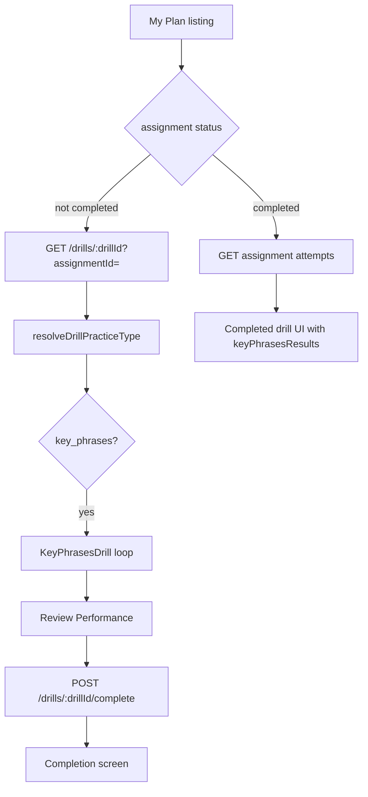
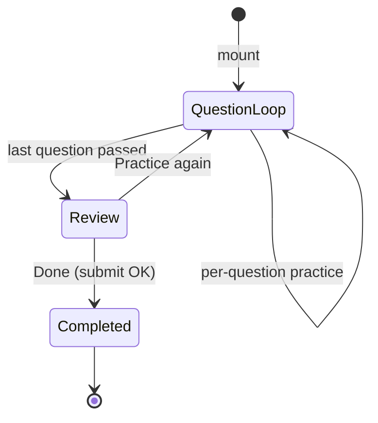
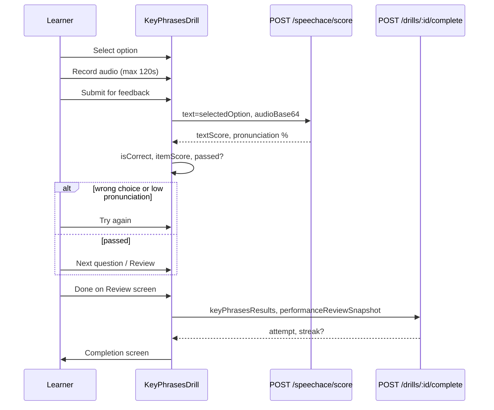

# Key Phrases Drill — Formation, Flow, and Calculations

This document describes the **key phrases** drill type (`type: "key_phrases"`): how content is defined, what the learner does step by step, how Speechace is used, what is stored on completion, and how mobile should mirror the web implementation.

> **Mobile prerequisites**: Read `MOBILE_README.md` for auth (`Authorization: Bearer <token>`), error envelope, and shared API conventions. Drill listing and completion routing are summarized in `MOBILE_MY_PLAN.md`.

---

## 1. Purpose

The key phrases drill is a **listening + multiple-choice + speaking** exercise. For each **item**, the learner:

1. Reads (and optionally hears) a **prompt** — typically something another person said in a situational dialogue.
2. Chooses the best **response** from several options (A, B, C, …).
3. **Records themselves** reading the chosen response aloud.
4. Gets **Speechace pronunciation feedback** on the spoken text (the selected option string, not the prompt).

Unlike **pronunciation** drills (word → sentence, two Speechace turns per item, plus `POST /pronunciations/drill-attempt` logging), key phrases combines **comprehension (pick the right phrase)** with **production (say it clearly)** in a **single turn per question**. There is **no** drill intro screen and **no** standalone pronunciation-attempt API call from this drill.

---

## 2. How the drill is formed (authoring and schema)

### 2.1 Drill document fields

On the `Drill` model (`src/models/drill.ts`), key phrases drills use:

- `type: "key_phrases"` (canonical slug; see §3 for aliases and inference).
- `key_phrase_items`: array of items (`KeyPhraseItemSchema`).

Each item supports:

| Field | Schema / API | Role |
|--------|----------------|------|
| `prompt` | String, **required** | Stimulus shown to the learner (situation / question / line from another speaker). |
| `respondentName` | String, optional | Speaker label above the prompt (e.g. “Waiter”, “Colleague”). UI default: **“Speaker says”** if empty after trim. |
| `options` | `string[]`, **≥ 2** non-empty strings | Multiple-choice responses (labeled A, B, C, … in the UI). |
| `correctAnswer` | String, **required** | Must **exactly match** one entry in `options` (validated on create). |
| `promptAudioUrl` | Optional | Pre-generated TTS URL for the **prompt** (not for options). |

Options are **not** scored individually with separate audio URLs in the learner UI today; only the **prompt** has `TTSButton` / `promptAudioUrl`.

### 2.2 API validation when creating a drill

`POST /api/v1/drills` uses Zod (`src/app/api/v1/drills/route.ts`):

- `type` enum includes `'key_phrases'`.
- `key_phrase_items` is optional on the schema object but should be provided by authors for this type.

Per-item schema (`keyPhraseItemSchema`):

```ts
{
  prompt: string;           // min length 1
  respondentName?: string;
  options: string[];        // min 2 elements, each min length 1
  correctAnswer: string;    // min length 1; must be in options[]
  promptAudioUrl?: string;
}
```

`superRefine` on the item rejects `correctAnswer` that is not one of `options`.

**Note:** Unlike vocabulary/pronunciation create rules, there is currently **no** `superRefine` block that forces `key_phrase_items.length >= 1` when `type === 'key_phrases'`. The learner UI handles empty arrays gracefully (“No key phrase items found”).

### 2.3 Assignments

Learners practice via a **DrillAssignment**; the practice UI receives `drill` JSON and `assignmentId` for the final **`POST /api/v1/drills/:drillId/complete`** call.

---

## 3. Type slug, aliases, and practice routing

### 3.1 Canonical slug

| Canonical | Label (learner UI) | Icon |
|-----------|-------------------|------|
| `key_phrases` | Key Phrases | 🗝️ |

Defined in `KNOWN_DRILL_TYPES` and `DRILL_TYPE_LABELS` in `src/utils/drill.ts`.

### 3.2 Aliases (`normalizeDrillType`)

These raw `drill.type` values map to `key_phrases`:

| Alias input | Normalized |
|-------------|------------|
| `key-phrases` | `key_phrases` |
| `key phrases` | `key_phrases` |
| `keyphrases` | `key_phrases` |

General normalization also lowercases, trims, and converts spaces/hyphens to underscores.

### 3.3 `resolveDrillPracticeType` inference

Used by **`DrillPracticeInterface`** and **`/account/drills/[id]/page.tsx`** before rendering:

```ts
export function resolveDrillPracticeType(drill: {
  type?: unknown;
  key_phrase_items?: unknown[] | null;
}): string | null {
  if (!drill) return null;

  const normalized = normalizeDrillType(drill.type);
  if (normalized === "key_phrases") return "key_phrases";

  const items = drill.key_phrase_items;
  if (Array.isArray(items) && items.length > 0) {
    return "key_phrases";  // infer even if type is wrong/missing in DB
  }

  return normalized ?? (drill.type != null ? String(drill.type) : null);
}
```

**Implications for mobile:**

- Always normalize `drill.type` the same way before `switch`.
- If `key_phrase_items.length > 0`, render **Key Phrases** even when `type` is misspelled.
- When inference changes the effective type, merge `{ ...drill, type: 'key_phrases' }` for child components (web passes `drillForUi`).

### 3.4 Component dispatch

`DrillPracticeInterface` `switch (drillType)` → `case "key_phrases":` → `<KeyPhrasesDrill drill={...} assignmentId={...} />`.

---

## 4. Web routes → mobile screens

| Web route | Mobile screen | Description |
|-----------|---------------|-------------|
| `/account/drills` | `my-plan/index.tsx` | Tabbed drill listing (Ongoing / Reviewed / Completed) |
| `/account/drills/[id]?assignmentId=` | `my-plan/drills/[id].tsx` | Drill runner; dispatch `key_phrases` → `KeyPhrasesDrill` |
| `/account/drills/[id]/completed?assignmentId=` | `my-plan/drills/[id]/completed.tsx` | Post-completion summary + attempt history |

### 4.1 End-to-end flow (learner)



**Server page wiring:** `src/app/(student)/account/drills/[id]/page.tsx` fetches drill + assignment, calls `resolveDrillPracticeType`, then mounts `DrillPracticeInterface`.

---

## 5. API endpoints

All paths below are under **`/api/v1`**. Mobile must send **`Authorization: Bearer <token>`** on every call (see `MOBILE_README.md`). Web uses session cookies; mobile uses Bearer tokens — same handlers.

| Method | Path | Used by key phrases drill |
|--------|------|---------------------------|
| GET | `/drills/learner/my-drills` | Listing / resolve missing `assignmentId` |
| GET | `/drills/:drillId?assignmentId=` | Load `key_phrase_items` + metadata |
| POST | `/drills/:drillId/complete` | Submit `keyPhrasesResults` + `performanceReviewSnapshot` |
| GET | `/drills/assignments/:assignmentId/attempts` | Completed screen history |
| POST | `/speechace/score` | Pronunciation scoring (`text` + `audioBase64`) |

### 5.1 Explicit: no `POST /pronunciations/drill-attempt`

**Vocabulary** and **pronunciation** drills call `pronunciationAPI.createDrillAttempt` → **`POST /api/v1/pronunciations/drill-attempt`** after each successful Speechace parse (server re-scores and stores `PronunciationAttempt` rows).

**Key phrases does not.** `KeyPhrasesDrill.tsx` only calls:

- `speechaceService.scorePronunciation(selectedOption, audioBlob)` → **`POST /api/v1/speechace/score`**

Do **not** implement or require `POST /pronunciations/drill-attempt` for mobile key phrases parity. Pronunciation profile metrics for this drill come from **`keyPhrasesResults`** on the drill attempt (and `performanceReviewSnapshot`), not from standalone pronunciation attempts.

---

## 6. Completing the drill — request body

`POST /api/v1/drills/:drillId/complete` (`src/app/api/v1/drills/[drillId]/complete/route.ts`).

### 6.1 Required fields

| Field | Type | Notes |
|-------|------|-------|
| `drillAssignmentId` | ObjectId string | Assignment being completed |
| `score` | number 0–100 | Web sets **average** of per-item `pronunciationScore` (see §8) |
| `timeSpent` | number ≥ 0 | Seconds since drill mount |
| `platform` | `'web' \| 'ios' \| 'android'` | **Always set on mobile** |

### 6.2 Type-specific: `keyPhrasesResults`

```ts
keyPhrasesResults: {
  items: Array<{
    prompt: string;
    selectedAnswer: string;
    correctAnswer: string;
    isCorrect: boolean;
    pronunciationScore?: number;  // 0 if wrong choice; else Speechace % when scored
    textScore?: Record<string, unknown>;  // full Speechace TextScore snapshot
    attempts: number;             // attempts on current question before pass
  }>;
  totalItems: number;      // items.length
  correctItems: number;    // count where isCorrect === true
  score: number;           // duplicate of top-level score (avg pronunciation)
}
```

Zod also accepts optional `textScore` per item as `z.record(z.string(), z.unknown())`.

### 6.3 `performanceReviewSnapshot`

Frozen copy of in-drill **Review Performance** UI for admin/tutor replay:

```ts
performanceReviewSnapshot: {
  version: 1;
  ui: "drillPerformance";
  avgScore: number;           // mean of sessionReviewAnalytics scores
  statsLine: string;          // e.g. "3 of 5 correct · 5 scored attempts"
  passThreshold: 65;
  sectionHeading: "Question-by-Question Analysis";
  groups: PerformanceReviewGroup[];  // serialized; sceneIndex = question index
}
```

Each analytics row uses `sceneIndex` = question index, `turnIndex` = **0** (single turn per question), `text` = **selected option** spoken, `score` = item score (0 if wrong choice).

### 6.4 Example complete payload (mobile)

```ts
await apiClient.post(`/drills/${drillId}/complete`, {
  drillAssignmentId: assignmentId,
  score: avgScore,
  timeSpent: elapsedSeconds,
  platform: Platform.OS === 'ios' ? 'ios' : 'android',
  keyPhrasesResults: {
    items: resultList,
    totalItems: items.length,
    correctItems,
    score: avgScore,
  },
  performanceReviewSnapshot: {
    version: 1,
    ui: 'drillPerformance',
    avgScore: reviewAvgScore,
    statsLine: reviewStatsLine,
    passThreshold: 65,
    sectionHeading: 'Question-by-Question Analysis',
    groups: reviewGroups,  // deep-clone before send
  },
});
```

**Populate only `keyPhrasesResults`** for this drill type (not `vocabularyResults` / `pronunciationResults`).

### 6.5 Backend side effects

After `DrillService.completeDrill`:

- Assignment marked **completed**; attempt persisted with `keyPhrasesResults`.
- Fire-and-forget: `computeConfidenceMetrics`, `computePronunciationMetrics`.
- If `score >= 70` and role is `user`, **`StreakService.recordActivityDay`** runs.

`computeConfidenceMetrics` uses `keyPhrasesResults.score` when present (`src/domain/confidence/confidence.service.ts`).

---

## 7. Learner state machine

Constants in `KeyPhrasesDrill.tsx`:

| Constant | Value | Meaning |
|----------|-------|---------|
| `PASS_THRESHOLD` | **65** | Minimum Speechace pronunciation % to advance (when choice is correct) |
| `MAX_RECORDING_SECONDS` | **120** | Auto-stop recording; toast “2 minute limit reached” |

### 7.1 No intro screen

Unlike drills that show `drill_intro` or a separate onboarding step, key phrases **starts immediately** on question 1 (`currentIndex = 0`). There is no `drill_intro` handling in `KeyPhrasesDrill.tsx`.

### 7.2 Top-level states



| State | `showReview` | `isCompleted` | UI |
|-------|--------------|---------------|-----|
| Question loop | `false` | `false` | Prompt + options + record |
| Review performance | `true` | `false` | `DrillPerformanceReview` |
| Done | `false` | `true` | `DrillCompletionScreen` |

### 7.3 Per-question sub-states

Within question loop for `currentIndex`:

1. **Select option** — tap one of `options`; clears pending recording/score.
2. **Record** — requires `selectedOption`; WebM/Opus, timer, auto-stop at 120s.
3. **Preview** — optional `RecordingPreviewBar`; **Submit for feedback**.
4. **Analyzed** — show pass/fail, `DrillLineReviewAccordion` when score exists.
5. **Advance** — **Next Question** / **Review** only if `isCorrect && pronunciationScore >= 65`.

**Try again** (failed): clears score/recording; if choice was wrong, also clears `selectedOption`; resets `attempts` counter for the question.

---

## 8. Per-question loop (detailed)

### 8.1 Item list

```ts
items = drill.key_phrase_items || []
```

`DrillProgress`: **Question** `currentIndex + 1` / `items.length`.

Empty list → **“No key phrase items found for this drill.”**

### 8.2 Prompt block

- Heading: `{respondentName} says` or **“Speaker says”**.
- Body: `currentItem.prompt`.
- `TTSButton` with `text={prompt}`, `audioUrl={promptAudioUrl}`.
- On mount / when `items` changes, web **pre-warms** TTS: `preloadTTSAudio(prompt)` or preloads `promptAudioUrl`.

### 8.3 Options block

- Section title: **“Your response”**.
- Each option: letter badge A/B/C…, full-width tappable card.
- After analysis (`pronunciationScore` set): cards disabled; correct option green; wrong selection red; others muted.

### 8.4 Recording gate

- Cannot record until **`selectedOption`** is set (toast if mic tapped without selection).
- Instruction: **“Read your chosen response aloud:”** + quoted `selectedOption`.

### 8.5 Speechace analysis

```ts
speechaceService.scorePronunciation(selectedOption, audioBlob);
```

Reference text = **selected option string**, not `prompt` and not `correctAnswer` unless the learner selected it.

Parse `textScore` from response (`textScore`, `text_score`, or `data.text_score`).

```ts
const score = textScore.speechace_score.pronunciation;
const isCorrect = selectedOption === currentItem.correctAnswer;
const itemScore = isCorrect ? score : 0;  // wrong choice → stored score 0
const passed = isCorrect && score >= PASS_THRESHOLD;
```

Toasts:

- Wrong choice → error with correct answer, score 0.
- Correct + passed → success with %.
- Correct + below threshold → warning, try again.

Updates `itemResults[currentIndex]`, `sessionReviewAnalytics` (one row per question, `turnIndex: 0`).

### 8.6 Advance (`handleNext`)

Blocked unless:

```ts
currentResult?.isCorrect && (currentResult.pronunciationScore ?? 0) >= PASS_THRESHOLD
```

Then: clear recording state, `currentIndex++` or `setShowReview(true)` on last item.

---

## 9. Scoring rules (summary)

| Scenario | `isCorrect` | `pronunciationScore` stored | Can advance? |
|----------|-------------|----------------------------|--------------|
| Wrong option | `false` | `0` | No |
| Right option, Speechace &lt; 65 | `true` | actual % (e.g. 50) | No |
| Right option, Speechace ≥ 65 | `true` | actual % | Yes |

### 9.1 Overall drill `score` (submitted)

```text
totalItems = key_phrase_items.length
avgScore = round( sum(pronunciationScore ?? 0 for each item) / totalItems )
```

- Unattempted items in submit map default to `pronunciationScore: 0`, `isCorrect: false`.
- This is **not** “% of questions fully passed”; a wrong choice contributes **0** to the average even if Speechace was high.
- **`correctItems`** is a separate count (`isCorrect === true`), used on the completed UI.

### 9.2 Review aggregates (client-only until submit)

- **`reviewAvgScore`:** mean of `sessionReviewAnalytics[].score`, else mean of positive `pronunciationScore` from `itemResults`.
- **`reviewStatsLine`:** `` `${correctItems} of ${items.length} correct · ${sessionReviewAnalytics.length} scored attempts` ``.

### 9.3 `timeSpent`

`floor((Date.now() - startTime) / 1000)` from component mount.

---

## 10. Review screen and completion

### 10.1 Review performance

After the last question passes (§8.6), `showReview = true`:

- `DrillLayout` title **“Review Performance”**.
- `DrillPerformanceReview` with `groups` built from `sessionReviewAnalytics` (`sceneTitle`: `Question N: {prompt preview}`).
- **Done** → `handleSubmit` (§6).
- **Practice again** → reset index, results, analytics, recordings.

### 10.2 Completion screen

`DrillCompletionScreen` with `drillType="key phrases"`, `returnPath="/account/drills"`.

No session transcript card (unlike pronunciation).

### 10.3 Completed drill UI (web)

`src/app/(student)/account/drills/[id]/completed/page.tsx`:

- Resolves review badge: `keyPhrasesResults` → status **reviewed**, `correctCount` / `totalCount` from `correctItems` / `totalItems`.
- Type block `case "key_phrases"`: summary card (Correct / Questions / Score %) + list **“Your answers”** per item (prompt, selected, correct if wrong, pronunciation %).

Mobile should mirror this layout on `completed.tsx`.

---

## 11. Mobile UI specification

| Area | Spec |
|------|------|
| Header | Drill title; optional bookmark on prompt (`itemType: sentence`, id `{drillId}-kp-{index}`) |
| Progress | `Question {n} of {total}` |
| Prompt card | Respondent line + prompt text + play (TTS or `promptAudioUrl`) |
| Options | Vertical list; min touch height ~60pt; letter badges A–Z |
| Selection | Highlight selected; disable re-tap after scoring |
| Post-select | Show “Read your chosen response aloud” + selected text |
| Recording | Mic → stop; max **120s**; optional waveform/preview + **Submit for feedback** |
| Feedback | Pass/fail icon; pronunciation %; **Try again** or **Next** / **Review** |
| Breakdown | Collapsible word-level Speechace (`DrillLineReviewAccordion` equivalent), threshold 65 |
| Review | Full-screen performance review before API complete |
| Completion | Generic completion + navigate back to My Plan |

**Audio format:** Web uses `audio/webm;codecs=opus` at 32kbps. Mobile should use a format accepted by `/speechace/score` (convert to base64 per `MOBILE_README.md` / existing pronunciation drill patterns).

---

## 12. Speechace and audio pipeline

### 12.1 Client call

`src/services/speechace.service.ts`:

```ts
POST /api/v1/speechace/score
Body: {
  text: selectedOption,      // NOT prompt
  audioBase64: string,       // from recorded blob
  questionInfo?: string
}
```

Mobile: same endpoint with Bearer auth.

### 12.2 Response handling

Expect `data.text_score` (or camelCase variants). Use:

```ts
textScore.speechace_score.pronunciation  // number 0–100
```

Persist full `textScore` on the item as `textScore` in `keyPhrasesResults.items[]` when submitting.

---

## 13. Comparison: key phrases vs pronunciation

| Aspect | Key phrases | Pronunciation |
|--------|-------------|---------------|
| Content array | `key_phrase_items` | `pronunciation_items` |
| Steps per item | 1 (choose + speak) | 2 (word, then sentence) |
| Comprehension | Multiple choice | N/A |
| Speechace reference | Selected **option** text | `word` / `sentence` |
| `POST /pronunciations/drill-attempt` | **No** | **Yes** |
| Complete payload | `keyPhrasesResults` | `pronunciationResults` |
| Intro screen | **No** | No dedicated intro in component |
| Overall score formula | Avg of per-item `pronunciationScore` | % items with word+sentence passed |
| Pass to advance | Correct + ≥ 65% on option | ≥ 65% per step |

---

## 14. Sequence diagram (one question)



---

## 15. Edge cases and implementation notes

- **Empty `key_phrase_items`:** Show empty state; do not call complete.
- **Missing `assignmentId`:** Submit blocked with toast; resolve from `GET /drills/learner/my-drills` (same as other drills).
- **Wrong type in DB but items present:** `resolveDrillPracticeType` still routes to key phrases.
- **`correctAnswer` not in options:** Rejected at create time; would break scoring if present in legacy data.
- **High pronunciation, wrong option:** `pronunciationScore` stored as **0**; learner must pick correctly.
- **Correct option, low pronunciation:** `isCorrect` true but cannot advance until ≥ 65%.
- **Double-counting attempts:** `attempts` increments each analysis on current question; reset on **Try again** / **Next**.
- **Streak:** Requires submitted `score >= 70`; average of zeros on wrong choices lowers streak eligibility.
- **Tutor review:** Not required; completed page treats key phrases as **reviewed** automatically via `keyPhrasesResults`.

---

## 16. Mobile implementation checklist

- [ ] Normalize `drill.type` and infer from `key_phrase_items` (`resolveDrillPracticeType` parity)
- [ ] Render `KeyPhrasesDrill` for `key_phrases` in runner `switch`
- [ ] Load `key_phrase_items` from `GET /drills/:id`
- [ ] No intro step; start at question 0
- [ ] Multiple choice UI with A/B/C labels and post-score styling
- [ ] Block recording until option selected
- [ ] `POST /speechace/score` with `text = selectedOption`, base64 audio
- [ ] **Do not** call `POST /pronunciations/drill-attempt`
- [ ] Enforce **65** pronunciation threshold and correct answer before next
- [ ] **120s** recording cap with auto-stop
- [ ] Preload / play `promptAudioUrl` or TTS for prompt
- [ ] In-drill performance review → `performanceReviewSnapshot` on complete
- [ ] `POST /drills/:id/complete` with `keyPhrasesResults` + `platform`
- [ ] Completed screen: correct/total/score + per-item answer list
- [ ] Invalidate learner drills query after complete

---

## 17. Source file index

| Concern | Location |
|---------|----------|
| Drill schema (`key_phrase_items`, type enum) | `src/models/drill.ts` |
| Attempt schema (`keyPhrasesResults`) | `src/models/drill-attempt.ts` |
| Create-drill Zod (`keyPhraseItemSchema`) | `src/app/api/v1/drills/route.ts` |
| Complete API Zod + streak | `src/app/api/v1/drills/[drillId]/complete/route.ts` |
| `completeDrill` persistence | `src/domain/drills/drill.service.ts` |
| Type aliases + `resolveDrillPracticeType` | `src/utils/drill.ts` |
| Learner UI | `src/components/drills/KeyPhrasesDrill.tsx` |
| Practice router | `src/components/drills/DrillPracticeInterface.tsx` |
| Server drill page | `src/app/(student)/account/drills/[id]/page.tsx` |
| Completed attempt UI | `src/app/(student)/account/drills/[id]/completed/page.tsx` |
| Shared review / recording UI | `src/components/drills/shared/` |
| Client Speechace wrapper | `src/services/speechace.service.ts` |
| Prompt audio generation | `src/services/drill-audio.service.ts` |
| Confidence score from results | `src/domain/confidence/confidence.service.ts` |
| Mobile handoff (listing + complete schema) | `docs/MOBILE_MY_PLAN.md` |
| Auth + API conventions | `docs/MOBILE_README.md` |

This is the full picture of how a **key phrases** drill is formed, how it is **supposed to run**, and what the app **calculates and stores** — including explicit differences from pronunciation drills and mobile parity requirements.
