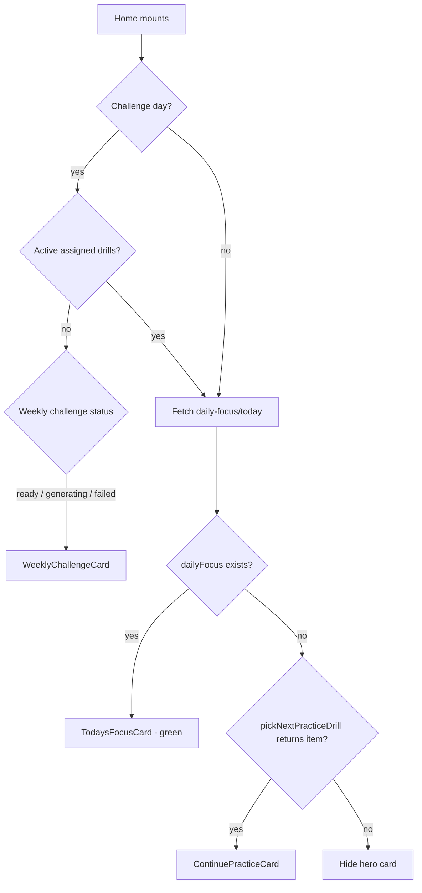

# Mobile Handoff — Continue Practice Card (Home)

> **Prerequisites**: Read [`MOBILE_README.md`](./MOBILE_README.md) first for auth, error envelope, and React Query conventions.
>
> **Related docs**:
> - [`MOBILE_HOME.md`](./MOBILE_HOME.md) — Home screen composition (this doc **supersedes** §5.1 / §5.4 regarding how the fallback card picks a drill)
> - [`MOBILE_DRILL_CHECKPOINTS.md`](./MOBILE_DRILL_CHECKPOINTS.md) — In-drill save/resume (checkpoints + roleplay progress)
> - [`DRILL_CHECKPOINTS.md`](./DRILL_CHECKPOINTS.md) — Product spec for checkpoint cadence

---

## 1. Overview

On web, the home screen hero card is rendered by **`TodaysFocusCard`**. It shows one of three things:

| Priority | Card | When |
|----------|------|------|
| 1 | **Weekly Challenge** | “Challenge day” + learner has **no active assigned drills** + weekly challenge exists |
| 2 | **Today's Focus** | `GET /daily-focus/today` returns a `dailyFocus` document |
| 3 | **Continue Practice** | No daily focus, but the learner has at least one **incomplete** assigned drill |

The **Continue Practice Card** is the emerald gradient fallback when there is no admin daily-focus entry for today. It is **not** a simple “first drill in the API list” (FIFO). It uses shared selection logic that **prioritizes drills the learner has already started** (assignment status `in-progress`, set when a checkpoint is saved).

**Web reference files**

| Piece | Path |
|-------|------|
| Home card orchestration | `src/components/daily-focus/TodaysFocusCard.tsx` |
| Continue Practice UI | `src/components/practice/ContinuePracticeCard.tsx` |
| Drill selection algorithm | `src/lib/learner-assigned-plan.ts` |
| Learner drill list hook | `src/hooks/useDrills.ts` → `useLearnerDrills()` |
| Checkpoint → `in-progress` side effect | `src/app/api/v1/drills/[drillId]/checkpoint/route.ts` (POST) |

---

## 2. Decision flow (what to show on Home)



### 2.1 “Challenge day” (not always Sunday)

Web uses `isWeeklyChallengeDayUtc(now, subscriptionActivatedAt)`:

- **No `subscriptionActivatedAt`**: challenge day = **Sunday UTC** (`getUTCDay() === 0`).
- **With `subscriptionActivatedAt`**: challenge day = every **7th calendar day** since activation (day 0 = activation day, day 6 = first challenge day, then repeats).

```ts
// src/lib/challenges/utc-week-challenge.ts
export function isWeeklyChallengeDayUtc(
  now: Date = new Date(),
  subscriptionActivatedAt?: Date,
): boolean {
  if (!subscriptionActivatedAt) {
    return now.getUTCDay() === 0;
  }
  const nowMs = Date.UTC(now.getUTCFullYear(), now.getUTCMonth(), now.getUTCDate());
  const activatedMs = Date.UTC(
    subscriptionActivatedAt.getUTCFullYear(),
    subscriptionActivatedAt.getUTCMonth(),
    subscriptionActivatedAt.getUTCDate(),
  );
  const daysDiff = Math.round((nowMs - activatedMs) / 86_400_000);
  return daysDiff >= 0 && daysDiff % 7 === 6;
}
```

**Weekly challenge override** only applies when:

1. It is challenge day, **and**
2. `activeDrills.length === 0` (no incomplete assignments), **and**
3. Weekly challenge `status` is `ready`, `generating`, or `failed`.

Fetch: `GET /api/v1/learner/weekly-challenge/current` (same as web `weeklyChallengeAPI.getCurrent()`). Poll every 3s while `status === 'generating'`.

### 2.2 Today's Focus

```http
GET /api/v1/daily-focus/today
Authorization: Bearer <token>
```

- HTTP **200** even when empty (`code: 'NotFound'`, `dailyFocus: null`).
- When `dailyFocus` is non-null, show the green “Focus Today” card and navigate to the daily-focus drill flow — **do not** show Continue Practice.

### 2.3 Continue Practice fallback

Shown only when `dailyFocus === null` **and** `pickNextPracticeDrill(...)` returns an item.

---

## 3. How the drill is chosen (critical — not API order)

Mobile must **not** use `drills[0]` or whatever order `/my-drills` returns. Web explicitly runs **`pickNextPracticeDrill`**.

### 3.1 Algorithm

```ts
// Portable copy of src/lib/learner-assigned-plan.ts

export function isCompletedPlanItem(item: {
  itemType?: string;
  drill?: { type?: string; date?: string | Date | null };
  completedAt?: string | Date | null;
  status?: string;
  assignmentStatus?: string;
  dueDate?: string | Date;
  latestAttempt?: { completedAt?: string | Date | null; reviewStatus?: string } | null;
}): boolean {
  // Free-talk rows use itemType / completedAt — see web for full branch
  const assignmentStatus = item.assignmentStatus ?? item.status;
  return Boolean(
    item.completedAt ||
    assignmentStatus === 'completed' ||
    item.latestAttempt?.completedAt,
  );
}

export function isActiveAssignedPlanItem(item: Parameters<typeof isCompletedPlanItem>[0]): boolean {
  return !isCompletedPlanItem(item);
}

export function isInProgressPlanItem(item: { status?: string }): boolean {
  return item.status === 'in-progress' || item.status === 'in_progress';
}

export function assignedPlanSortTime(item: {
  assignedAt?: string | Date | null;
  drill?: { date?: string | Date | null };
}): number {
  const raw = item.assignedAt ?? item.drill?.date ?? 0;
  const d = new Date(raw as string | Date);
  return Number.isNaN(d.getTime()) ? 0 : d.getTime();
}

export function sortAssignedPlanItems<T extends { assignedAt?: string | Date | null; drill?: { date?: string | Date | null } }>(
  items: T[],
): T[] {
  return [...items].sort((a, b) => assignedPlanSortTime(a) - assignedPlanSortTime(b));
}

/** Next drill for Start/Continue Practice: resume in-progress, else oldest incomplete assignment. */
export function pickNextPracticeDrill<T extends { status?: string; assignedAt?: string | Date | null; drill?: { date?: string | Date | null } }>(
  items: T[],
): T | undefined {
  const active = sortAssignedPlanItems(items.filter(isActiveAssignedPlanItem));
  return active.find(isInProgressPlanItem) ?? active[0];
}
```

### 3.2 Selection rules (plain language)

1. **Drop completed drills** — anything with `completedAt`, `status/assignmentStatus === 'completed'`, or `latestAttempt.completedAt`.
2. **Sort remaining by assignment time** — ascending `assignedAt` (fallback: `drill.date`). **Oldest assignment first.**
3. **Prefer in-progress** — if any active drill has `status` of `in-progress` or `in_progress`, pick the **first** such drill after sorting (there is usually only one).
4. **Otherwise** pick the **oldest incomplete** assignment.

### 3.3 Why this matters for checkpoints

When a learner saves a drill checkpoint (every 5 items, or roleplay scene break), the server sets the assignment to **`in-progress`**:

```ts
// POST /drills/:drillId/checkpoint
await assignmentRepo.updateStatus(assignmentId, 'in-progress');
```

That status is what makes the home card:

- Show the drill the learner was working on (not the next pending FIFO drill).
- Display **“Continue Practice”** / **“Resume”** instead of **“Start Practice”** / **“Start”**.

**If mobile only uses API array order**, learners who paused drill B will still see drill A on the home card — this is the bug to fix.

### 3.4 Data source

```http
GET /api/v1/drills/learner/my-drills?limit=100
Authorization: Bearer <token>
```

Web `useLearnerDrills()` defaults to `limit: 100`. Use the **same** limit for home selection so older incomplete assignments are not missed.

Normalize rows the same way as web (`normalizeLearnerDrillItem` in `src/hooks/useDrills.ts`): each item should expose `assignmentId`, `drill`, `assignedAt`, `status`, `completedAt`, `latestAttempt`.

---

## 4. Continue Practice Card UI

Match web `ContinuePracticeCard`:

| Element | Value |
|---------|--------|
| Container | Emerald gradient (`from-emerald-600` → `emerald-700`), `rounded-3xl`, padding ~20 |
| Badge | Play icon + **“CONTINUE PRACTICE”** or **“START PRACTICE”** (uppercase, small) |
| Topic line | `drill.drill.topicTitle` when present (bold, 2-line clamp) |
| Title | `drill.drill.title` |
| Meta row | Human-readable drill type + **“5–15 minutes”** (`DRILL_ESTIMATED_DURATION_LABEL`) |
| CTA button | Yellow (`#FACC15` family): **“Resume”** or **“Start”** |

### 4.1 Drill type labels

```ts
const DRILL_TYPE_LABELS: Record<string, string> = {
  roleplay: 'Roleplay',
  vocabulary: 'Vocabulary',
  grammar: 'Grammar',
  matching: 'Matching',
  definition: 'Definition',
  sentence_writing: 'Sentence Building',
  fill_blank: 'Fill-in-the-Blank',
  key_phrases: 'Key Phrases',
  summary: 'Reading',
  listening: 'Listening',
  sentence: 'Sentence',
};
```

### 4.2 Resume vs Start

```ts
const isResume = isInProgressPlanItem(continueDrill);
// Badge: isResume ? 'Continue Practice' : 'Start Practice'
// Button: isResume ? 'Resume' : 'Start'
```

`isResume` is driven **only** by assignment `status`, not by whether a checkpoint document exists. Status is updated when checkpoints are saved.

---

## 5. Navigation on tap

### 5.1 Standard assigned drills

Navigate to the drill runner with **both** drill id and assignment id:

```ts
router.push({
  pathname: '/my-plan/drills/[id]',
  params: {
    id: continueDrill.drill._id,
    assignmentId: String(continueDrill.assignmentId),
  },
});
```

**Always pass `assignmentId`.** Web’s `ContinuePracticeCard` links to `/account/drills/:drillId` without a query param, but `DrillPracticeInterface` then looks up the assignment via `GET /my-drills?drillId=...`. Mobile should pass `assignmentId` explicitly so checkpoint load is reliable on first paint.

### 5.2 On drill open — load checkpoint

After navigation, the drill runner must:

1. Wait until `assignmentId` is known.
2. `GET /drills/{drillId}/checkpoint?assignmentId={assignmentId}` (or roleplay progress endpoint for roleplay).
3. Restore `resumeFromIndex` / `partialResults` before starting item 0.

Full per-type restore rules: [`MOBILE_DRILL_CHECKPOINTS.md`](./MOBILE_DRILL_CHECKPOINTS.md).

### 5.3 Free Talk plan rows

If `itemType === 'free_talk_scenario'`, route to the Free Talk flow — not the generic drill runner. Web’s `pickNextPracticeDrill` can return these rows; handle `isFreeTalkPlanItem` if you include them in the same list.

---

## 6. Parallel queries on Home (web pattern)

Fire in parallel on home mount:

```ts
useQuery(['daily-focus-today'], fetchDailyFocusToday);
useQuery(['learner-drills', { limit: 100 }], () => fetchLearnerDrills({ limit: 100 }));
useQuery(['user-current'], fetchUserCurrent); // subscriptionActivatedAt for challenge day
useQuery(['weekly-challenge-current'], fetchWeeklyChallengeCurrent, {
  enabled: isChallengeDay,
});
```

Compute the hero card from query results — do not block daily-focus fetch on drills or vice versa.

### 6.1 Cache invalidation

Invalidate `learner-drills` when:

- A drill is completed.
- A checkpoint is saved (assignment flips to `in-progress`).
- User returns to Home from a drill via “Exit & Resume Later”.

This keeps the Continue Practice card in sync with checkpoint state.

---

## 7. Assigned Drills list vs Continue Practice card

These are **related but different**:

| Surface | Selection | Count |
|---------|-----------|-------|
| **Continue Practice** (hero) | `pickNextPracticeDrill` — in-progress first, else oldest active | 1 drill |
| **Assigned Drills** (list below metrics) | `sortAssignedPlanItems(active).slice(0, 4)` | Up to 4 oldest active |

Both filter with `isActiveAssignedPlanItem` and sort by `assignedAt`, but only the hero card prioritizes `in-progress`.

Web reference: `src/app/(student)/account/assigned-drills-section-client.tsx`.

---

## 8. Common mobile mistakes

| Mistake | Symptom | Fix |
|---------|---------|-----|
| Use `drills[0]` from API | Wrong drill after pausing another | Implement `pickNextPracticeDrill` |
| Ignore `in-progress` status | Home always says “Start” for paused drills | Check `status === 'in-progress' \|\| 'in_progress'` |
| Open drill without `assignmentId` | Checkpoint restore fails or races | Pass `assignmentId` in navigation params |
| Load checkpoint before `assignmentId` | Always starts at item 0 | Gate checkpoint GET on assignment context |
| Small `limit` on `/my-drills` | Oldest incomplete drill missing from pool | Use `limit=100` for selection |
| Don’t refetch after checkpoint save | Home card stale until app restart | Invalidate `learner-drills` on checkpoint POST success |

---

## 9. End-to-end sync example

1. Learner has drills **A** (assigned Monday) and **B** (assigned Tuesday), both pending.
2. Home Continue Practice shows **A** (oldest).
3. Learner starts **B** from My Plan, completes 5 items, saves checkpoint.
4. Server sets **B** → `in-progress`.
5. Learner exits to Home.
6. Home refetches `/my-drills`.
7. `pickNextPracticeDrill` finds **B** as in-progress → Continue Practice shows **B**, badge **“Continue Practice”**, button **“Resume”**.
8. Tap → drill runner loads checkpoint at `resumeFromIndex: 5`.

---

## 10. Acceptance checklist

- [ ] Hero card priority: Weekly Challenge (when rules match) → Today's Focus → Continue Practice → hidden
- [ ] Challenge day uses `subscriptionActivatedAt` cadence, not hard-coded Sunday only
- [ ] Continue Practice uses `pickNextPracticeDrill`, **not** raw API order
- [ ] Completed drills never appear on Continue Practice
- [ ] In-progress assignment always wins over older pending assignments
- [ ] Resume vs Start copy matches assignment `status`
- [ ] `topicTitle` shown above drill title when present
- [ ] Navigation includes `assignmentId`
- [ ] Drill runner restores checkpoint on entry (see `MOBILE_DRILL_CHECKPOINTS.md`)
- [ ] `learner-drills` invalidated after checkpoint save and drill completion
- [ ] Assigned Drills list (4 cards) still uses oldest-first sort without in-progress override

---

## 11. Quick reference — web code map

```text
TodaysFocusCard
  ├─ isWeeklyChallengeDayUtc + useWeeklyChallenge → WeeklyChallengeCard
  ├─ GET /daily-focus/today → green TodaysFocusCard
  └─ pickNextPracticeDrill(useLearnerDrills()) → ContinuePracticeCard
        ├─ isInProgressPlanItem → Resume copy
        └─ onPress → /account/drills/:drillId (+ assignment lookup in DrillPracticeInterface)
```

For checkpoint behavior inside the drill: [`MOBILE_DRILL_CHECKPOINTS.md`](./MOBILE_DRILL_CHECKPOINTS.md).
