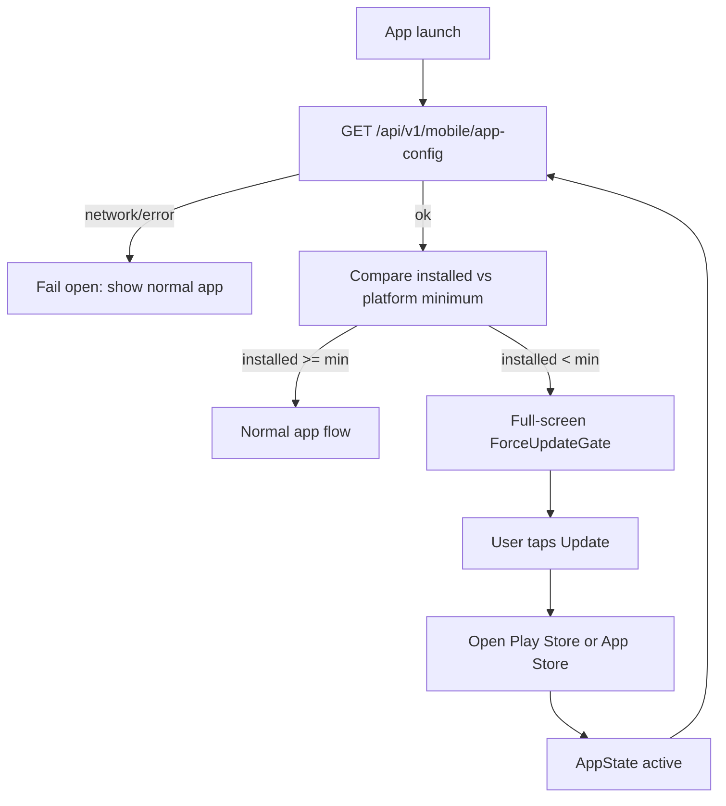

# Mobile Force Update Contract

> **Audience:** Backend + Expo mobile.  
> **Scope:** Store-binary force update gate only. **Not** EAS OTA / JS updates.  
> **Status:** Mobile client implements against this contract; backend owns the endpoint.

---

## Goal

On every cold start (and when returning to foreground), the mobile app fetches a public app-config payload. If the installed binary version is below the platform minimum, the app shows a non-dismissible **Update** screen that opens the Play Store or App Store.

This is separate from EAS OTA (`services/ota-updates.ts`): OTA updates JS inside the same binary; this gate forces a **store binary** upgrade.



---

## Endpoint

| | |
|--|--|
| **Method / path** | `GET /api/v1/mobile/app-config` |
| **Auth** | None (public; must work before login) |
| **Purpose** | Tell the client the minimum supported binary version per platform |

Base path: `{API_HOST}/api/v1`.

---

## Response (200)

Flat JSON object (not wrapped in `{ code, data }` unless the backend already standardizes all public routes that way — client accepts either).

```json
{
  "minimumIosVersion": "1.3.5",
  "minimumAndroidVersion": "1.3.5",
  "iosStoreUrl": "https://apps.apple.com/app/id6759982033",
  "androidStoreUrl": "https://play.google.com/store/apps/details?id=com.eklan.ai",
  "title": "Update required",
  "message": "A new version of Eklan is required to continue. Please update from the store."
}
```

| Field | Type | Required | Client use |
|-------|------|----------|------------|
| `minimumIosVersion` | semver string | yes | Compare on iOS |
| `minimumAndroidVersion` | semver string | yes | Compare on Android |
| `iosStoreUrl` | string URL | no | Override store link; else client default |
| `androidStoreUrl` | string URL | no | Override store link; else client default |
| `title` | string | no | Gate headline; else default copy |
| `message` | string | no | Gate body; else default copy |

Unknown extra fields are ignored by the client.

---

## Locked rules

| Rule | Detail |
|------|--------|
| Version kind | Marketing semver matching Expo `expo.version` (currently `1.3.4` in `app.json`), **not** `versionCode` / `buildNumber` |
| When to raise mins | Only when users must leave the old binary (breaking API, critical fix, store-only change) |
| Store URL overrides | Optional fields let backend hot-fix listing links without an app release |
| Comparison | Force update iff `compareSemver(installed, minimum) < 0` for the current platform |
| Block style | Always hard-block (no soft “later” path) |
| Fail-open | If the request fails, times out, or returns invalid data → do **not** block the app |

---

## Client behavior (mobile)

- Installed version from `Constants.expoConfig?.version`.
- Skip check in `__DEV__` by default; set `EXPO_PUBLIC_FORCE_UPDATE_CHECK=1` to test locally.
- While the first check is in flight: show the normal app shell (fail-open); only show the gate once `required === true`. Do not hold splash waiting on this endpoint.
- Re-fetch when `AppState` becomes `active` (user returns from store).
- Do **not** call `Updates.reloadAsync()` from this flow — OTA stays separate.

Default store URLs (used when response omits overrides):

| Platform | URL |
|----------|-----|
| iOS | `https://apps.apple.com/app/id6759982033` |
| Android | `https://play.google.com/store/apps/details?id=com.eklan.ai` |

Default copy when `title` / `message` omitted:

- Title: `Update required`
- Message: `A new version of Eklan is required to continue. Please update from the store.`

---

## Backend handoff

Until the endpoint exists, fail-open means no user impact.

Suggested initial values: set both minimums equal to the latest store version (e.g. `"1.3.4"`) so nobody is blocked until the floor is intentionally raised.

---

## Out of scope

- Soft / optional “update available” toast
- Play In-App Updates API / StoreKit soft prompts
- Changing EAS OTA policy
- Backend implementation in the mobile repo (contract only)
