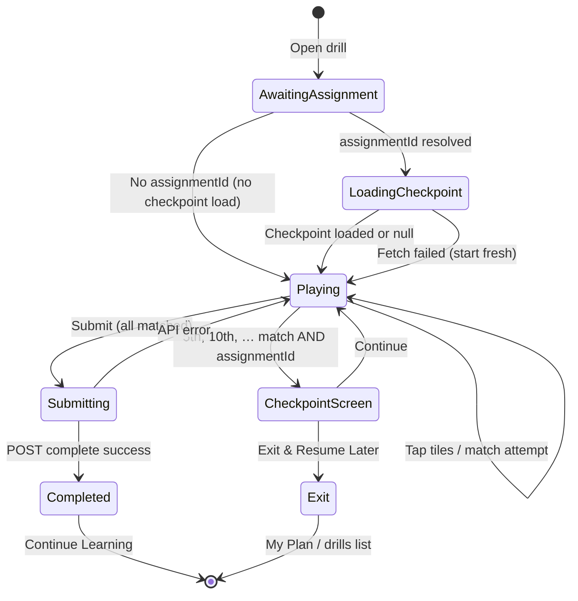
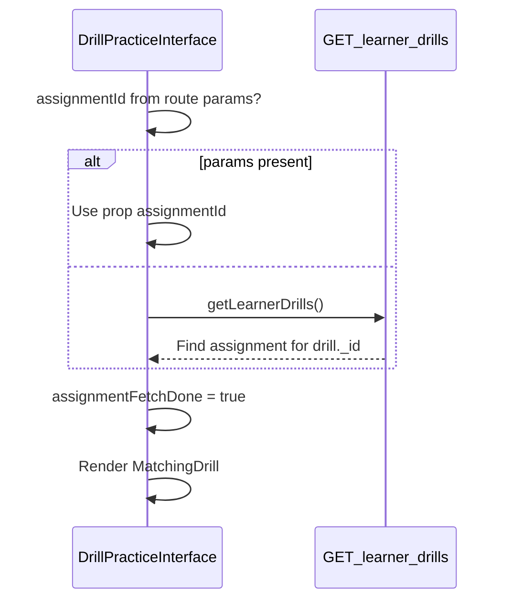
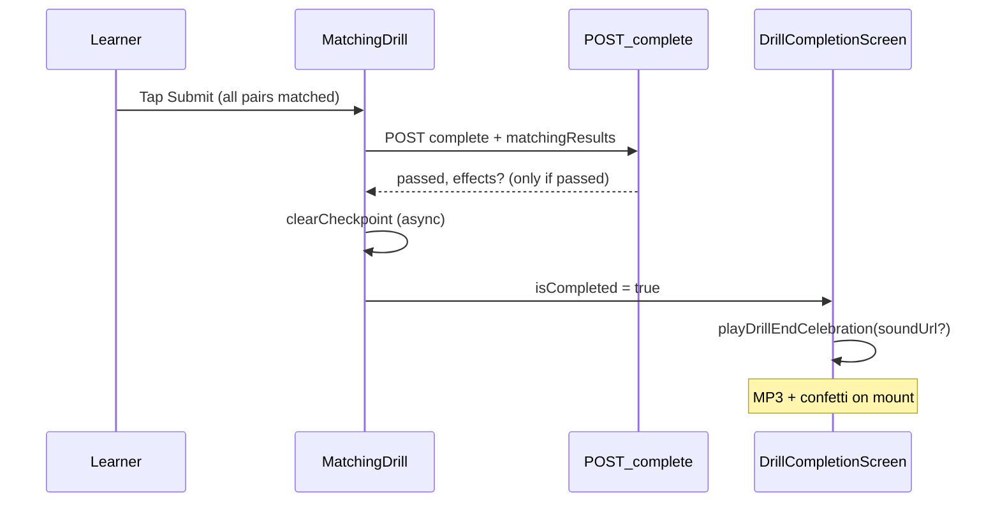

# Mobile Handoff — Matching Drill

> **Prerequisites**: Read [`MOBILE_README.md`](MOBILE_README.md) first for auth, error envelope, and React Query conventions.
>
> **Related**:
> - [`MOBILE_MY_PLAN.md`](MOBILE_MY_PLAN.md) — drill runner routing, assignment resolution, complete mutation
> - [`MOBILE_DRILL_CELEBRATION.md`](MOBILE_DRILL_CELEBRATION.md) — Pattern B end-of-drill MP3 + confetti
> - [`MOBILE_DRILL_CHECKPOINTS.md`](MOBILE_DRILL_CHECKPOINTS.md) — save-and-resume every 5 items
> - [`mobile-practice-feedback.md`](mobile-practice-feedback.md) — per-pair success/failure haptics (not end-of-drill)
>
> **Web source of truth (June 2026)**: [`src/components/drills/MatchingDrill.tsx`](../src/components/drills/MatchingDrill.tsx)

---

## 1. Overview

The **Matching Drill** presents shuffled left and right columns of text pairs. The learner taps one tile from each column to attempt a match. Correct matches lock tiles; incorrect attempts flash red briefly. The learner must match **all** pairs, then tap **Submit** manually — there is **no auto-submit** when the last pair is matched.

| Behavior | Web (June 2026) |
|----------|-----------------|
| Interaction | Tap-to-select (left then right, or right then left) |
| Submit | Manual only, after all pairs matched |
| Per-pair feedback | `playPracticeFeedback('success' \| 'failure')` on each attempt |
| Checkpoint | Every **5** successful matches (requires `assignmentId`) |
| Checkpoint on final match | **Skipped** — toast only, then user submits |
| Complete API | Pattern B — POST complete **before** completion screen |
| Celebration | Completion screen always mounts with `celebrate={true}`; MP3 from `effects.soundUrl` when passed, else fallback URL |
| Score | `Math.round((pairsMatched / (pairsMatched + incorrectCount)) * 100)` |
| Pass threshold | `score >= 70` (server default when `performanceReviewSnapshot` omitted) |

**Drill payload field**: `drill.matching_pairs` — array of `{ left, right, leftTranslation?, rightTranslation?, leftAudioUrl?, rightAudioUrl? }`.

> **Note**: Web does **not** play `leftAudioUrl` / `rightAudioUrl` on tap today. Audio fields exist on the model but are unused in `MatchingDrill.tsx`. Mobile may add audio later; do not block shipping on it.

---

## 2. Web source of truth — file map

| Area | Path |
|------|------|
| Matching drill UI + logic | `src/components/drills/MatchingDrill.tsx` |
| Drill router + `assignmentId` resolution | `src/components/drills/DrillPracticeInterface.tsx` |
| Shared layout (header progress bar) | `src/components/drills/shared/DrillLayout.tsx` |
| Checkpoint screen UI | `src/components/drills/shared/CheckpointScreen.tsx` |
| Completion screen (Pattern B) | `src/components/drills/shared/DrillCompletionScreen.tsx` |
| Checkpoint client helpers | `src/lib/drill/drill-checkpoint.ts` |
| Complete mutation helper | `src/lib/drill/complete-learner-drill.ts` |
| Per-pair feedback | `src/lib/practice-feedback.ts` → `playPracticeFeedback` |
| End-of-drill celebration | `src/lib/practice-feedback.ts` → `playDrillEndCelebration` |
| Complete API + `matchingResults` schema | `src/app/api/v1/drills/[drillId]/complete/route.ts` |
| Checkpoint API | `src/app/api/v1/drills/[drillId]/checkpoint/route.ts` |
| `matchingResults` persistence | `src/models/drill-attempt.ts` |
| Completed attempt analytics UI | `src/app/(student)/account/drills/[id]/completed/page.tsx` |
| Activity tracking | `src/utils/activity-cache.ts` → `trackActivity` |
| Drill model (`matching_pairs`) | `src/models/drill.ts` |

---

## 3. User flow — state machine



**Assignment resolution** (parent screen, before matching drill mounts):



---

## 4. Screen states

### 4.1 `loading_checkpoint`

Shown when `assignmentId` is present and checkpoint GET is in flight.

| UI | Web behavior |
|----|--------------|
| Layout | `DrillLayout` with drill title |
| Body | Centered spinner |
| Interaction | None |

Equivalent mobile: full-screen or in-drill loader; do **not** initialize empty matched state that races with restore.

### 4.2 `playing`

Main two-column matching grid.

| UI element | Behavior |
|------------|----------|
| Header | Drill title + progress `{ current: matchedCount, total: pairs.length }` |
| Instruction | “Tap the Matching pairs” |
| Context | Optional `drill.context` callout box |
| Grid | 2 columns; each **visual row** shows `leftItems[rowIdx]` and `rightItems[rowIdx]` (shuffle positions differ per column) |
| Submit | Full-width button; label “Submit” or “Submitting…” with spinner |
| Bookmark | Optional header bookmark (`matching-drill-{drillId}`) — web only |

### 4.3 `checkpoint_screen`

Shown **after** a successful checkpoint POST at every 5th match (5, 10, 15, …). **Not** shown on load. **Not** shown when the 5th match is also the final all-matched match.

| UI | Copy |
|----|------|
| Title | “Progress Saved” (or drill title in header) |
| Body | “You've completed **X** of **Y** items.” + remaining count |
| Primary CTA | **Continue** — dismiss screen, resume matching |
| Secondary CTA | **Exit & Resume Later** — navigate to drills list |

### 4.4 `submitting`

`handleSubmit` in progress.

| Guard | Behavior |
|-------|----------|
| `isSubmittingRef` | Blocks double-tap |
| Button | Disabled, shows spinner + “Submitting…” |
| On success | `isSubmitting` stays true; navigate to completed (web sets `isCompleted`) |
| On error | Reset `isSubmitting`, show error toast |

### 4.5 `completed`

`DrillCompletionScreen` after successful POST complete.

| Prop | Matching value |
|------|----------------|
| `drillType` | `"matching"` |
| `celebrate` | **`true` always** (web does not gate on `passed`) |
| `celebrationSoundUrl` | `result.data.effects?.soundUrl` (undefined when `passed: false`) |

Completion screen plays `playDrillEndCelebration(celebrationSoundUrl)` on mount. When `soundUrl` is absent, web falls back to `DEFAULT_CELEBRATION_SOUND_URL`.

---

## 5. Match validation logic

Matching uses **canonical pair indices** `0 .. n-1` (original `matching_pairs` array index). Left and right columns are shuffled independently; each tile carries `id` = canonical index.

### 5.1 Text normalization

```ts
function normalizeMatchText(s: string): string {
  return s.trim().replace(/\s+/g, ' ');
}
```

### 5.2 Correctness rules

On left index `L` and right index `R`:

1. **Fast path — same canonical id**: `leftItems[L].id === rightItems[R].id` → correct; canonical index = `leftItems[L].id`.
2. **Duplicate labels — text fallback**: When ids differ but normalized `(left text, right text)` matches an **unmatched** row in `pairs`, accept as correct (handles duplicate strings in the drill).
3. Otherwise → incorrect.

### 5.3 `findUnmatchedCanonicalPairIndex` (duplicate labels)

```pseudocode
function findUnmatchedCanonicalPairIndex(pairs, leftItem, rightItem, matchedCanonical):
  L = normalize(leftItem.text)
  R = normalize(rightItem.text)
  candidates = []
  for i, p in pairs:
    if i in matchedCanonical: continue
    if normalize(p.left) == L and normalize(p.right) == R:
      candidates.push(i)

  if candidates is empty: return -1
  if candidates.length == 1: return candidates[0]
  if leftItem.id in candidates: return leftItem.id
  if rightItem.id in candidates: return rightItem.id
  return candidates[0]
```

### 5.4 `matchedPairKeys` format

Each successful match stores:

```
"{leftTileId}-{rightTileId}"
```

Where `leftTileId` = `leftItems[L].id` and `rightTileId` = `rightItems[R].id` (canonical indices, **not** visual row indices).

Example: pair 2 left matched to pair 2 right → `"2-2"`. After shuffle, left tile for pair 0 might sit on visual row 3 → still `"0-0"` when matched correctly by id.

### 5.5 Restore from checkpoint

When reloading `matchedPairKeys`:

```pseudocode
function restoreMatchedCanonicalIndices(pairs, restoredKeys, leftItems, rightItems):
  matched = Set()
  for key in restoredKeys:
    [leftIdStr, rightIdStr] = key.split("-")
    leftId = Number(leftIdStr)
    rightId = Number(rightIdStr)

    if leftId == rightId:
      matched.add(leftId)
      continue

    leftItem = leftItems.find(id == leftId)
    rightItem = rightItems.find(id == rightId)
    if leftItem and rightItem:
      idx = findUnmatchedCanonicalPairIndex(pairs, leftItem, rightItem, matched)
      if idx != -1: matched.add(idx)
  return matched
```

Re-shuffle left/right columns on each session init; restore by keys + canonical index set.

### 5.6 Incorrect attempt analytics

On failure, append to `incorrectPairsRef` (max **50** entries):

```ts
{
  left: leftItem.text,
  right: pairs[leftItem.id]?.right if left text matches canonical row else "",
  attemptedMatch: rightItem.text,
}
```

`attemptKey` for transient UI: `"{leftVisualIndex}-{rightVisualIndex}"` (cleared after 1s).

---

## 6. Tile UI states

| State | Condition | Web styling (semantic) |
|-------|-----------|------------------------|
| **Default** | Unmatched, unselected | Card background, border |
| **Selected** | `selectedLeftIndex` or `selectedRightIndex` | Ring / highlight on selected tile |
| **Matched** | Tile's canonical `id` appears in any `matchedPairKeys` | Green border + green tint; disabled |
| **Incorrect flash** | `incorrectAttempts` contains key with this visual index | Red border + red tint; auto-clears after **1000 ms** |

**Interaction rules**:

- Tap matched tile → no-op (disabled).
- Tap selected tile again → deselect.
- Tap left while right selected (or vice versa) → evaluate match immediately.
- Matched tiles cannot be selected again.

**Optional translations**: When `leftTranslation` / `rightTranslation` exist, show as smaller muted text below main label.

---

## 7. Per-pair feedback (haptics / tones)

Call on **every** match attempt (correct or incorrect). This is separate from end-of-drill celebration.

| Outcome | Web | Mobile |
|---------|-----|--------|
| Correct match | `playPracticeFeedback('success')` | `expo-haptics` success notification |
| Incorrect match | `playPracticeFeedback('failure')` | `expo-haptics` error notification |

See [`mobile-practice-feedback.md`](mobile-practice-feedback.md) for the shared `playPracticeFeedback` module.

**Toasts (web)** — mirror with non-blocking UI feedback on mobile:

| Moment | Message |
|--------|---------|
| Correct (not last) | “Correct match! ✓” |
| Last pair matched | “All pairs matched! Press Submit to finish.” |
| Incorrect | “Incorrect match. Try again!” |

---

## 8. Manual submit flow and guards

Submit is **never** automatic when the last pair locks.

### 8.1 Submit button enabled when

```ts
const allMatched = pairs.length > 0 && matchedPairs.size === pairs.length;
// disabled when: isSubmitting || !allMatched
```

### 8.2 `handleSubmit` guards (in order)

| Guard | Error |
|-------|-------|
| `isSubmittingRef.current` | Return silently (no double submit) |
| `!assignmentId` | “Assignment ID is missing. Cannot submit drill.” |
| `pairs.length === 0` | “This drill has no matching pairs.” |
| `matchedPairs.size !== pairs.length` | “Please match all pairs before submitting” |

### 8.3 On successful submit

1. POST `/drills/:drillId/complete`
2. `clearCheckpoint(drillId, assignmentId)` — fire-and-forget
3. `trackActivity('drill', drillId, 'completed', { title, type, score })`
4. Set `isCompleted = true` → completion screen
5. Toast: “Drill completed! Great job!”

### 8.4 What submit does **not** do

- Does not run on last match (user must tap Submit).
- Does not show checkpoint screen when `matchedCount === totalPairs` even if count is a multiple of 5.

---

## 9. Score / accuracy formula

```ts
function computeMatchingScore(pairsMatched: number, incorrectCount: number): number {
  const totalAttempts = pairsMatched + incorrectCount;
  if (totalAttempts === 0) return 0;
  return Math.round((pairsMatched / totalAttempts) * 100);
}
```

- `pairsMatched` = `matchedPairs.size` at submit time (= `totalPairs` when submit allowed).
- `incorrectCount` = length of incorrect-pairs log (each wrong tap adds one entry).
- `score` sent to API = `accuracy` = same computed value.

### Examples

| Pairs | Wrong attempts | Calculation | Score |
|-------|----------------|-------------|-------|
| 10 | 0 | 10/10 | **100** |
| 10 | 2 | 10/12 ≈ 0.833 | **83** |
| 5 | 5 | 5/10 | **50** |
| 8 | 0 (restored via checkpoint, no new mistakes) | 8/8 | **100** |

**Pass**: server `passed = score >= 70` (default threshold). Matching does **not** send `performanceReviewSnapshot` on web.

---

## 10. Checkpoint — save, restore, skip

Full API details: [`MOBILE_DRILL_CHECKPOINTS.md`](MOBILE_DRILL_CHECKPOINTS.md) §3.

### 10.1 When to save

After a **correct** match when **all** of:

```ts
newMatchedCount % 5 === 0
assignmentId is truthy
newMatchedCount < pairs.length   // implicit — all-matched branch returns early before checkpoint
```

So checkpoints at 5, 10, 15, … matches — **never** on the final all-matched match.

### 10.2 Save payload

```json
{
  "assignmentId": "674a1b2c3d4e5f6789012345",
  "drillType": "matching",
  "resumeFromIndex": 5,
  "completedItemCount": 5,
  "partialResults": {
    "matchedPairKeys": ["3-3", "1-1", "0-0", "4-4", "2-2"]
  },
  "startedAt": "2026-06-25T10:00:00.000Z"
}
```

- `resumeFromIndex` = `completedItemCount` = `newMatchedCount`.
- `partialResults.matchedPairKeys` = full array of keys in the matched set (order not semantically important).
- `startedAt` = session `startTime` (set on first checkpoint save in session).

### 10.3 When to load

On mount **and** whenever `assignmentId` or `drill._id` changes:

```
IF !assignmentId:
  init empty drill (shuffle, no restore)
  RETURN

FETCH GET /drills/{drillId}/checkpoint?assignmentId={assignmentId}
IF checkpoint?.partialResults?.matchedPairKeys:
  restore matchedPairKeys Set
  restore matchedCanonicalIndicesRef via restoreMatchedCanonicalIndices()
  setCheckpointCount = checkpoint.completedItemCount
ELSE:
  fresh shuffle
```

Use cancellation flag on async load (web pattern) to avoid stale overwrites.

### 10.4 When to skip checkpoint UI

- On initial load (restore goes straight to `playing`).
- When final match completes (toast only).
- When `assignmentId` is missing (no save/load).

### 10.5 When to clear

After successful complete POST — `DELETE /drills/{drillId}/checkpoint?assignmentId={assignmentId}` (ignore errors).

### 10.6 Checkpoint API quick reference

| Method | Path | Purpose |
|--------|------|---------|
| GET | `/drills/{drillId}/checkpoint?assignmentId=` | Load; `checkpoint: null` if none |
| POST | `/drills/{drillId}/checkpoint` | Save progress; sets assignment `in-progress` |
| DELETE | `/drills/{drillId}/checkpoint?assignmentId=` | Clear on completion |

---

## 11. Complete API — request / response

### 11.1 Endpoint

```http
POST /api/v1/drills/{drillId}/complete
Authorization: Bearer <token>
Content-Type: application/json
```

### 11.2 Request body (matching)

```json
{
  "drillAssignmentId": "674a1b2c3d4e5f6789012345",
  "score": 83,
  "timeSpent": 142,
  "platform": "ios",
  "matchingResults": {
    "pairsMatched": 10,
    "totalPairs": 10,
    "accuracy": 83,
    "incorrectPairs": [
      {
        "left": "hello",
        "right": "hola",
        "attemptedMatch": "adiós"
      },
      {
        "left": "goodbye",
        "right": "adiós",
        "attemptedMatch": "hola"
      }
    ],
    "pairMatchEvents": [
      { "durationSec": 4.25, "left": "hello", "right": "hola" },
      { "durationSec": 2.10, "left": "goodbye", "right": "adiós" }
    ]
  }
}
```

| Field | Required | Notes |
|-------|----------|-------|
| `drillAssignmentId` | yes | Same as `assignmentId` |
| `score` | yes | 0–100; equals `matchingResults.accuracy` on web |
| `timeSpent` | yes | Seconds since session `startTime` |
| `platform` | yes | `'ios'` \| `'android'` on mobile |
| `matchingResults.pairsMatched` | yes | Count of locked pairs |
| `matchingResults.totalPairs` | yes | `matching_pairs.length` |
| `matchingResults.accuracy` | yes | Same formula as §9 |
| `matchingResults.incorrectPairs` | no | Omit when empty |
| `matchingResults.pairMatchEvents` | no | Omit when empty; max 100 on web |

**`pairMatchEvents`**: For each correct lock, seconds since previous lock (or session start for first); uses canonical `pairs[canonicalIndex].left/right` labels. Rounded to 2 decimal places, minimum 0.

### 11.3 TypeScript type (correct shape)

```ts
export type MatchingResults = {
  pairsMatched: number;
  totalPairs: number;
  accuracy: number;
  incorrectPairs?: Array<{
    left: string;
    right: string;
    attemptedMatch: string;
  }>;
  pairMatchEvents?: Array<{
    durationSec: number;
    left: string;
    right: string;
  }>;
};

// NOT an array — MOBILE_MY_PLAN.md `MatchingResult[]` is outdated
```

### 11.4 Success response

```json
{
  "code": "Success",
  "data": {
    "drillId": "674a1b2c3d4e5f6789012345",
    "passed": true,
    "attempt": {
      "id": "674a...",
      "score": 83,
      "timeSpent": 142,
      "completedAt": "2026-06-25T10:02:22.000Z"
    },
    "badgesUnlocked": [],
    "effects": {
      "soundUrl": "https://mrsxoheopyanhton.public.blob.vercel-storage.com/Celebration%20_Sound.mp3",
      "triggerConfetti": true
    }
  }
}
```

When `passed: false` (`score < 70`), **`effects` is omitted**. Matching web still mounts completion screen with `celebrate={true}` and uses the client fallback MP3 — see §12.

---

## 12. Celebration timing (Pattern B)

Matching uses **Pattern B** from [`MOBILE_DRILL_CELEBRATION.md`](MOBILE_DRILL_CELEBRATION.md):



| Topic | Behavior |
|-------|----------|
| When sound/confetti fire | On **completion screen mount**, not on Submit tap |
| Pattern | B — complete API first, then celebration UI |
| `celebrate` prop | **Always `true`** for matching on web |
| Sound URL | `effects.soundUrl` when `passed`; else `DEFAULT_CELEBRATION_SOUND_URL` fallback |
| Confetti | Web fires via `triggerDrillEndConfetti()` inside `playDrillEndCelebration` regardless of API `triggerConfetti` when celebrate runs |
| `passed` threshold | `score >= 70` (server `resolveDrillPassed`) |
| API `effects` | Only present when `passed: true` — mobile should still mirror web fallback celebration on matching completion screen |

**Do not** call `playDrillEndCelebration` inside the complete mutation handler — only on completion screen mount (avoids double play).

---

## 13. Completed results screen analytics

Fetch attempts: `GET /drills/assignments/{assignmentId}/attempts` (see [`MOBILE_MY_PLAN.md`](MOBILE_MY_PLAN.md) §8.4).

For `drill.type === 'matching'`, display from `attempt.matchingResults`:

| Metric | Field |
|--------|-------|
| Matched | `pairsMatched` |
| Total | `totalPairs` |
| Accuracy | `Math.round(accuracy)%` |

**Incorrect matches section** (when `incorrectPairs.length > 0`):

Each row: `{left} → {right} (attempted: {attemptedMatch})`

- `left` / `right` = expected pair labels from drill content
- `attemptedMatch` = what the learner tapped on the right column

Also show standard attempt header: overall `score`, `timeSpent`, `completedAt`.

---

## 14. Error handling

| Scenario | Web behavior | Mobile action |
|----------|--------------|---------------|
| Checkpoint GET fails | `loadCheckpoint` catches → `null`, start fresh | Same; log optionally |
| Checkpoint POST fails | Silent (`void saveCheckpoint`) | Consider retry or toast; web does not block play |
| Clear checkpoint fails | Ignored | Fire-and-forget |
| Missing `assignmentId` on submit | Toast error; no API call | Block submit; show message |
| Not all pairs matched | Toast: “Please match all pairs…” | Disable Submit until `allMatched` |
| Empty drill (`pairs.length === 0`) | Toast error | Show empty state; disable submit |
| Complete API failure | Toast: “Failed to submit drill: …”; re-enable submit | `Alert` or toast; reset `isSubmitting` |
| Double submit | `isSubmittingRef` guard | Same ref pattern |
| Assignment ID race on open | `DrillPracticeInterface` waits `assignmentFetchDone`; remount drill when ID arrives | Remount with `key={drillId}-${assignmentId ?? 'pending'}` |
| 401 on any API | Web redirects via global handler | Clear token → login ([`MOBILE_README.md`](MOBILE_README.md)) |

---

## 15. Known doc discrepancies in `MOBILE_MY_PLAN.md`

Fix these on mobile; do not copy outdated §9 snippets.

| MOBILE_MY_PLAN.md says | Actual web / API (June 2026) |
|------------------------|------------------------------|
| `matchingResults?: MatchingResult[]` (array type) | **Single object** `MatchingResults` with `pairsMatched`, `totalPairs`, `accuracy` |
| §9 example: `{ pairs, correct, total }` | Use §11 shape above |
| “Drag-and-drop or tap-to-match” | Web is **tap-to-select** only (two taps per attempt) |
| “Play `leftAudioUrl` / `rightAudioUrl` when items are tapped” | **Not implemented** in `MatchingDrill.tsx` |
| Implies auto-complete when done | **Manual Submit** required after all pairs matched |
| Pattern B celebration gated only on `data.effects` | Matching sets `celebrate={true}` always; fallback MP3 when effects absent |

---

## 16. Mobile implementation checklist

### Data & routing

- [ ] Resolve `assignmentId` from route params or `GET learner-drills` fallback before checkpoint load
- [ ] Remount drill screen when `assignmentId` transitions `null` → value
- [ ] Read `drill.matching_pairs`; handle empty array

### Core matching logic

- [ ] Shuffle left and right columns independently; tile `id` = canonical index `0..n-1`
- [ ] Implement `normalizeMatchText`, `findUnmatchedCanonicalPairIndex`, `restoreMatchedCanonicalIndices`
- [ ] Store `matchedPairKeys` as `"{leftId}-{rightId}"`
- [ ] Track `incorrectPairs` (cap 50) and `pairMatchEvents` (cap 100)
- [ ] Per-attempt `playPracticeFeedback`; incorrect flash 1s

### Submit & score

- [ ] Submit enabled iff `matchedCount === totalPairs && totalPairs > 0`
- [ ] No auto-submit on last match; show “All pairs matched! Press Submit to finish.”
- [ ] `computeMatchingScore` for `score` and `matchingResults.accuracy`
- [ ] Require `assignmentId` for submit

### Checkpoints

- [ ] Load checkpoint when `assignmentId` present; `partialResults.matchedPairKeys`
- [ ] Save every 5th match with `drillType: "matching"`; skip on final all-matched match
- [ ] `CheckpointScreen` after save; Continue / Exit
- [ ] `clearCheckpoint` after successful complete

### Complete & celebration

- [ ] POST complete with `matchingResults` object (§11)
- [ ] `platform: 'ios' | 'android'`
- [ ] Pattern B: navigate to completion screen; `playDrillEndCelebration` on mount
- [ ] `celebrate={true}`; pass `effects?.soundUrl` with fallback constant
- [ ] Invalidate `learner-drills`, `progress-scorecard` (mirror `completeLearnerDrill`)

### UI parity

- [ ] Header progress: matched / total pairs
- [ ] Optional `drill.context` banner
- [ ] Tile states: default, selected, matched, incorrect flash
- [ ] Optional translations under tile text

### Suggested file layout

```
components/drills/MatchingDrill.tsx
lib/drill/matching-score.ts          # computeMatchingScore
lib/drill/matching-validation.ts     # normalize, findUnmatchedCanonicalPairIndex, restore
lib/drill/drill-checkpoint.ts        # shared with other drills
lib/complete-learner-drill.ts
lib/practice-feedback.ts
hooks/useDrillCheckpoint.ts          # optional shared hook
```

---

## 17. Testing checklist

### Matching logic

- [ ] Correct match by same id after shuffle
- [ ] Duplicate label drill: text-based match picks unused canonical row
- [ ] Incorrect match: red flash ~1s, failure haptic, logged in `incorrectPairs`
- [ ] Last match: success toast mentions Submit; **no** auto-submit
- [ ] Submit disabled until all pairs matched

### Score

- [ ] 10 pairs, 0 wrong → score 100
- [ ] 10 pairs, 2 wrong → score 83
- [ ] `score === matchingResults.accuracy` in POST body

### Checkpoints

- [ ] No `assignmentId` → no checkpoint save/load
- [ ] 5th match → checkpoint screen; resume restores locked pairs
- [ ] 10th match (not final) → second checkpoint
- [ ] Final match when total=5 → **no** checkpoint screen (toast only)
- [ ] Exit & Resume Later → reopen restores pairs
- [ ] Complete drill → checkpoint cleared

### Submit & API

- [ ] Missing `assignmentId` → error, no POST
- [ ] Complete success → `matchingResults` persisted on attempt
- [ ] Complete failure → can retry submit
- [ ] Double-tap Submit → single POST

### Celebration (Pattern B)

- [ ] Pass (≥70): `effects.soundUrl` used on completion screen
- [ ] Fail (&lt;70): no `effects` in response; completion screen still plays fallback MP3 (web parity)
- [ ] Celebration fires once on completion mount, not on Submit handler
- [ ] Unmount completion screen → unload audio

### Cross-platform

- [ ] Start on web, resume on mobile (same `assignmentId`, `matchedPairKeys`)
- [ ] Start on mobile, resume on web

### Analytics screen

- [ ] Completed view shows pairsMatched, totalPairs, accuracy %
- [ ] `incorrectPairs` list renders when present

### Assignment timing

- [ ] Open drill before `assignmentId` resolves → no stale empty overwrite after ID arrives

---

## 18. Web file index (quick links)

| Concern | Path |
|---------|------|
| Matching drill | `src/components/drills/MatchingDrill.tsx` |
| Parent router | `src/components/drills/DrillPracticeInterface.tsx` |
| Checkpoints doc | `docs/MOBILE_DRILL_CHECKPOINTS.md` |
| Celebration doc | `docs/MOBILE_DRILL_CELEBRATION.md` |
| Practice feedback doc | `docs/mobile-practice-feedback.md` |
