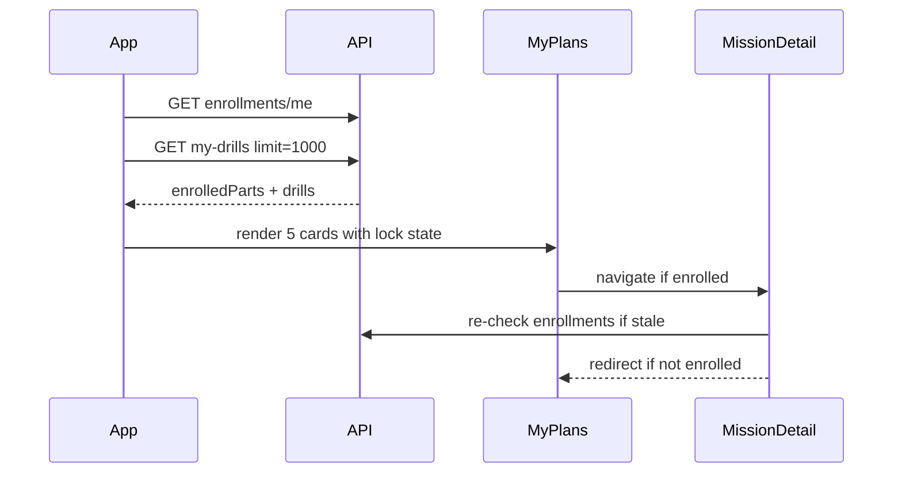

# Mobile Handoff — Learning Journey Mission Enrollment

> **Version:** 1.0 · **Date:** July 2026  
> **Status:** Backend shipped on web · Mobile UI not yet implemented  
> **Prerequisites:** Read [`MOBILE_README.md`](./MOBILE_README.md) first, then [`eklan-mobile-learning-journey-spec.md`](./eklan-mobile-learning-journey-spec.md) for the base My Learning Journey UI.  
> **Web reference:** `LEARNING_JOURNEY_MISSION_ENROLLMENT.md` (repo root), `src/app/(student)/account/drills/page.tsx`, `src/components/drills/LearningJourneyPartCard.tsx`  
> **Deep spec:** [`learning-journey-mission-enrollment.md`](./learning-journey-mission-enrollment.md)

---

## Table of Contents

1. [Overview](#1-overview)
2. [What Changed on Web](#2-what-changed-on-web)
3. [Shared Backend](#3-shared-backend)
4. [API Endpoints](#4-api-endpoints)
5. [Types](#5-types)
6. [Mobile Screen Changes](#6-mobile-screen-changes)
7. [Component Spec — Locked Mission Card](#7-component-spec--locked-mission-card)
8. [Data Flow & React Query](#8-data-flow--react-query)
9. [Route Guard — Mission Detail](#9-route-guard--mission-detail)
10. [Catalog & Grouping](#10-catalog--grouping)
11. [Edge Cases](#11-edge-cases)
12. [Parity Checklist](#12-parity-checklist)
13. [Out of Scope (Mobile v1)](#13-out-of-scope-mobile-v1)
14. [Related Docs](#14-related-docs)

---

## 1. Overview

Mission enrollment is a **new gate** on top of the existing Learning Journey UI. The mobile app uses the **same backend** as web — no separate mobile API.

### Two-layer model

| Layer | What it is | Mobile impact |
|-------|------------|---------------|
| **Enrollment** | Tutor/admin enrolls learner in Missions 1–5 | Unenrolled missions show as **locked** on My Plans |
| **Assignment** | Tutor assigns drills to learner | Drill rows inside enrolled missions (unchanged) |

### Product rules (match web)

- All **5 missions** always visible on My Plans.
- **Unenrolled** missions: greyed, lock icon, subtitle *"Not enrolled yet"*, **not tappable**.
- **Enrolled** missions: tappable, show progress (*"X of Y drills completed"*) or *"No drills assigned yet"*.
- **Mission Detail** screen: block access if learner is not enrolled (redirect + toast).
- **Pro subscription** gate still applies first (unchanged from learning journey spec).

### Who manages enrollment?

Tutors and admins enroll students via the **web Drill Builder** (`MissionEnrollmentModal`). Mobile v1 is **read-only** for learners — no self-enrollment, no tutor enrollment UI on mobile.

---

## 2. What Changed on Web

This is an **addendum** to [`eklan-mobile-learning-journey-spec.md`](./eklan-mobile-learning-journey-spec.md). Everything in that doc still applies except:

### My Plans — My Learning Journey section

| Before | After |
|--------|-------|
| All 5 mission cards always tappable | Cards split into **enrolled** (tappable) vs **locked** (not tappable) |
| Mission Detail open for any mission URL | Mission Detail requires enrollment for that `part` |

### Unchanged on mobile

- Next Session card
- Saved Drills collapsible
- Mission Detail layout (topics + drill rows) once enrolled
- `GET /drills/learner/my-drills` for drill content
- Hard-coded 5-mission catalog

---

## 3. Shared Backend

### Data model

Collection: `learner_mission_enrollments`

```ts
interface LearnerMissionEnrollment {
  learnerId: string;           // User ObjectId
  learningJourneyPart: 1 | 2 | 3 | 4 | 5;
  enrolledBy: string;          // tutor or admin User id
  enrolledAt: string;          // ISO date
  status: 'active' | 'withdrawn';
}
```

Unique index: `{ learnerId, learningJourneyPart }`

### Web source files (for reference)

| Layer | Path |
|-------|------|
| Model | `src/models/learner-mission-enrollment.ts` |
| Service | `src/domain/learning-journey/mission-enrollment.service.ts` |
| Learner API | `src/app/api/v1/learning-journey/enrollments/me/route.ts` |
| Catalog | `src/domain/learning-journey/learning-journey.catalog.ts` |

### Migration (ops — not mobile code)

Existing students with assigned journey drills are auto-enrolled via:

```bash
node scripts/migrate-mission-enrollments.mjs
```

Run in staging/production before enabling lock UI. Without migration, learners with drills may see missions locked until their tutor enrolls them.

---

## 4. API Endpoints

Base: `https://<domain>/api/v1` · Auth: `Authorization: Bearer <token>` (see `MOBILE_README.md`).

### Learner (required for mobile)

| Method | Path | Response `data` | Notes |
|--------|------|-----------------|-------|
| `GET` | `/learning-journey/enrollments/me` | `{ enrolledParts: number[] }` | e.g. `[1, 3, 5]` — active enrollments only |

**Example success:**

```json
{
  "code": "Success",
  "data": {
    "enrolledParts": [1, 2]
  }
}
```

**Empty enrollments:**

```json
{
  "code": "Success",
  "data": {
    "enrolledParts": []
  }
}
```

### Staff (web only — document for completeness)

Mobile v1 does **not** call these. Included so mobile team knows the full API surface.

| Method | Path | Who | Purpose |
|--------|------|-----|---------|
| `GET` | `/learning-journey/enrollments` | Tutor, Admin | List enrollments (tutor scoped to roster) |
| `GET` | `/learning-journey/enrollments/learner/:learnerId` | Tutor, Admin, Learner (own) | Enrolled parts for one learner |
| `PUT` | `/learning-journey/enrollments/learner/:learnerId` | Tutor, Admin | Set missions `{ parts: [1,2,3] }` |

### Existing endpoints (unchanged)

| Method | Path | Notes |
|--------|------|-------|
| `GET` | `/drills/learner/my-drills` | `limit: 1000` on journey screens for accurate progress |
| `GET` | `/users/me` or session | Pro subscription check |

### Server-side drill enforcement

If a tutor assigns a drill to an unenrolled learner, `POST /drills` and assign routes return an error. Mobile does not need extra handling — drills for unenrolled missions should not appear in journey grouping.

---

## 5. Types

Copy or generate from backend:

```ts
type LearningJourneyPartId = 1 | 2 | 3 | 4 | 5;

interface MyEnrollmentsResponse {
  enrolledParts: LearningJourneyPartId[];
}

interface LearningJourneyPart {
  part: LearningJourneyPartId;
  title: string;
  topics: Array<{ id: string; title: string; order: number }>;
}

// Mission card props (mirror web LearningJourneyPartCard)
interface MissionCardProps {
  part: LearningJourneyPartId;
  completedCount: number;
  totalCount: number;
  isEnrolled: boolean;
  isLocked: boolean; // true when !isEnrolled
}
```

**Derive lock state:**

```ts
const enrolledSet = new Set(enrolledParts);
const isEnrolled = enrolledSet.has(part);
const isLocked = !isEnrolled;
```

---

## 6. Mobile Screen Changes

### 6.1 My Plans (`my-plan/index.tsx` or equivalent)

**Add** enrollment fetch alongside existing `my-drills` call:

```
on mount:
  1. GET /users/me          → subscription gate (existing)
  2. GET /drills/learner/my-drills?limit=1000  → drills (existing)
  3. GET /learning-journey/enrollments/me      → enrolledParts (NEW)
```

**Render** all 5 mission cards from hard-coded catalog (same as web `LEARNING_JOURNEY_PARTS`):

```
for each part in catalog:
  progress = countPartJourneyProgress(drills, part)
  isEnrolled = enrolledParts.includes(part)
  render MissionCard(part, progress, isEnrolled, isLocked: !isEnrolled)
```

### 6.2 Mission Detail (`my-plan/journey/[part].tsx`)

**Add guard** after enrollments load:

```
if part is valid AND enrollments loaded AND part NOT IN enrolledParts:
  show toast: "You are not enrolled in this mission yet."
  navigate back to My Plans
  return
```

Do **not** render mission content while guard is pending or failing.

### 6.3 Deep links

If the app supports `eklan://my-plan/journey/2` or similar:

- Validate `part` is 1–5
- Run enrollment guard before rendering
- Redirect to My Plans if locked

---

## 7. Component Spec — Locked Mission Card

Mirror web `LearningJourneyPartCard.tsx`.

### Enrolled (active) card

```
┌─────────────────────────────────────────────┐
│ [1]  MISSION 1                          >   │
│      Communication with Patients            │
│      2 of 5 drills completed                │
└─────────────────────────────────────────────┘
  ↑ green/teal badge with mission number
  ↑ Pressable → Mission Detail
```

### Locked card

```
┌─────────────────────────────────────────────┐
│ [🔒]  MISSION 2                             │
│       Communication with Colleagues         │
│       Not enrolled yet                      │
└─────────────────────────────────────────────┘
  ↑ muted/grey badge with lock icon (no chevron)
  ↑ NOT pressable (opacity ~75%, no navigation)
  ↑ accessibility: accessibilityState={{ disabled: true }}
```

### Visual tokens (match web intent)

| State | Badge | Title color | Subtitle | Chevron | Pressable |
|-------|-------|-------------|----------|---------|-----------|
| Enrolled | Mission number, emerald gradient | Primary | Progress or "No drills assigned yet" | Yes | Yes |
| Locked | Lock icon, muted background | Muted | "Not enrolled yet" | No | No |

### Subtitle logic

```ts
if (isLocked) {
  subtitle = 'Not enrolled yet';
} else if (totalCount > 0) {
  subtitle = `${completedCount} of ${totalCount} drills completed`;
} else {
  subtitle = 'No drills assigned yet';
}
```

---

## 8. Data Flow & React Query



### Suggested React Query keys

```ts
// lib/query-keys.ts
learningJourney: {
  myEnrollments: () => ['learning-journey', 'enrollments', 'me'] as const,
}
```

### Suggested hook

```ts
export function useMyMissionEnrollments() {
  return useQuery({
    queryKey: queryKeys.learningJourney.myEnrollments(),
    queryFn: async () => {
      const res = await api.get('/learning-journey/enrollments/me');
      return res.data.enrolledParts as LearningJourneyPartId[];
    },
    staleTime: 2 * 60 * 1000, // 2 min — match web
  });
}
```

### Cache invalidation

Invalidate `myEnrollments` when:

- User pulls to refresh on My Plans
- User returns to My Plans from background (optional `refetchOnWindowFocus`)
- After logout/login

No mutation on mobile — enrollment changes happen on web; next fetch picks up new state.

---

## 9. Route Guard — Mission Detail

Web implementation (`journey/[part]/page.tsx`):

1. Parse `part` from route → must be 1–5
2. Wait for `enrollmentsLoading` to finish
3. If `!enrolledParts.includes(part)` → toast + redirect to My Plans
4. Invalid `part` → redirect to My Plans (no toast)

**Mobile equivalent (Expo Router):**

```tsx
useEffect(() => {
  if (enrollmentsLoading || part == null) return;
  if (!enrolledParts.includes(part)) {
    Toast.show({ type: 'error', text1: 'You are not enrolled in this mission yet.' });
    router.replace('/my-plan');
  }
}, [enrollmentsLoading, enrolledParts, part]);
```

Show a loading spinner while `enrollmentsLoading || drillsLoading` on first paint.

---

## 10. Catalog & Grouping

### Catalog

Hard-code the same 5 missions as web (`LEARNING_JOURNEY_PARTS`). Do not fetch catalog from API.

Source of truth: `src/domain/learning-journey/learning-journey.catalog.ts`

| Part | Title |
|------|-------|
| 1 | Communication with Patients |
| 2 | Communication with Colleagues |
| 3 | Communication with Doctors, Families and Friends |
| 4 | Interview Preparation |
| 5 | Bonus Scenarios |

### Grouping drills by mission

Unchanged from learning journey spec — filter `my-drills` by `drill.learning_journey_part`, group by `learning_journey_topic`.

**Enrollment does not change grouping logic** — only whether the learner can open the mission screen.

Optional: when rendering Mission Detail, only show drills for enrolled `part` (guard already prevents unenrolled access).

---

## 11. Edge Cases

| Scenario | Mobile behavior |
|----------|-----------------|
| `enrolledParts` empty `[]` | All 5 cards locked |
| Enrolled but no drills | Card tappable; Mission Detail shows empty topics with "No drills assigned for this topic yet" |
| User not subscribed | Redirect to subscription screen **before** enrollment UI (existing gate) |
| Enrollment API fails | Show error on My Plans; fall back to all locked OR retry (recommend: show error banner, don't assume enrolled) |
| Tutor enrolls on web while app open | Next refetch unlocks card |
| Tutor withdraws enrollment | Mission locks on next fetch; deep link to that mission redirects |
| Legacy drills before migration | May exist in `my-drills` but mission locked until migration or tutor enrolls |
| Free Talk rows in journey | Same enrollment rules — only visible inside enrolled mission topics |

---

## 12. Parity Checklist

Use this when implementing and QA'ing mobile against web.

### My Plans

- [ ] Fetches `GET /learning-journey/enrollments/me` on load
- [ ] Shows all 5 mission cards
- [ ] Unenrolled cards: lock icon, muted style, "Not enrolled yet", not pressable
- [ ] Enrolled cards: mission number badge, chevron, tappable
- [ ] Enrolled + no drills: "No drills assigned yet"
- [ ] Enrolled + drills: "X of Y drills completed"
- [ ] Pro subscription gate still enforced

### Mission Detail

- [ ] Blocks unenrolled `part` with toast + redirect
- [ ] Invalid `part` redirects without toast
- [ ] Uses `limit=1000` on my-drills for progress accuracy
- [ ] Topic sections and drill rows unchanged when enrolled

### API

- [ ] Bearer auth on `enrollments/me`
- [ ] Handles empty `enrolledParts`
- [ ] Handles 401 (redirect to login)

### Not required on mobile v1

- [ ] Tutor Enrollment button / modal
- [ ] `PUT` enrollments API
- [ ] Drill builder mission filter gating

---

## 13. Out of Scope (Mobile v1)

- Tutor/admin enrollment UI (`MissionEnrollmentModal`)
- Student self-enrollment
- Push notification when enrolled ("You've been enrolled in Mission 2")
- Topic-level enrollment (mission-level only)
- Sequential auto-unlock (Mission 2 after Mission 1 complete)

---

## 14. Related Docs

| Doc | Purpose |
|-----|---------|
| [`MOBILE_README.md`](./MOBILE_README.md) | Auth, API conventions, React Query |
| [`eklan-mobile-learning-journey-spec.md`](./eklan-mobile-learning-journey-spec.md) | Base journey UI (missions, topics, drill rows) |
| [`learning-journey-mission-enrollment.md`](./learning-journey-mission-enrollment.md) | Full system spec (web + backend) |
| [`LEARNING_JOURNEY_MISSION_ENROLLMENT.md`](../LEARNING_JOURNEY_MISSION_ENROLLMENT.md) | Web implementation guide |
| [`eklan-learners-journey.md`](./eklan-learners-journey.md) | Curriculum content (5 missions, 24 topics) |

---

## Quick implementation order (mobile team)

1. Add `GET /learning-journey/enrollments/me` to API client + `useMyMissionEnrollments` hook
2. Update My Plans mission cards with locked vs enrolled states
3. Add Mission Detail route guard
4. QA with parity checklist
5. Test against staging after migration script has run
