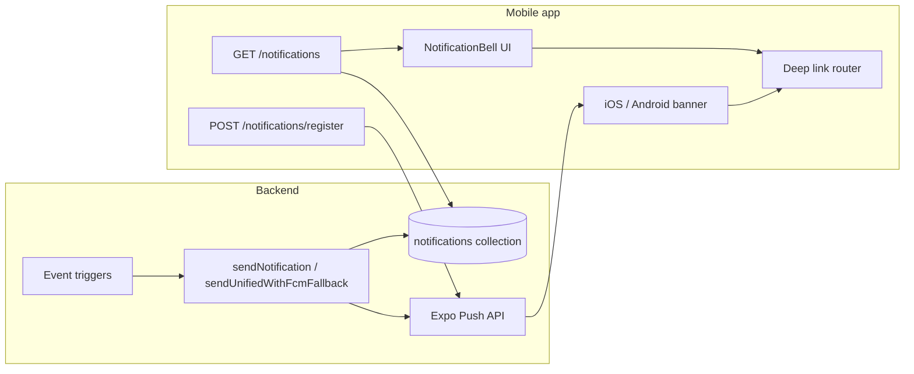

# Mobile Handoff — Notification Bell & In-App Notifications

> **Prerequisites**: Read [`MOBILE_README.md`](./MOBILE_README.md) first for auth, error envelope, and React Query conventions.
>
> **Related docs**:
> - [`MOBILE_HOME.md`](./MOBILE_HOME.md) — Home layout (bell lives in the greeting header)
> - [`MOBILE_SETTINGS.md`](./MOBILE_SETTINGS.md) — Expo push token registration + notification preference toggles
> - [`NOTIFICATION_IMPLEMENTATION_COMPLETE.md`](./NOTIFICATION_IMPLEMENTATION_COMPLETE.md) — Server-side trigger overview (FCM / unified delivery)

---

## 1. Overview

The **notification bell** is the in-app inbox for a learner (or tutor). It shows the same notification records the web app shows — persisted in MongoDB and fetched via REST. Push notifications (Expo) are a **delivery channel**; the bell reads from the **in-app notification store**.

| Layer | What it does | Mobile stack |
|-------|----------------|--------------|
| **In-app inbox** | List, unread badge, mark read, delete, deep links | `GET /notifications` + bell UI |
| **Push delivery** | OS banner when app is backgrounded | `expo-notifications` + `POST /notifications/register` |
| **Preference toggles** | Email-style opt-outs on profile | `PATCH /users/preferences` (separate from token registration) |

**Web reference files**

| Piece | Path |
|-------|------|
| Bell + dropdown | `src/components/notifications/NotificationBell.tsx` |
| Full notifications page | `src/app/(student)/account/notifications/page.tsx` |
| React Query hooks | `src/hooks/useNotifications.ts` |
| REST API | `src/app/api/v1/notifications/**` |
| Notification model + types | `src/models/notification.model.ts` |
| Server triggers (titles, bodies, deep links) | `src/services/notification/triggers.ts` |
| Unified send (in-app + Expo + web push) | `src/services/notification/index.ts`, `delivery.ts` |

**Where the bell appears on web**

- Home greeting header (`HomeGreetingClient`) — primary placement
- My Plans header (`/account/drills`)

Mobile should place the bell in the same header cluster as streak / badges on **Home** and **My Plan**.

---

## 2. Architecture



Every successful server send **always creates an in-app row** (`Notification.create`). Mobile inbox parity does not depend on push delivery succeeding — if push fails, the bell still shows the item after the next fetch.

---

## 3. REST API

All paths relative to `/api/v1`. Auth: `Authorization: Bearer <token>`.

> **Response envelope**: Notification endpoints return a **flat JSON object** — **not** wrapped in `{ code, data }`. This differs from many other v1 routes.

### 3.1 List notifications

```http
GET /notifications?limit=20&skip=0&unreadOnly=false
Authorization: Bearer <token>
```

| Query | Default | Notes |
|-------|---------|-------|
| `limit` | `20` | Bell dropdown uses **10** on web; full page uses **50** |
| `skip` | `0` | Pagination offset |
| `unreadOnly` | `false` | Set `true` for Unread filter tab |

**Response**

```json
{
  "notifications": [
    {
      "_id": "674a1b2c3d4e5f6789012345",
      "userId": "...",
      "title": "New Drill Assigned! 📚",
      "body": "Your tutor assigned you \"Restaurant Roleplay\"",
      "type": "drill_assigned",
      "data": {
        "screen": "DrillDetail",
        "resourceId": "674...",
        "resourceType": "drill",
        "url": "/account/drills/674..."
      },
      "isRead": false,
      "readAt": null,
      "pushSentAt": "2026-07-10T12:00:00.000Z",
      "pushDelivered": true,
      "createdAt": "2026-07-10T12:00:00.000Z",
      "updatedAt": "2026-07-10T12:00:00.000Z"
    }
  ],
  "unreadCount": 3,
  "pagination": {
    "limit": 20,
    "skip": 0,
    "hasMore": true
  }
}
```

**Sort order**: `createdAt` descending (newest first) — server-side in `getNotifications()`.

**TTL**: Notifications auto-expire after **90 days** (MongoDB TTL index).

### 3.2 Mark one as read

```http
PATCH /notifications/{notificationId}
Authorization: Bearer <token>
```

**Response**: `{ "success": true }`  
**404** if notification not found or not owned by user.

### 3.3 Mark all as read

```http
POST /notifications/read-all
Authorization: Bearer <token>
```

**Response**: `{ "success": true, "markedCount": 5 }`

### 3.4 Delete notification

```http
DELETE /notifications/{notificationId}
Authorization: Bearer <token>
```

**Response**: `{ "success": true }`

### 3.5 Register Expo push token

```http
POST /notifications/register
Authorization: Bearer <token>
Content-Type: application/json

{
  "platform": "expo",
  "token": "ExponentPushToken[xxxx]",
  "deviceInfo": {
    "deviceName": "iPhone 15",
    "osVersion": "17.4",
    "appVersion": "1.2.0"
  }
}
```

**Response**: `{ "success": true, "tokenId": "..." }`

`platform` enum: `expo` | `web` | `fcm` — mobile uses **`expo`**.

### 3.6 Unregister push token (logout)

```http
DELETE /notifications/register?token={expoPushToken}
Authorization: Bearer <token>
```

**Response**: `{ "success": true }`

### 3.7 Web-only — skip on mobile

| Endpoint | Reason |
|----------|--------|
| `GET /notifications/vapid-key` | Web Push (VAPID) only |

---

## 4. TypeScript types

```ts
// types/notifications.ts

export type NotificationType =
  | 'drill_assigned'
  | 'drill_reminder'
  | 'drill_reviewed'
  | 'drill_completed'
  | 'daily_focus'
  | 'achievement'
  | 'message'
  | 'tutor_update'
  | 'system'
  | 'class_session_reminder'
  | 'class_nps_form'
  | 'weekly_drill_digest'
  | 'weekly_challenge_ready';

export interface NotificationData {
  screen?: string;
  resourceId?: string;
  resourceType?: string;
  url?: string;
  assignmentId?: string;
  weekStartDate?: string;
  weekKey?: string;
  sessionId?: string;
  drillId?: string;
  [key: string]: unknown;
}

export interface AppNotification {
  _id: string;
  title: string;
  body: string;
  type: NotificationType | string;
  data?: NotificationData;
  isRead: boolean;
  readAt?: string | null;
  createdAt: string;
}

export interface NotificationsResponse {
  notifications: AppNotification[];
  unreadCount: number;
  pagination: {
    limit: number;
    skip: number;
    hasMore: boolean;
  };
}
```

---

## 5. React Query / fetching (match web)

```ts
// Bell dropdown — web uses limit: 10
useQuery({
  queryKey: ['notifications', { limit: 10, unreadOnly: false }],
  queryFn: () => fetchNotifications({ limit: 10 }),
  staleTime: 30_000,       // 30 seconds
  refetchInterval: 60_000, // poll every 60 seconds while mounted
});

// Full notifications screen — web uses limit: 50
useQuery({
  queryKey: ['notifications', { limit: 50, unreadOnly: filter === 'unread' }],
  queryFn: () => fetchNotifications({ limit: 50, unreadOnly: filter === 'unread' }),
  staleTime: 30_000,
});
```

**Invalidate** `['notifications']` after:

- Mark one read (`PATCH`)
- Mark all read (`POST read-all`)
- Delete (`DELETE`)
- User returns to Home from a push deep link (optional refresh)

---

## 6. NotificationBell UI spec

### 6.1 Bell button

| Element | Behavior |
|---------|----------|
| Icon | Bell outline, ~24px, gray |
| Badge | Red pill, top-right; hidden when `unreadCount === 0` |
| Badge text | `unreadCount`, or **`99+`** when `> 99` |
| `aria-label` | `Notifications (N unread)` when count > 0 |

### 6.2 Dropdown / bottom sheet (mobile)

Web uses a right-aligned dropdown (`w-80` / `w-96`, max height 400px). On mobile, use a **bottom sheet** (`@gorhom/bottom-sheet`) or full-screen modal with the same content.

**Header**

- Title: **Notifications**
- **Mark all read** — visible only when `unreadCount > 0`; calls `POST /read-all`

**Row layout** (each notification)

| Zone | Content |
|------|---------|
| Icon circle | Emoji by `type` (see §7) |
| Title | `notification.title` — bolder when unread |
| Body | `notification.body` — 2-line clamp in dropdown |
| Time | Relative time (`formatDistanceToNow`, e.g. "5 minutes ago") |
| Unread dot | Blue dot when `!isRead` |
| Delete | Trash icon — `DELETE /notifications/:id` (stop propagation so row tap doesn't fire) |

**Unread styling**: Light blue background (`bg-blue-50/50` on web).

**Footer** (when list non-empty): **View all notifications** → navigates to full list screen.

**Empty state**: Bell icon + "No notifications yet"

**Loading**: Centered spinner in list area.

### 6.3 Tap behavior (critical — match web)

```ts
async function onNotificationPress(notification: AppNotification) {
  // 1. Mark read if unread
  if (!notification.isRead) {
    await api.patch(`/notifications/${notification._id}`);
    queryClient.invalidateQueries({ queryKey: ['notifications'] });
  }

  // 2. Navigate via deep link (§8)
  navigateFromNotification(notification.data);

  // 3. Close sheet
  closeSheet();
}
```

Web bell uses `notification.data?.url` as the `href`. Full notifications page does the same via `router.push(notification.data.url)`.

### 6.4 Full notifications screen

Route: `notifications/index.tsx` (or `home/notifications.tsx`).

| Feature | Web behavior |
|---------|--------------|
| Filter tabs | **All** / **Unread** (`unreadOnly=true`) |
| Unread tab label | `Unread (N)` when count > 0 |
| Mark all read | Same as dropdown |
| Row | Larger icon (48px), delete button always visible |
| Unread row | Left blue border + "New" pill |
| Empty copy | "No unread notifications" / "No notifications yet" |

---

## 7. Notification type → icon & color

Copy from web `NotificationBell.tsx` / notifications page:

```ts
const notificationStyles: Record<string, { icon: string; bgColor: string }> = {
  drill_assigned:       { icon: '📚', bgColor: 'bg-blue-100' },
  drill_reminder:       { icon: '⏰', bgColor: 'bg-amber-100' },
  drill_reviewed:       { icon: '✅', bgColor: 'bg-green-100' },
  drill_completed:      { icon: '📝', bgColor: 'bg-primary-100' },
  daily_focus:          { icon: '🎯', bgColor: 'bg-indigo-100' },
  achievement:          { icon: '🏆', bgColor: 'bg-yellow-100' },
  message:              { icon: '💬', bgColor: 'bg-cyan-100' },
  tutor_update:         { icon: '👨‍🏫', bgColor: 'bg-pink-100' },
  class_session_reminder: { icon: '📅', bgColor: 'bg-violet-100' },
  class_nps_form:       { icon: '⭐', bgColor: 'bg-orange-100' },
  weekly_drill_digest:  { icon: '🗓️', bgColor: 'bg-teal-100' },
  weekly_challenge_ready: { icon: '🏆', bgColor: 'bg-amber-100' },
  system:               { icon: '📢', bgColor: 'bg-gray-100' },
};

// Fallback for unknown types
const style = notificationStyles[notification.type] ?? notificationStyles.system;
```

---

## 8. Deep linking — stay in sync with web

Each notification carries navigation hints in `data`:

| Field | Purpose |
|-------|---------|
| `screen` | **Preferred** mobile route key (stable contract) |
| `resourceId` | Primary entity id (drill, focus, session, etc.) |
| `resourceType` | Entity kind (`drill`, `daily_focus`, `weekly_challenge`, …) |
| `url` | Web path — **fallback** if `screen` unmapped |

### 8.1 `screen` → mobile route map (learner app)

| `data.screen` | Typical `resourceId` / extras | Mobile route |
|---------------|------------------------------|--------------|
| `DrillDetail` | `resourceId` = drill `_id` | `/my-plan/drills/[id]` — pass `assignmentId` if present in `data` |
| `DrillCompleted` | `resourceId` = drill `_id`, `assignmentId` in `data` | `/my-plan/drills/[id]/completed?assignmentId=...` |
| `DailyFocus` | `resourceId` = daily focus `_id` | `/daily-focus/[id]` |
| `MyPlan` | — | My Plan tab `/my-plan` |
| `Home` | — | Home tab `/home` |
| `Classes` | `resourceId` = session id (optional) | `/classes` |
| `WeeklyChallenge` | `weekStartDate` in `data` | `/practice/weekly-challenge/[weekStartDate]` — **URL-decode** the segment |
| `Achievements` | — | `/achievements` or badges screen |
| `NpsForm` | `url` = full form URL | Open `data.url` in in-app WebView / browser |
| `Notifications` | — | Notifications list screen |
| `TutorStudentDetail` | tutor-only | Skip or tutor app route |

### 8.2 Web `url` → mobile fallback parser

If `screen` is missing, map known web prefixes:

```ts
function navigateFromNotification(data?: NotificationData) {
  if (!data) return;

  // Prefer explicit screen contract
  if (data.screen) {
    routeByScreen(data);
    return;
  }

  const url = data.url ?? '';
  if (url.startsWith('/account/drills/') && url.includes('/completed')) {
    // /account/drills/:id/completed?assignmentId=
    const { drillId, assignmentId } = parseDrillCompletedUrl(url);
    router.push({ pathname: '/my-plan/drills/[id]/completed', params: { id: drillId, assignmentId } });
  } else if (url.match(/^\/account\/drills\/[^/]+$/)) {
    const drillId = url.split('/').pop()!;
    router.push({ pathname: '/my-plan/drills/[id]', params: { id: drillId } });
  } else if (url.startsWith('/account/daily-focus/')) {
    const id = url.split('/').pop()!;
    router.push({ pathname: '/daily-focus/[id]', params: { id } });
  } else if (url.startsWith('/account/practice/weekly-challenge/')) {
    const encoded = url.split('/').pop()!;
    const weekStartDate = decodeURIComponent(encoded);
    router.push({ pathname: '/practice/weekly-challenge/[weekStartDate]', params: { weekStartDate } });
  } else if (url === '/account/drills' || url === '/account') {
    router.push(url === '/account' ? '/home' : '/my-plan');
  } else if (url.startsWith('/account/classes')) {
    router.push('/classes');
  } else if (data.url) {
    Linking.openURL(/* absolute URL if external NPS form */);
  }
}
```

Weekly challenge paths use `encodeURIComponent(weekStartDate)` on the server — always **decode** before API calls.

### 8.3 Notification catalog (what learners receive)

| `type` | Example title | Trigger | `data.screen` | `data.url` |
|--------|---------------|---------|---------------|------------|
| `drill_assigned` | New Drill Assigned! 📚 | Tutor assigns drill | `DrillDetail` | `/account/drills/{drillId}` |
| `drill_reminder` | Time to practise today / Don't Break Your Streak! 🔥 | Daily nudge, streak, practice reminder | `MyPlan` or `Home` | `/account/drills` or `/account` |
| `drill_reviewed` | Drill Reviewed! ✅ | Tutor reviews submission | `DrillCompleted` | `/account/drills/{id}/completed?assignmentId=` |
| `daily_focus` | Today's Focus is Ready! 🎯 | Admin publishes today's focus | `DailyFocus` | `/account/daily-focus/{focusId}` |
| `achievement` | Achievement Unlocked! 🏆 | Badge earned | `Achievements` | `/account/achievements` |
| `class_session_reminder` | Class starts in N minutes | Class cron | `Classes` | `/account/classes` |
| `class_nps_form` | How was your class? | Post-class NPS email cron | `NpsForm` | External form URL |
| `weekly_drill_digest` | Your new drills are ready | Weekly digest cron | `MyPlan` | `/account/drills` |
| `weekly_challenge_ready` | Your weekly challenge is ready | Challenge generation | `WeeklyChallenge` | `/account/practice/weekly-challenge/{encodedWeekStart}` |
| `system` | (varies) | Admin announcement | `Notifications` | custom or `/account/notifications` |

Tutor-only types (`drill_completed`, `tutor_update`) use tutor URLs — ignore in learner builds.

---

## 9. Push notifications (Expo)

In-app bell and push share the **same server `data` payload** on unified delivery paths.

### 9.1 Register token after login

Call once per session / on Home first mount (see [`MOBILE_SETTINGS.md`](./MOBILE_SETTINGS.md) §9):

```ts
import * as Notifications from 'expo-notifications';
import { Platform } from 'react-native';

Notifications.setNotificationHandler({
  handleNotification: async () => ({
    shouldShowAlert: true,
    shouldPlaySound: true,
    shouldSetBadge: true,
  }),
});

export async function registerExpoPushToken() {
  const { status } = await Notifications.requestPermissionsAsync();
  if (status !== 'granted') return null;

  const token = (await Notifications.getExpoPushTokenAsync()).data;

  await api.post('/notifications/register', {
    platform: 'expo',
    token,
    deviceInfo: { platform: Platform.OS },
  });

  return token;
}
```

### 9.2 Handle notification tap (foreground + background)

```ts
// Cold start / background tap
Notifications.addNotificationResponseReceivedListener((response) => {
  const data = response.notification.request.content.data as NotificationData;
  navigateFromNotification(data);
  queryClient.invalidateQueries({ queryKey: ['notifications'] });
});

// Foreground receipt — optionally show in-app toast; inbox still updates on poll
Notifications.addNotificationReceivedListener(() => {
  queryClient.invalidateQueries({ queryKey: ['notifications'] });
});
```

Expo push `data` fields are stringified on some legacy FCM paths — coerce with `String(value)` when reading.

### 9.3 Badge count

Sync iOS app icon badge with `unreadCount` from `GET /notifications`:

```ts
import * as Notifications from 'expo-notifications';

useEffect(() => {
  Notifications.setBadgeCountAsync(unreadCount).catch(() => {});
}, [unreadCount]);
```

### 9.4 Logout

`DELETE /notifications/register?token=...` then clear badge.

---

## 10. What *not* to do on mobile

| Mistake | Symptom | Fix |
|---------|---------|-----|
| Expect `{ code, data }` wrapper on `/notifications` | Parse errors | Use flat response shape |
| Only listen to push, skip `GET /notifications` | Bell empty while pushes work | Poll/fetch inbox API |
| Ignore `data.screen` | Wrong screen on new notification types | Route by `screen` first |
| Forget `decodeURIComponent` on weekly challenge week | 404 on challenge screen | Decode URL segment |
| Use Web Push / VAPID | Broken on native | Expo push only |
| Skip mark-read on tap | Unread badge stuck | `PATCH` before navigate (same as web) |
| Hard-code Sunday for challenge notifications | Wrong promo timing | Use server `weekStartDate` from payload |

---

## 11. End-to-end flow example

1. Tutor assigns drill → server `sendNotification` creates DB row + sends Expo push.
2. Learner's bell poll (`refetchInterval: 60s`) picks up `unreadCount: 1`.
3. Red badge appears on bell.
4. Learner opens sheet → sees "New Drill Assigned! 📚".
5. Taps row → `PATCH` marks read → navigates to `/my-plan/drills/{drillId}`.
6. Badge clears; row styling updates to read.

If learner taps the **OS push** instead:

1. App opens → `addNotificationResponseReceivedListener` fires.
2. `navigateFromNotification(data)` with same `screen` / `url`.
3. Invalidate notifications query → bell stays in sync.

---

## 12. File layout (Expo Router)

```
app/(student)/
├── home/
│   └── index.tsx              ← NotificationBell in header
├── my-plan/
│   └── index.tsx              ← NotificationBell in header (optional, matches web)
└── notifications/
    └── index.tsx              ← Full list (View all)
```

Suggested shared modules:

```
components/notifications/
├── NotificationBell.tsx       ← Badge + sheet trigger
├── NotificationList.tsx       ← Reusable list rows
└── notification-styles.ts     ← Icon/color map

lib/notifications/
├── api.ts                     ← fetch, markRead, delete, register
├── deep-links.ts              ← navigateFromNotification()
└── expo-push.ts               ← register + listeners
```

---

## 13. Acceptance checklist

- [ ] Bell visible on Home header (and My Plan if matching web)
- [ ] Unread badge shows count; displays `99+` when > 99
- [ ] Dropdown/sheet lists latest **10** notifications, newest first
- [ ] Unread rows visually distinct (background + dot / "New" pill)
- [ ] Tap row marks unread as read via `PATCH`
- [ ] Tap row navigates to correct screen for every `type` in §8.3
- [ ] "Mark all read" works and clears badge
- [ ] Delete removes row via `DELETE`
- [ ] "View all" opens full list with All / Unread filters (`limit=50`)
- [ ] `GET /notifications` polled every ~60s on Home (or refetch on focus)
- [ ] Expo token registered via `POST /notifications/register` after login
- [ ] Push tap uses same deep link logic as in-app tap
- [ ] iOS badge synced to `unreadCount`
- [ ] Token unregistered on logout
- [ ] No VAPID / web push code on native
- [ ] Notifications without `data.url` still render (no crash); fallback to list screen

---

## 14. Quick reference — web code map

```text
HomeGreetingClient
  └── NotificationBell
        ├── useNotifications({ limit: 10 })     → GET /notifications
        ├── useMarkAsRead()                     → PATCH /notifications/:id
        ├── useMarkAllAsRead()                  → POST /notifications/read-all
        ├── useDeleteNotification()             → DELETE /notifications/:id
        ├── Badge: data.unreadCount
        ├── Row tap: mark read + Link to data.url
        └── Footer: /account/notifications

/account/notifications/page.tsx
  └── Same hooks, limit: 50, unread filter, router.push(data.url)
```

Server always persists notifications in `sendNotification()` before push — mobile inbox is the same source of truth as web.
