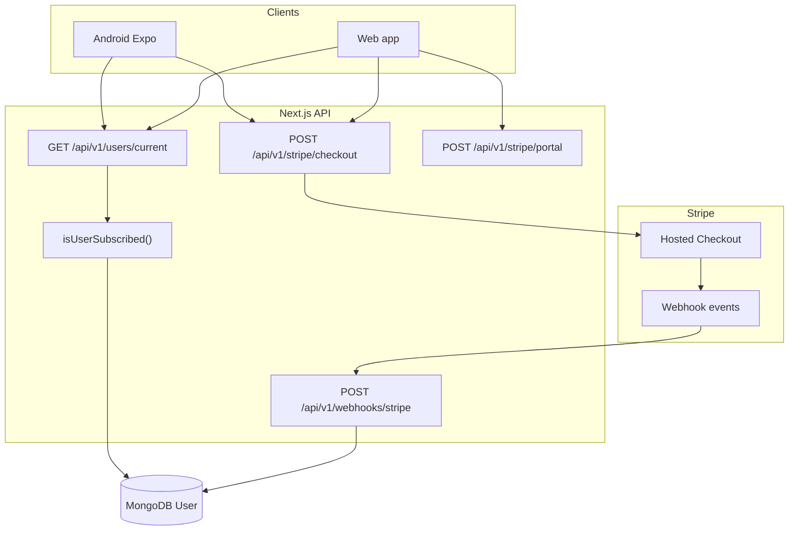
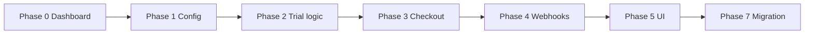

# Stripe Payment System Upgrade — Phased Implementation Guide

> **Audience:** Backend, web, Android (Expo), and ops teams.  
> **Scope:** Stripe only — multi-plan pricing, gated trial, grandfathering, webhooks, and go-live.  
> **Out of scope:** Apple IAP / StoreKit (see [PRICING_AND_TRIAL_MIGRATION.md](./PRICING_AND_TRIAL_MIGRATION.md) § PR 4 when ready).  
> **Status:** Phases 1–6 **complete**; Phase 7 **code complete** (ops test-clock verification pending); Phase 8 **automated suite complete** (live Stripe checklist ops); Phase 9 pending; **Phase 10** (Zero Pause cohort pricing) **complete**. See [progress tracker](#progress-tracker).

**Parent plan:** [PRICING_AND_TRIAL_MIGRATION.md](./PRICING_AND_TRIAL_MIGRATION.md)  
**Current Stripe reference:** [docs/stripe-implementation.md](./docs/stripe-implementation.md)  
**Keys & env safety:** [docs/STRIPE_PAYMENTS_AND_KEYS.md](./docs/STRIPE_PAYMENTS_AND_KEYS.md)  
**Webhook incident audit:** [docs/stripe-webhook-subscription-upgrade-audit.md](./docs/stripe-webhook-subscription-upgrade-audit.md)

**Stripe API version in codebase:** `2026-04-22.dahlia` (keep SDK and server calls aligned).

---


## Progress tracker

Use this table to track where you are. Complete phases **in order** unless noted.


| Phase | Name                                                                                        | Risk       | User impact              | Status |
| ----- | ------------------------------------------------------------------------------------------- | ---------- | ------------------------ | ------ |
| **0** | [Stripe Dashboard setup](#phase-0--stripe-dashboard-setup-no-code)                          | Low        | None                     | ☐      |
| **1** | [Config & environment variables](#phase-1--config--environment-variables)                   | Low        | None                     | ☑      |
| **2** | [Trial eligibility logic](#phase-2--trial-eligibility-logic)                                | Low        | None (library only)      | ☑      |
| **3** | [Checkout API upgrade](#phase-3--checkout-api-upgrade)                                      | Medium     | New checkouts            | ☑      |
| **4** | [Webhook hardening & billing period sync](#phase-4--webhook-hardening--billing-period-sync) | Medium     | All Stripe subscribers   | ☑      |
| **5** | [Web UI & eligibility API](#phase-5--web-ui--eligibility-api)                               | Medium     | New checkouts            | ☑      |
| **6** | [Android / mobile Stripe contract](#phase-6--android--mobile-stripe-contract)               | Low        | Android paywall          | ☑      |
| **7** | [Grandfather existing monthly payers](#phase-7--grandfather-existing-monthly-payers)        | **Higher** | Existing subs at renewal | ☑      |
| **8** | [Testing (all phases)](#phase-8--testing)                                                   | —          | QA only                  | ☑      |
| **9** | [Production deploy & go-live](#phase-9--production-deploy--go-live)                         | Medium     | Everyone on Stripe       | ☐      |
| **10** | [Zero Pause Challenge community pricing](#phase-10--zero-pause-challenge-community-pricing) | Medium     | Maintainer default (public $) + Challenge ~$1.99 windows | ☑      |


**Recommended PR mapping:**


| PR                           | Phases        |
| ---------------------------- | ------------- |
| PR 1 (config)                | 0 → 1 → 2     |
| PR 2 (checkout + trial + UI) | 3 → 4 → 5 → 6 |
| PR 3 (migration)             | 7             |
| PR 4 (Zero Pause cohorts)    | 10            |


---


## Locked business rules (Stripe)

These are confirmed product rules. Do not change without sign-off.


| Rule                               | Behavior                                                                                                                              |
| ---------------------------------- | ------------------------------------------------------------------------------------------------------------------------------------- |
| **New monthly**                    | US$20 / month (Maintainer / default)                                                                                                  |
| **Quarterly**                      | US$60 / 3 months (Maintainer / public)                                                                                                |
| **Annual**                         | $200 / year (Maintainer / public)                                                                                                     |
| **Legacy monthly (“one ninety-nine”)** | Existing Price `STRIPE_PREMIUM_MONTHLY_PRICE_ID_LEGACY` (~US$1.99) — **not** a new $199 price                                      |
| **Free trial**                     | **14 days**, only for accounts created **on or after** `SUBSCRIPTION_TRIAL_LAUNCH_AT` who have **never** subscribed (Stripe or Apple). Maintainer Checkout trial unchanged. **Cardless signup trial** is **out of scope** |
| **Pre-launch free accounts**       | No trial — pay from day one                                                                                                           |
| **Former / current subscribers**   | No trial — pay from day one                                                                                                           |
| **Existing Stripe monthly payers** | Keep **legacy price** until `current_period_end`; US$20 at **next renewal** (no mid-cycle proration)                                  |
| **Zero Pause Maintainer** (default)| Every new registrant; no date window → new pricing + existing trial rules                                                             |
| **Zero Pause Challenge**           | Admin assigns Challenge + **start + end** dates. During `[start, end]` inclusive: Checkout **legacy monthly only** (no quarterly/annual) |
| **Zero Pause Mastery**             | Badge/add-on only — **does not** switch Pro price by itself; price follows Challenge window vs Maintainer/public                      |


### Zero Pause pricing cohorts

| Cohort | Who | What they see / pay |
| ------ | --- | ------------------- |
| **Zero Pause Maintainer** (default) | Every new registrant; anyone not in an active Challenge window | New pricing: monthly US$20 / quarterly US$60 / annual $200; existing trial eligibility |
| **Zero Pause Challenge** | Admin assigns Challenge + **start date + end date** | During `[start, end]` inclusive: **only** legacy monthly Checkout (~US$1.99). Not on the new pricing system for that window |
| **Zero Pause Mastery** | Admin assign (unchanged) | Label/add-on; Pro price follows Challenge vs Maintainer rules above |

**Lifecycle:** signup → Maintainer (new prices) → admin sets Challenge window → legacy monthly only → window ends → Maintainer again → if still on legacy Price, schedule prior public plan at next renewal (Phase 7 helper). See [Phase 10](#phase-10--zero-pause-challenge-community-pricing).

**Data migration:** after deploying this role correction, run `npm run migrate:swap-zero-pause-cohorts` (dry-run) then `--execute` once per environment to flip existing `challenge` ↔ `maintainer` product keys. If that script was already executed under the **swapped** (incorrect) mapping, run dry-run then `--execute` **once more** — the flip is an involution and corrects a prior wrong flip.

### Trial eligibility (authoritative server-side)

```typescript
const LAUNCH_DATE = new Date(process.env.SUBSCRIPTION_TRIAL_LAUNCH_AT!);

function isEligibleForTrial(user: IUser): boolean {
  const isPostLaunchAccount = user.createdAt >= LAUNCH_DATE;
  const neverHadAnySubscription =
    !user.subscriptionActivatedAt &&
    !user.subscriptionProvider &&
    !user.stripeSubscriptionId &&
    !user.appleOriginalTransactionId;
  return isPostLaunchAccount && neverHadAnySubscription;
}
```

**Secondary Stripe check (belt-and-suspenders):** before granting trial, call `stripe.subscriptions.list({ customer, status: 'all', limit: 1 })`. If any subscription exists, deny trial. Stripe cannot see Apple history — the DB predicate above is cross-platform truth.

**Re-subscribers:** Never clear `subscriptionActivatedAt` on downgrade. Stripe forgets trial usage; your DB must not.

---


## Current vs target state


### Today (baseline in repo)


| Area                  | Current                                                                                                  |
| --------------------- | -------------------------------------------------------------------------------------------------------- |
| Checkout              | **Monthly only** — single `STRIPE_PREMIUM_MONTHLY_PRICE_ID` in `src/app/api/v1/stripe/checkout/route.ts` |
| Trial                 | **None** — no `trial_period_days`, no `isEligibleForTrial`                                               |
| Config                | Only `STRIPE_PREMIUM_MONTHLY_PRICE_ID` exported from `src/lib/api/config.ts`                             |
| Billing period mapper | `src/lib/api/stripe-billing-period.ts` already knows quarterly/annual env keys (partial)                 |
| Webhooks              | 5 events handled; user lookup **hardened** via `findUserByStripeCustomer`                                |
| Checkout metadata     | No `client_reference_id` or session `metadata` yet                                                       |
| Migration             | No Subscription Schedules for legacy → new price                                                         |


### Target (after all phases)


| Area      | Target                                                                                   |
| --------- | ---------------------------------------------------------------------------------------- |
| Checkout  | Accept `{ billingPeriod: 'monthly' | 'quarterly' | 'annual' }`; resolve correct Price ID |
| Trial     | Server-gated `subscription_data.trial_period_days: 14` when eligible                     |
| Webhooks  | Set `subscriptionBillingPeriod` from price ID; handle schedule events (Phase 7)          |
| UI        | Plan picker + trial copy only when server says eligible                                  |
| Migration | Legacy monthly subs move to US$20 at renewal via Subscription Schedules                  |


---


## Architecture (Stripe rail only)




**Access rule:** All premium API routes use `withPremium` → HTTP **402** `SubscriptionRequired`. Mobile only needs to handle 402 — no Stripe SDK on device.

**Payment flow:**

1. Client → `POST /api/v1/stripe/checkout` with optional `billingPeriod`
2. Server creates/reuses Customer, saves `stripeCustomerId`, returns `{ url }`
3. Client opens Stripe-hosted Checkout (browser / Custom Tabs / expo-web-browser)
4. Stripe fires webhooks → MongoDB updated
5. Client polls `GET /api/v1/users/current` until `isSubscribed: true`

---


## Phase 0 — Stripe Dashboard setup (no code)

Complete in **test mode first**, then mirror in **live**.

### Product structure

One Product (e.g. "Eklan Pro"), multiple **Price** objects. **Never edit** an existing live Price amount — create new Prices and archive old ones after migration.


| Price          | Amount    | Recurring        | Env var (Phase 1)                        |
| -------------- | --------- | ---------------- | ---------------------------------------- |
| Legacy monthly | (current) | `month`, count 1 | `STRIPE_PREMIUM_MONTHLY_PRICE_ID_LEGACY` |
| New monthly    | US$20     | `month`, count 1 | `STRIPE_PREMIUM_MONTHLY_PRICE_ID`        |
| Quarterly      | US$60     | `month`, count 3 | `STRIPE_PREMIUM_QUARTERLY_PRICE_ID`      |
| Annual         | $200      | `year`, count 1  | `STRIPE_PREMIUM_ANNUAL_PRICE_ID`         |


### Dashboard steps

1. Stripe Dashboard → **Products** → select Pro product (or create).
2. **Add price** for each new tier.
3. Copy each `price_...` ID for env vars.
4. Set `tax_behavior` explicitly on new Prices if using Stripe Tax (immutable after creation).
5. **Do not** attach a trial to the Price object — trial is gated server-side via Checkout `subscription_data.trial_period_days`.
6. After Phase 7 migration completes, archive legacy monthly Price (`active: false`).


### Webhook endpoint (test + live separately)

Register **one endpoint per environment**:


| Setting          | Value                                                                                                                                    |
| ---------------- | ---------------------------------------------------------------------------------------------------------------------------------------- |
| URL              | `https://<host>/api/v1/webhooks/stripe`                                                                                                  |
| Events (minimum) | `checkout.session.completed`, `customer.subscription.updated`, `customer.subscription.deleted`, `invoice.paid`, `invoice.payment_failed` |
| Recommended add  | `customer.subscription.created`, `subscription_schedule.created`, `subscription_schedule.completed`, `subscription_schedule.released`    |


Copy each endpoint's **Signing secret** (`whsec_...`) into the matching deployment's `STRIPE_WEBHOOK_SECRET`.

### API keys


| Environment | Key type                             | Prefix                   |
| ----------- | ------------------------------------ | ------------------------ |
| Development | Test secret or restricted            | `sk_test_` or `rk_test_` |
| Production  | **Restricted API Key** (recommended) | `rk_live_`               |


Minimum RAK permissions: Customers (write), Checkout Sessions (write), Billing Portal (write), Subscriptions (read), Prices (read).

**References:**

- [How products and prices work](https://docs.stripe.com/products-prices/how-products-and-prices-work)
- [Manage products and prices](https://docs.stripe.com/products-prices/manage-prices)
- [Restricted API keys](https://docs.stripe.com/keys/restricted-api-keys)
- [Go-live checklist](https://docs.stripe.com/get-started/checklist/go-live)


### Phase 0 exit criteria

- [x] All four Price IDs copied (test mode)
- [x] Webhook endpoint registered in test Dashboard with required events
- [x] Test `whsec_...` saved for local dev
- [x] Live Prices + webhook planned (can create live objects before code deploy)

---


## Phase 1 — Config & environment variables

**Goal:** App knows all Price IDs and trial launch date. **No user-facing change** — checkout stays monthly-only until Phase 3.

### Environment variables

Add to `.env.local` (dev) and Vercel/hosting secrets (staging/production). **Never commit secrets.**

```bash
# ── Existing (required) ──────────────────────────────────────────────────────
STRIPE_SECRET_KEY=sk_test_...              # or rk_test_ / rk_live_ in prod
STRIPE_WEBHOOK_SECRET=whsec_...            # one secret per webhook endpoint + mode

# ── New (Phase 1) ────────────────────────────────────────────────────────────
STRIPE_PREMIUM_MONTHLY_PRICE_ID=price_...        # NEW US$20 — new checkouts (Phase 3+)
STRIPE_PREMIUM_MONTHLY_PRICE_ID_LEGACY=price_... # OLD monthly — grandfathered subs
STRIPE_PREMIUM_QUARTERLY_PRICE_ID=price_...
STRIPE_PREMIUM_ANNUAL_PRICE_ID=price_...
SUBSCRIPTION_TRIAL_LAUNCH_AT=2026-08-01T00:00:00.000Z

# ── App URL (checkout redirects) ─────────────────────────────────────────────
NEXT_PUBLIC_APP_URL=https://app.eklan.ai
```


| Variable                       | Who needs it    | Notes                                                 |
| ------------------------------ | --------------- | ----------------------------------------------------- |
| `STRIPE_SECRET_KEY`            | Server only     | Must match mode (test vs live) of Prices and webhooks |
| `STRIPE_WEBHOOK_SECRET`        | Server only     | From Dashboard endpoint or `stripe listen` CLI output |
| `STRIPE_PREMIUM_*_PRICE_ID`    | Server only     | Used in checkout + billing-period mapping             |
| `SUBSCRIPTION_TRIAL_LAUNCH_AT` | Server only     | ISO 8601 UTC; accounts before this date get no trial  |
| `NEXT_PUBLIC_APP_URL`          | Client + server | success/cancel URLs for Checkout                      |


**Until Phase 3 ships:** You can set `STRIPE_PREMIUM_MONTHLY_PRICE_ID` to the **legacy** price so existing checkout keeps working, then swap to the new US$20 price when Phase 3 deploys.

### Code changes


| File                                   | Change                                 |
| -------------------------------------- | -------------------------------------- |
| `src/lib/api/config.ts`                | Export all new env vars                |
| `.env.example`                         | Document all vars with comments        |
| `src/lib/api/stripe-billing-period.ts` | Map legacy + new monthly → `'monthly'` |


```typescript
// src/lib/api/stripe-billing-period.ts — add legacy monthly mapping
const envMap: Array<[string | undefined, BillingPeriod]> = [
  [process.env.STRIPE_PREMIUM_MONTHLY_PRICE_ID, 'monthly'],
  [process.env.STRIPE_PREMIUM_MONTHLY_PRICE_ID_LEGACY, 'monthly'],
  [process.env.STRIPE_PREMIUM_QUARTERLY_PRICE_ID, 'quarterly'],
  [process.env.STRIPE_PREMIUM_ANNUAL_PRICE_ID, 'annual'],
];
```


### Local webhook forwarding

Stripe cannot reach `localhost`. Use Stripe CLI:

```bash
# Install: https://docs.stripe.com/stripe-cli
stripe login
stripe listen --forward-to localhost:3000/api/v1/webhooks/stripe
# Copy the printed whsec_... into .env.local as STRIPE_WEBHOOK_SECRET
```

Alternative (no Stripe account tunnel setup):

```bash
npx hookdeck-cli listen 3000 stripe --path /api/v1/webhooks/stripe
```


### Phase 1 exit criteria

- [x] All env vars in `.env.example` with descriptions
- [x] `config.ts` exports new vars
- [x] `billingPeriodFromStripePriceId` maps legacy + new monthly
- [x] App builds and deploys with **no checkout behavior change** (monthly-only; env may point at new or legacy price)
- [x] Webhook route exists for `stripe listen --forward-to localhost:3000/api/v1/webhooks/stripe`

---


## Phase 2 — Trial eligibility logic

**Goal:** Shared, testable module for trial gating. No Checkout changes yet.

### New file (recommended)

`src/lib/api/stripe-trial-eligibility.ts`

```typescript
import type { IUser } from '@/models/user';
import config from '@/lib/api/config';

export function getSubscriptionTrialLaunchDate(): Date | null {
  const raw = config.SUBSCRIPTION_TRIAL_LAUNCH_AT;
  if (!raw) return null;
  const d = new Date(raw);
  return Number.isNaN(d.getTime()) ? null : d;
}

export function isEligibleForTrial(user: Pick<
  IUser,
  | 'createdAt'
  | 'subscriptionActivatedAt'
  | 'subscriptionProvider'
  | 'stripeSubscriptionId'
  | 'appleOriginalTransactionId'
>): boolean {
  const launch = getSubscriptionTrialLaunchDate();
  if (!launch) return false;

  const isPostLaunchAccount = user.createdAt >= launch;
  const neverHadAnySubscription =
    !user.subscriptionActivatedAt &&
    !user.subscriptionProvider &&
    !user.stripeSubscriptionId &&
    !user.appleOriginalTransactionId;

  return isPostLaunchAccount && neverHadAnySubscription;
}
```


### Optional: Stripe subscription history check

```typescript
import Stripe from 'stripe';

export async function hasPriorStripeSubscriptions(
  stripe: Stripe,
  customerId: string
): Promise<boolean> {
  const subs = await stripe.subscriptions.list({
    customer: customerId,
    status: 'all',
    limit: 1,
  });
  return subs.data.length > 0;
}
```

Use in checkout: `eligibleForTrial = isEligibleForTrial(user) && !(await hasPriorStripeSubscriptions(...))`.

### Unit tests

Add tests in `src/lib/api/stripe-trial-eligibility.test.ts`:

- Post-launch + never subscribed → eligible
- Pre-launch account → not eligible
- `subscriptionActivatedAt` set → not eligible
- `stripeSubscriptionId` set → not eligible
- `appleOriginalTransactionId` set → not eligible (cross-platform)
- Missing `SUBSCRIPTION_TRIAL_LAUNCH_AT` → not eligible


### Phase 2 exit criteria

- [x] `isEligibleForTrial()` implemented and tested
- [x] Optional Stripe history helper implemented
- [x] No user-facing behavior change yet

---


## Phase 3 — Checkout API upgrade

**Goal:** Multi-plan checkout + server-gated trial.

**File:** `src/app/api/v1/stripe/checkout/route.ts`

### Request contract

```http
POST /api/v1/stripe/checkout
Authorization: Bearer <session-token>
Content-Type: application/json

{
  "billingPeriod": "monthly" | "quarterly" | "annual"   // optional, default "monthly"
}
```


### Price resolution

```typescript
function resolveStripePriceId(billingPeriod: BillingPeriod): string {
  const map: Record<BillingPeriod, string | undefined> = {
    monthly: config.STRIPE_PREMIUM_MONTHLY_PRICE_ID,
    quarterly: config.STRIPE_PREMIUM_QUARTERLY_PRICE_ID,
    annual: config.STRIPE_PREMIUM_ANNUAL_PRICE_ID,
  };
  const priceId = map[billingPeriod];
  if (!priceId) throw new Error(`Price not configured for ${billingPeriod}`);
  return priceId;
}
```


### Checkout Session creation

Follow [Stripe billing best practices](https://docs.stripe.com/billing/subscriptions/design-an-integration):

- Use `mode: 'subscription'`
- **Do not** pass `payment_method_types` — Stripe uses dynamic payment methods from Dashboard
- Gate trial via `subscription_data.trial_period_days` (Trial Offers API is **not** compatible with Checkout on API `2026-04-22.dahlia`)
- Set linkage fields for webhook fallbacks

```typescript
const eligibleForTrial =
  isEligibleForTrial(user) &&
  !(await hasPriorStripeSubscriptions(stripe, stripeCustomerId));

const session = await stripe.checkout.sessions.create({
  customer: stripeCustomerId,
  mode: 'subscription',
  client_reference_id: String(user._id),
  metadata: { userId: String(user._id) },
  line_items: [{ price: priceId, quantity: 1 }],
  ...(eligibleForTrial && {
    subscription_data: {
      trial_period_days: 14,
      metadata: { userId: String(user._id) },
    },
  }),
  success_url: `${appUrl}/account/settings/subscriptions?checkout=success`,
  cancel_url: `${appUrl}/account/settings/subscriptions`,
  allow_promotion_codes: true,
});
```


### Customer creation (existing pattern — keep)

On first checkout:

1. `stripe.customers.create({ email, name, metadata: { userId } })`
2. Save `user.stripeCustomerId`
3. **Verify** `user.save()` **succeeds** before returning checkout URL


### Important rules


| Rule                                                    | Why                                                   |
| ------------------------------------------------------- | ----------------------------------------------------- |
| Never expose `STRIPE_SECRET_KEY` to client              | All Stripe API calls stay server-side                 |
| Trial only when server computes eligible                | Prevents UI-only bypass                               |
| `allow_promotion_codes: true` + trial OK                | Coupon applies at first **paid** invoice (post-trial) |
| Cannot use both `discounts` and `allow_promotion_codes` | Pick one on the session                               |


**References:**

- [Free trials with Checkout](https://docs.stripe.com/payments/checkout/free-trials)
- [Configure trials on subscriptions](https://docs.stripe.com/billing/subscriptions/trials)
- [Dynamic payment methods](https://docs.stripe.com/payments/payment-methods/dynamic-payment-methods)
- [Radar free trial abuse](https://docs.stripe.com/radar/free-trial-abuse) — enable in Dashboard


### Phase 3 exit criteria

- [x] Checkout accepts `billingPeriod` and resolves correct Price ID
- [x] Trial applied only when eligible
- [x] `client_reference_id` + session `metadata.userId` set
- [x] Customer `stripeCustomerId` persisted before URL returned
- [x] Manual test: quarterly checkout creates session with correct price

---


## Phase 4 — Webhook hardening & billing period sync

**Goal:** Webhooks stay reliable under multi-plan + trial; billing period stored on user.

**File:** `src/app/api/v1/webhooks/stripe/route.ts`

### Verification (required pattern)

Per [stripe-webhooks skill](https://github.com/hookdeck/webhook-skills):

1. Read **raw body** via `await req.text()` — never `req.json()` first
2. Verify signature: `stripe.webhooks.constructEvent(rawBody, signature, STRIPE_WEBHOOK_SECRET)`
3. Return `400` on signature failure (Stripe retries)
4. Dispatch by `event.type`
5. Return `200` only after handler completes

Route must export:

```typescript
export const dynamic = 'force-dynamic';
export const runtime = 'nodejs';
```


### User resolution (already implemented — verify in use)

`src/lib/api/stripe-webhook-user.ts` → `findUserByStripeCustomer()`:

1. `User.stripeCustomerId`
2. Stripe Customer `metadata.userId`
3. Stripe Customer `email` → User email (backfills `stripeCustomerId`)

**Additional fallback (Phase 4):** In `handleCheckoutSessionCompleted`, if customer lookup fails:

```typescript
const userId =
  session.client_reference_id ?? session.metadata?.userId;
```


### Events to handle


| Event                           | Action                                                                        |
| ------------------------------- | ----------------------------------------------------------------------------- |
| `checkout.session.completed`    | Activate subscription; set plan, expiry, Stripe IDs                           |
| `customer.subscription.created` | **Add** — mirror `subscription.updated` (safety net if checkout event missed) |
| `customer.subscription.updated` | Sync status, period end, plan tier                                            |
| `customer.subscription.deleted` | Downgrade to `free`                                                           |
| `invoice.paid`                  | Extend `subscriptionExpiresAt` on renewal                                     |
| `invoice.payment_failed`        | Set `past_due`; do not downgrade immediately                                  |


### Billing period sync (new in this upgrade)

In `handleCheckoutSessionCompleted` and `handleSubscriptionUpdated`:

```typescript
import { billingPeriodFromStripePriceId } from '@/lib/api/stripe-billing-period';

const priceId = subscription.items.data[0]?.price?.id;
const billingPeriod = billingPeriodFromStripePriceId(priceId);
if (billingPeriod) {
  user.subscriptionBillingPeriod = billingPeriod;
}
```


### Trial / entitlement

`trialing` status must grant access. Current logic in `src/lib/api/stripe-subscription-apply.ts` and `isUserSubscribed()` treats `active` / `trialing` with future `subscriptionExpiresAt` as entitled.

### Dahlia API note

`current_period_end` lives on **SubscriptionItem**, not subscription root:

```typescript
function getSubscriptionPeriodEnd(subscription: Stripe.Subscription): Date | null {
  const ts = subscription.items?.data?.[0]?.current_period_end;
  return typeof ts === 'number' ? new Date(ts * 1000) : null;
}
```

Always retrieve subscription with `expand: ['items.data']`.

### Idempotency (recommended)

Store processed `event.id` in MongoDB before mutating user. Skip if already processed. Prevents double-extension on Stripe retries.

### Silent failure alert

If subscription is `active`/`trialing` but no user found after all fallbacks:

- Log at **error** with `event.id`, `customerId`, `subscriptionId`
- Consider ops alert (Sentry, Slack)
- Do **not** silently return `200` without a metric — see [webhook audit](./docs/stripe-webhook-subscription-upgrade-audit.md)


### Recovery path (existing)

```bash
# Admin API
POST /api/v1/admin/users/stripe-sync
{ "email": "user@example.com" }

# CLI
npx tsx scripts/stripe-sync-user.ts --email user@example.com
```


### Phase 4 exit criteria

- [x] `subscriptionBillingPeriod` set from price ID in webhook handlers
- [x] `customer.subscription.created` handled
- [x] Checkout session fallbacks wired (`client_reference_id`)
- [x] Local test: `stripe trigger checkout.session.completed` updates MongoDB
- [x] Trialing subscription → `isSubscribed: true` on `/users/current`

---


## Phase 5 — Web UI & eligibility API

**Goal:** Users pick a plan; trial copy only when server allows.

### Eligibility exposure

**Option A (recommended):** Add to `GET /api/v1/users/current`:

```json
{
  "user": {
    "isSubscribed": false,
    "eligibleForTrial": true,
    "subscriptionBillingPeriod": null
  }
}
```

**Option B:** New lightweight route `GET /api/v1/stripe/checkout-eligibility` → `{ eligibleForTrial: boolean }`.

### Subscriptions page

**File:** `src/app/(student)/account/settings/subscriptions/page.tsx`

- Plan picker: Monthly **US$20** / 3-month **US$60** / 1-year **$200**
- Show **"2-week free trial"** only when `eligibleForTrial === true`
- Pre-launch / former subscribers: price + **Subscribe**, no trial copy
- POST checkout with `{ billingPeriod }`
- Keep post-checkout polling (up to ~5× every 2s on `?checkout=success`)


### Payment modal stub

**File:** `src/app/(student)/account/payment/modal/page.tsx` — fix "7 days" copy to 14-day gated trial or remove stub.

### Billing Portal (unchanged)

`POST /api/v1/stripe/portal` → open returned URL for cancel / payment method / plan changes Stripe Portal supports.

### Phase 5 exit criteria

- [x] Plan picker renders three options
- [x] Trial badge hidden for ineligible users
- [x] Checkout POST includes selected `billingPeriod`
- [x] Post-checkout polling unlocks Pro features

---


## Phase 6 — Android / mobile Stripe contract

**Goal:** Document Android integration (same API as web). No StoreKit.

**Deliverable:** Create root [`STRIPE_ANDROID_MOBILE_CONTRACT.md`](./STRIPE_ANDROID_MOBILE_CONTRACT.md) (self-contained Android Stripe API contract — `billingPeriod`, `eligibleForTrial`, checkout/portal, 402, polling). Do **not** treat updating [`docs/MOBILE_EXPO_BILLING.md`](./docs/MOBILE_EXPO_BILLING.md) as the Phase 6 primary deliverable (that file remains the legacy dual-rail / iOS guide).

### API summary for mobile


| Step            | Call                                                    |
| --------------- | ------------------------------------------------------- |
| Check access    | `GET /api/v1/users/current` → `user.isSubscribed`       |
| Check trial UI  | `user.eligibleForTrial` (after Phase 5)                 |
| Start checkout  | `POST /api/v1/stripe/checkout` body `{ billingPeriod }` |
| Open payment    | `Linking.openURL(url)` or `expo-web-browser`            |
| Poll            | Re-fetch `/users/current` until `isSubscribed`          |
| Paywall trigger | HTTP **402** `SubscriptionRequired` on premium routes   |
| Manage sub      | `POST /api/v1/stripe/portal` → open URL                 |


### Android example

Full example (checkout + WebBrowser + 2 s × 5 poll) lives in [`STRIPE_ANDROID_MOBILE_CONTRACT.md`](./STRIPE_ANDROID_MOBILE_CONTRACT.md).

```typescript
const res = await fetch(`${API_BASE}/api/v1/stripe/checkout`, {
  method: 'POST',
  headers: {
    Authorization: `Bearer ${sessionToken}`,
    'Content-Type': 'application/json',
  },
  body: JSON.stringify({ billingPeriod: 'monthly' }),
});
const { url } = await res.json();
await WebBrowser.openBrowserAsync(url);
// Poll /users/current
```


### Phase 6 exit criteria

- [x] Root [`STRIPE_ANDROID_MOBILE_CONTRACT.md`](./STRIPE_ANDROID_MOBILE_CONTRACT.md) created with `billingPeriod` + `eligibleForTrial` + checkout/portal/402/polling contract
- [ ] Android team confirms 402 handling + checkout flow (checklist in the contract doc — external sign-off)

---


## Phase 7 — Grandfather existing monthly payers

**Goal:** Existing subs keep legacy price until period end; US$20 at next renewal.

**Do not** call `subscriptions.update` with default proration mid-cycle.

### Approach: Subscription Schedules API

```typescript
async function schedulePriceMigrationAtRenewal(
  stripe: Stripe,
  subscriptionId: string,
  legacyPriceId: string,
  newPriceId: string
) {
  const subscription = await stripe.subscriptions.retrieve(subscriptionId, {
    expand: ['items.data'],
  });
  const item = subscription.items.data[0];
  const currentPeriodEnd = item.current_period_end;

  if (item.price.id === newPriceId) return;
  if (subscription.schedule) return;

  const schedule = await stripe.subscriptionSchedules.create(
    { from_subscription: subscriptionId },
    { idempotencyKey: `migration-2026-${subscriptionId}` }
  );

  await stripe.subscriptionSchedules.update(schedule.id, {
    proration_behavior: 'none',
    phases: [
      {
        items: [{ price: legacyPriceId, quantity: 1 }],
        start_date: item.current_period_start,
        end_date: currentPeriodEnd,
        proration_behavior: 'none',
      },
      {
        items: [{ price: newPriceId, quantity: 1 }],
        proration_behavior: 'none',
      },
    ],
    end_behavior: 'release',
  });

  return schedule.id;
}
```


### User model

Add optional `stripeScheduleId` on User. Clear on `subscription_schedule.released` / `subscription_schedule.canceled`.

### Bulk migration

**Bulk path (implemented):** CLI script [`scripts/stripe-migrate-legacy-monthly.ts`](./scripts/stripe-migrate-legacy-monthly.ts) — dry-run by default; `--execute` applies schedules. npm: `npm run migrate:legacy-monthly` (add `-- --execute` to apply).

This satisfies the “migration script or batch job” exit criterion without Stripe Batch Jobs infrastructure. (Batch Jobs remain an optional alternative for very large volumes.)

**Filter:** `status: 'active'` or `trialing` only. Skip `past_due` — resolve payment first.

```bash
# Dry-run (default) — lists candidates + skip reasons; no Stripe writes
npm run migrate:legacy-monthly

# Apply schedules (ops only; do not run against live until go-live)
npm run migrate:legacy-monthly -- --execute
```

### Migration completion signals


| Event                                      | Action                              |
| ------------------------------------------ | ----------------------------------- |
| `subscription_schedule.created`            | Persist `schedule.id`               |
| `invoice.paid` with new `price.id` on line | **Reliable** migration confirmation |
| `subscription_schedule.released` / `canceled` / `completed` | Clear `stripeScheduleId` |


**Gotcha:** `customer.subscription.updated` does **not** reliably fire when a schedule advances phases. Do not rely on it alone (webhook does **not** treat it as migration completion).

### Test with Stripe Test Clocks (ops / manual)

[Stripe test clocks](https://docs.stripe.com/billing/testing/test-clocks) simulate renewal without waiting a month. **Not automated in CI** — run in Stripe Dashboard / test mode before go-live:

1. Create a **Test Clock** in Stripe test mode; attach a customer + subscription on the **legacy** monthly price.
2. Run the migration helper / CLI (`--execute` in test mode) so a schedule is attached (legacy until `current_period_end` → new US$20 price).
3. Advance the test clock past `current_period_end`.
4. Confirm the renewal invoice is for the **new** monthly price (US$20) with **no mid-cycle proration** invoice.
5. Confirm webhook logs: `subscription_schedule.created` → `invoice.paid` migration confirmation → schedule `released`/`completed` clears `stripeScheduleId`.

### Phase 7 exit criteria

- [x] Migration script or batch job schedules all legacy monthly subs *(CLI `scripts/stripe-migrate-legacy-monthly.ts`; not Batch Jobs API)*
- [x] Webhook handlers for schedule events *(created / released / canceled / completed + `invoice.paid` confirmation)*
- [ ] Test clock proves US$20 invoice at phase transition *(ops / manual — see steps above)*
- [x] No mid-cycle proration charges *(implementation uses Subscription Schedules + `proration_behavior: 'none'` only; no mid-cycle `subscriptions.update`)*

---


## Phase 8 — Testing

**Status:** automated suite complete; live Stripe checklist ops.

```bash
npm run test:phase8
```

Covers billing-period mapping, trial eligibility, checkout session params, price migration scheduling, trialing entitlement, and trial UI gating. Live Stripe Test Clock / Checkout / `stripe listen` remain **ops/manual** (not claimed verified by the suite).

### Phase 8 exit criteria

- [x] Automated smoke suite green via `npm run test:phase8`
- [ ] Stripe test-mode checklist (live Checkout / Test Clock / promo / cancel-during-trial) — **ops/manual**
- [ ] Local `stripe listen` webhook runbook exercised — **ops/manual**
- [x] `402` premium gate covered by existing `npm run test:gates` (env + running app; not rewritten here)

### Per-phase smoke tests


| Phase | Test                                                     | Automated coverage |
| ----- | -------------------------------------------------------- | ------------------ |
| 1     | `billingPeriodFromStripePriceId(legacyId)` → `'monthly'` | `src/lib/api/stripe-billing-period.test.ts` |
| 2     | Unit tests for `isEligibleForTrial` pass                 | `src/lib/api/stripe-trial-eligibility.test.ts` |
| 3     | API creates Checkout with correct price for each period  | `src/lib/api/stripe-checkout-session.test.ts` (price + trial params) |
| 4     | Webhook updates user + `subscriptionBillingPeriod`       | `applyBillingPeriodFromPriceId` in `stripe-billing-period.test.ts` |
| 5     | UI shows/hides trial correctly                           | `src/lib/api/subscription-trial-ui.test.ts` |
| 7     | Schedule migrates price at simulated renewal             | `src/lib/api/stripe-price-migration.test.ts` (stub); live Test Clock = ops |


### Stripe test mode checklist

Automated (lib / unit):

- [x] **Eligible / ineligible trial params** → `subscriptionDataForCheckout` + `isEligibleForTrial` unit tests
- [x] **Quarterly / annual** → correct Price ID via `resolveStripePriceId`
- [x] **Webhook billing period sync core** → `applyBillingPeriodFromPriceId` for monthly / quarterly / annual
- [x] **trialing** → `isUserSubscribed: true` (`user-subscription.test.ts`)
- [x] **Phase 7 schedule** → create+update with `proration_behavior: 'none'`; skips; no `subscriptions.update`
- [x] **402** on premium route when not subscribed → `npm run test:gates` (separate; needs env + running app)

Live Stripe / ops (not claimed verified by Phase 8 suite):

- [ ] **Eligible new user** → Checkout has `trial_period_days: 14` → status `trialing` → `isSubscribed: true`
- [ ] **Pre-launch free user** → no trial → first invoice immediate
- [ ] **Former subscriber** (`subscriptionActivatedAt` set) → no trial
- [ ] **Webhook** sets `subscriptionBillingPeriod` for all three plans (end-to-end against Stripe)
- [ ] **Legacy monthly sub** → still billed old amount until period end
- [ ] **After Phase 7** → Test Clock / `invoice.paid` shows new `price.id`; no mid-cycle proration
- [ ] **Cancel during trial** → downgrade via webhook
- [ ] **Promotion code + trial** → discount at first paid invoice only


### Local webhook testing

```bash
# Terminal 1 — app
npm run dev

# Terminal 2 — forward webhooks
stripe listen --forward-to localhost:3000/api/v1/webhooks/stripe

# Terminal 3 — trigger events
stripe trigger checkout.session.completed
stripe trigger customer.subscription.updated
stripe trigger invoice.paid
```

Use [Stripe test cards](https://docs.stripe.com/testing#cards) in Checkout UI.

### Verify route exists (before pointing Stripe at host)

```bash
curl -sS https://<host>/api/v1/webhooks/stripe
# Expect JSON { ok: true, ... } — NOT HTML 404

curl -sS -X POST https://<host>/api/v1/webhooks/stripe \
  -H "Content-Type: application/json" -d '{}'
# Expect 400 (missing stripe-signature) — NOT 404
```


### Incident debugging


| Symptom                | Check                                                                                              |
| ---------------------- | -------------------------------------------------------------------------------------------------- |
| Paid but still free    | Compare Stripe `cus_` vs MongoDB `stripeCustomerId`; search logs for `user not found for customer` |
| Webhook 404            | Deployment branch mismatch — routes not on production                                              |
| Signature 400          | Wrong `STRIPE_WEBHOOK_SECRET` or test/live mismatch                                                |
| Wrong account upgraded | User B logged in while User A paid — session vs Stripe receipt email                               |


Run recovery: `POST /api/v1/admin/users/stripe-sync` or `scripts/stripe-sync-user.ts`.

---


## Phase 9 — Production deploy & go-live


### Pre-deploy checklist

- [ ] All phases 0–5 merged to `main` (production branch)
- [ ] Production env vars set (live keys, live Price IDs, live webhook secret)
- [ ] `SUBSCRIPTION_TRIAL_LAUNCH_AT` set to agreed launch instant (UTC)
- [ ] `curl` webhook checks pass on production host (**not 404**)
- [ ] Stripe Dashboard webhook URL points to production
- [ ] Webhook subscribes to all required events
- [ ] Radar free trial abuse enabled (optional but recommended)
- [ ] Smoke test with real card in live mode (small team)


### Deploy order




| Step       | Who affected                         |
| ---------- | ------------------------------------ |
| Phases 0–2 | Nobody (config + library)            |
| Phases 3–5 | New checkouts only                   |
| Phase 7    | Existing monthly at **next renewal** |


### Post-deploy

1. Send test webhook from Stripe Dashboard → confirm 200 + log line
2. Complete one live checkout (internal account) → confirm MongoDB `premium`
3. Schedule Phase 7 migration for legacy subs
4. Backfill any users who paid during prior 404 window via `stripe-sync`


### After migration complete

Archive legacy monthly Price in Stripe Dashboard (`active: false`).

**Note:** Do **not** archive the legacy monthly Price while Phase 10 Challenge windows still need `STRIPE_PREMIUM_MONTHLY_PRICE_ID_LEGACY` for Checkout. Archive only after Challenge pricing no longer depends on that Price ID (product decision).

---


## Phase 10 — Zero Pause Challenge community pricing

**Goal:** New users default to **Zero Pause Maintainer** (new US$20 / US$60 / $200 + existing trial rules, **no dates**). Students in an admin-set **Challenge** date window Checkout **only** at legacy monthly (`STRIPE_PREMIUM_MONTHLY_PRICE_ID_LEGACY`, ~US$1.99). When the window ends they return to Maintainer; if still on legacy Price, schedule the prior public plan at next renewal (reuse Phase 7 helper). **Mastery** is a label only and does not switch Pro price. Nightingale stays tied to product key `challenge`. Cardless signup trial remains **out of scope**.

**Depends on:** Phases 3–5 (checkout + UI), Phase 7 helper (`schedulePriceMigrationAtRenewal` / `stripe-price-migration.ts`). Can ship after or alongside Phase 9 go-live; does not require rewriting Phases 1–8.

**Parent plan:** [PRICING_AND_TRIAL_MIGRATION.md](./PRICING_AND_TRIAL_MIGRATION.md) § Zero Pause pricing cohorts.


### 1. Model

- Extend `ZeroPauseProduct` with `"maintainer"` (today: `"challenge" | "mastery"` in `src/domain/subscriptions/subscription.types.ts`).
- Add `zeroPauseEndDate` (Date). Keep `zeroPauseDate` as **start** — both apply **only** to Challenge windows.
- Document mutual exclusivity: a user is either in an **active Challenge window** (legacy ~US$1.99) or treated as **Maintainer/public** for Pro price resolution. Mastery may coexist as a badge; it must not override Challenge/Maintainer price rules.
- Prefer storing explicit `maintainer` so admin UI can show the label (vs deriving only when not Challenge).


### 2. Signup default

- On new student create, set Zero Pause product to `maintainer` (public prices, no dates).
- Alternative acceptable if product prefers: derive “Maintainer/public” when not in an active Challenge window — still prefer explicit `maintainer` for admin clarity.


### 3. Admin UI / API

- [`src/app/(admin)/admin/subscriptions/page.tsx`](src/app/(admin)/admin/subscriptions/page.tsx): Challenge requires **start + end** date; validate `end >= start`. Maintainer clears/hides dates. Challenge ↔ Maintainer mutually exclusive; Mastery independent.
- [`src/app/api/v1/admin/users/subscription/route.ts`](src/app/api/v1/admin/users/subscription/route.ts): accept/persist `challenge`, `zeroPauseEndDate`; reject invalid Challenge windows; clear dates when assigning Maintainer.
- UI labels `zeroPauseDate` as “Start date” — Challenge-window only.
- **Stripe next-invoice sync (dynamic every toggle):** assigning Challenge (window end ≥ today) for a user with an active Stripe sub **always** syncs Stripe on each admin save — from **monthly, quarterly, or annual** current price → legacy monthly (~US$1.99) at `current_period_end` (`proration_behavior: 'none'`, unique idempotency key per request). Prior public price is stored on the user (`zeroPausePriorStripePriceId` / `zeroPausePriorBillingPeriod`). Switching Challenge → Maintainer (or Challenge expiry) restores that prior plan (US$20 / US$60 / $200) at next renewal via `schedulePriceChangeAtRenewal` (not monthly-only). See `syncStripeForZeroPauseChallengePricing` (→ legacy) / `syncStripeForZeroPauseMaintainerPricing` (→ public restore) in [`src/lib/api/stripe-challenge-pricing-sync.ts`](src/lib/api/stripe-challenge-pricing-sync.ts). Stripe failures return **502**.


### 4. Checkout price resolution

Server resolves price before creating the Checkout Session:

1. If user has `challenge` and **today** is within `[zeroPauseDate, zeroPauseEndDate]` inclusive → force `STRIPE_PREMIUM_MONTHLY_PRICE_ID_LEGACY`; reject or ignore quarterly/annual (`challenge_period_not_allowed`).
2. Else → existing new price map (monthly / quarterly / annual) + existing trial gating (Phases 2–3).

Do not invent a second legacy Price ID. “One ninety-nine” = existing legacy monthly env var.


### 5. Student UI

- Subscriptions page: when Challenge-active (`challengePricingActive`), hide or disable quarterly/annual; show legacy monthly amount (US$1.99).
- Maintainer / public cohort keeps the three-plan UI from Phase 5.


### 6. Window expiry

On Checkout and a cron/webhook path:

1. If `now > zeroPauseEndDate` and user still has `challenge` → remove `challenge`, ensure `maintainer` (dates kept as history).
2. Cron calls `syncStripeForZeroPauseMaintainerPricing` so **next renewal** restores the prior public plan (US$20 / US$60 / $200 from `zeroPausePriorStripePriceId`, else billing-period map / new monthly). No mid-cycle proration.


### 7. Tests

Extend Phase 8-style unit tests for:

- Cohort → price resolution (Maintainer/public vs Challenge-active vs Mastery-only)
- Window boundaries (`start`, `end`, day before/after end)
- Expiry path schedules migration when still on legacy Price


### 8. Ops

- Product flip after role correction: `npm run migrate:swap-zero-pause-cohorts` (dry-run) then `--execute` — swaps `challenge` ↔ `maintainer` on existing users; leaves `mastery` alone. If already executed under the incorrect mapping, run dry-run + `--execute` **once more** to invert.
- Challenge users already on legacy stay until the window ends, then schedule restore to public prices.
- Do not archive legacy monthly Price while Challenge Checkout still needs it.


### Phase 10 exit criteria

- [x] `ZeroPauseProduct` includes `maintainer`; `zeroPauseEndDate` persisted and validated for Challenge (`end >= start`)
- [x] New signups default to Maintainer (explicit or equivalent)
- [x] Admin can assign Challenge (+ start/end) / Maintainer (no dates) / Mastery per locked rules
- [x] Challenge-active Checkout uses **only** `STRIPE_PREMIUM_MONTHLY_PRICE_ID_LEGACY`; quarterly/annual rejected or ignored
- [x] Maintainer Checkout uses new US$20 / US$60 / $200 + existing trial gating
- [x] Mastery alone does **not** change Pro price
- [x] Student UI hides/disables quarterly/annual while Challenge-active (`challengePricingActive`)
- [x] After end date: cohort returns to Maintainer; legacy subs get renewal schedule to prior public plan
- [x] Unit tests cover cohort resolution and window boundaries
- [x] No cardless signup trial introduced
- [x] Admin Challenge ↔ Maintainer toggles are **dynamic every save** (unique Stripe idempotency); quarterly/annual supported via prior-price restore
- [x] One-time Mongo swap script available for existing `challenge` ↔ `maintainer` assignments

---


## Key files index


| Concern                 | Path                                                        |
| ----------------------- | ----------------------------------------------------------- |
| Config                  | `src/lib/api/config.ts`                                     |
| Checkout                | `src/app/api/v1/stripe/checkout/route.ts`                   |
| Portal                  | `src/app/api/v1/stripe/portal/route.ts`                     |
| Webhooks                | `src/app/api/v1/webhooks/stripe/route.ts`                   |
| Webhook user lookup     | `src/lib/api/stripe-webhook-user.ts`                        |
| Billing period map      | `src/lib/api/stripe-billing-period.ts`                      |
| Checkout session params | `src/lib/api/stripe-checkout-session.ts`                    |
| Zero Pause cohort pricing | `src/lib/api/zero-pause-pricing.ts`                       |
| Challenge expiry cron   | `src/app/api/v1/cron/zero-pause-challenge-expiry/route.ts`  |
| Trial eligibility (new) | `src/lib/api/stripe-trial-eligibility.ts`                   |
| Price migration helper  | `src/lib/api/stripe-price-migration.ts`                     |
| Challenge Stripe sync   | `src/lib/api/stripe-challenge-pricing-sync.ts`              |
| Trial UI gating         | `src/lib/api/subscription-trial-ui.ts`                      |
| Subscription apply      | `src/lib/api/stripe-subscription-apply.ts`                  |
| Entitlement             | `src/lib/api/user-subscription.ts`                          |
| Premium middleware      | `src/lib/api/middleware.ts`                                 |
| Current user API        | `src/app/api/v1/users/current/route.ts`                     |
| Admin sync              | `src/app/api/v1/admin/users/stripe-sync/route.ts`           |
| Admin manual grant      | `src/app/api/v1/admin/users/subscription/route.ts`          |
| CLI sync                | `scripts/stripe-sync-user.ts`                               |
| Subscriptions UI        | `src/app/(student)/account/settings/subscriptions/page.tsx` |
| User model              | `src/models/user.ts`                                        |
| Env template            | `.env.example`                                              |


---


## External references


### Stripe docs

- [Design a subscriptions integration](https://docs.stripe.com/billing/subscriptions/design-an-integration)
- [Checkout subscription mode](https://docs.stripe.com/payments/checkout/subscriptions)
- [Free trials (Checkout)](https://docs.stripe.com/payments/checkout/free-trials)
- [Change price of existing subscriptions](https://docs.stripe.com/billing/subscriptions/change-price)
- [Subscription schedules](https://docs.stripe.com/billing/subscriptions/subscription-schedules)
- [Using webhooks with subscriptions](https://docs.stripe.com/billing/subscriptions/webhooks)
- [Webhook signature verification](https://docs.stripe.com/webhooks/signatures)
- [Test clocks](https://docs.stripe.com/billing/testing/test-clocks)
- [Batch Jobs API](https://docs.stripe.com/batch-api)
- [Radar free trial abuse](https://docs.stripe.com/radar/free-trial-abuse)
- [Go-live checklist](https://docs.stripe.com/get-started/checklist/go-live)


### Internal skills (used for this guide)

- `.agents/skills/stripe-subscriptions` — subscription sync patterns
- `.agents/skills/stripe-webhooks` — verification, event handling, local dev
- `.agents/skills/stripe-best-practices` — API version, RAKs, no `payment_method_types`

---


## What's next after Stripe

1. **Phase 9** — Production deploy & go-live (ops), if not already done.
2. Continue with Apple IAP in [PRICING_AND_TRIAL_MIGRATION.md](./PRICING_AND_TRIAL_MIGRATION.md) § PR 4 (StoreKit, App Store Connect, three products, intro offers). Challenge legacy monthly remains Stripe-first unless a separate StoreKit product is approved.