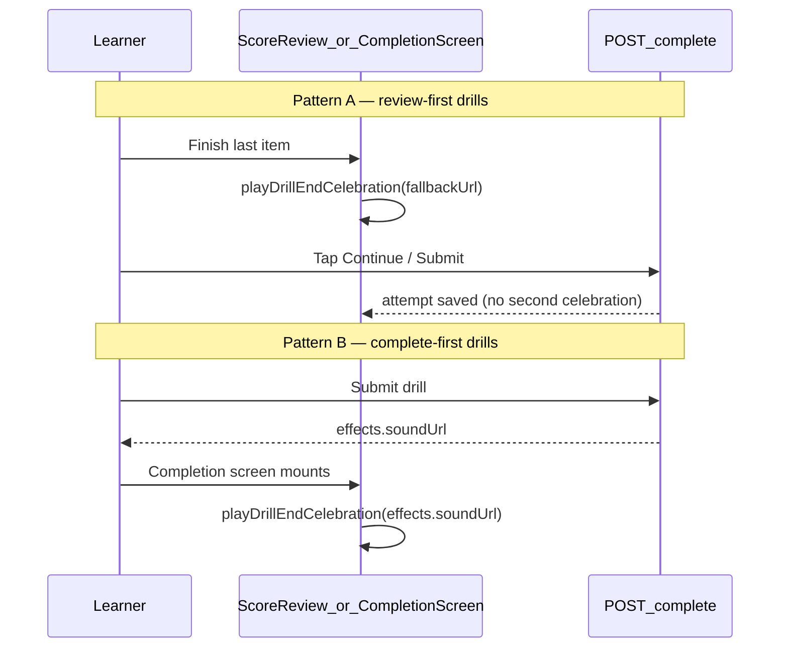

# Mobile Handoff — Drill Completion Celebration (MP3 + Confetti)

> **Prerequisites**: Read [`MOBILE_README.md`](MOBILE_README.md) for auth, error envelope, and React Query conventions.  
> **Related**: [`MOBILE_MY_PLAN.md`](MOBILE_MY_PLAN.md) §8.3 (complete mutation), [`mobile-practice-feedback.md`](mobile-practice-feedback.md) (per-item pass/fail — **not** end-of-drill).  
> **Web source of truth**: [`src/lib/practice-feedback.ts`](../src/lib/practice-feedback.ts) (`playDrillEndCelebration`), [`src/lib/drill/celebration-sound-url.ts`](../src/lib/drill/celebration-sound-url.ts), [`src/hooks/useDrillScoreCelebration.ts`](../src/hooks/useDrillScoreCelebration.ts), [`src/lib/drill/celebration-effects.ts`](../src/lib/drill/celebration-effects.ts)

---

## 1. Overview

When a learner **passes** a drill, the app plays a **celebration MP3** (hosted on Vercel Blob), triggers **success haptics**, and shows **confetti** once.

| Layer | Responsibility |
|-------|----------------|
| **API** | `POST /drills/:drillId/complete` returns `effects.soundUrl` + `effects.triggerConfetti` when `passed: true` |
| **Mobile client** | Play that URL via `expo-av`; do **not** hardcode the asset in production (use API URL; keep default constant only as offline fallback) |

**Scope**: Assigned My Plan drills (`POST /drills/:drillId/complete`). Weekly challenge completion does **not** return `effects` today.

**Not in scope**: Per-item pass/fail during the drill (short haptics / optional tones) — see [`mobile-practice-feedback.md`](mobile-practice-feedback.md).

---

## 2. What changed (June 2026)

| Before | After (web + API) |
|--------|-------------------|
| End-of-drill sound was synthesized Web Audio tones | End-of-drill sound is the **Celebration MP3** from `effects.soundUrl` |
| Complete response: `{ attempt, badgesUnlocked }` | Adds `drillId`, `passed`, optional `effects` |
| Mobile had no server-driven asset | Server config `CELEBRATION_SOUND_URL` controls the URL returned in `effects` |

Default asset (when env unset):

```
https://mrsxoheopyanhton.public.blob.vercel-storage.com/Celebration%20_Sound.mp3
```

---

## 3. API contract

### 3.1 Endpoint

```http
POST /api/v1/drills/{drillId}/complete
Authorization: Bearer <token>
Content-Type: application/json
```

Request body unchanged — see [`MOBILE_MY_PLAN.md`](MOBILE_MY_PLAN.md) §5. Always send `platform: 'ios' | 'android'` and `performanceReviewSnapshot.passThreshold` when the drill shows a score review.

### 3.2 Success response

```json
{
  "code": "Success",
  "data": {
    "drillId": "674a1b2c3d4e5f6789012345",
    "passed": true,
    "attempt": {
      "id": "674a...",
      "score": 85,
      "timeSpent": 120,
      "completedAt": "2026-06-24T12:00:00.000Z"
    },
    "badgesUnlocked": [],
    "effects": {
      "soundUrl": "https://mrsxoheopyanhton.public.blob.vercel-storage.com/Celebration%20_Sound.mp3",
      "triggerConfetti": true
    }
  }
}
```

When `passed` is `false`, **`effects` is omitted** — no celebration audio or confetti.

### 3.3 TypeScript types

```ts
export const DEFAULT_CELEBRATION_SOUND_URL =
  'https://mrsxoheopyanhton.public.blob.vercel-storage.com/Celebration%20_Sound.mp3';

export type DrillCompletionEffects = {
  soundUrl: string;
  triggerConfetti: boolean;
};

export type CompleteDrillResponse = {
  code: 'Success';
  data: {
    drillId: string;
    passed: boolean;
    attempt: {
      id: string;
      score: number;
      timeSpent: number;
      completedAt: string;
    };
    badgesUnlocked?: BadgeUnlockCelebration[];
    effects?: DrillCompletionEffects;
  };
};
```

### 3.4 When `passed` is true (server)

| Condition | `passed` |
|-----------|----------|
| `summaryResults.summaryProvided === true` | `true` (score may be `0`) |
| `listeningResults.completed === true` | `true` |
| Otherwise | `score >= performanceReviewSnapshot.passThreshold` (default **70**) |

Use `data.passed && data.effects` as the gate for celebration — do not re-derive pass from score on the client for effects.

---

## 4. Web timing — mirror on mobile

Web uses **two patterns**. Mobile must match so celebration fires at the same UX moment (not twice).



### Pattern A — Score review **before** complete API

Celebration when the **performance review** (or fill-blank results screen) appears and the learner **passed**. Complete API runs later when they tap Continue / Submit.

| Drill types | Web hook / component |
|-------------|----------------------|
| Vocabulary, Pronunciation, Key Phrases, Roleplay | `DrillPerformanceReview` → `useDrillScoreCelebration` |
| Fill in the Blank | `useDrillScoreCelebration` on results view |

**Sound URL at this moment**: API not called yet → use `DEFAULT_CELEBRATION_SOUND_URL` (same default the server uses). Web: `getClientCelebrationSoundUrl()` in [`celebration-sound-url.ts`](../src/lib/drill/celebration-sound-url.ts).

**Mobile**: `playDrillEndCelebration({ soundUrl: DEFAULT_CELEBRATION_SOUND_URL, triggerConfetti: true })` when review mounts with pass. Do **not** celebrate again in complete `onSuccess`.

### Pattern B — Complete API **before** completion screen

Celebration when the **completion screen** mounts after a successful complete call.

| Drill types | Web behavior |
|-------------|--------------|
| Matching, Listening | `completeLearnerDrill` → store `result.data.effects?.soundUrl` → `DrillCompletionScreen` with `celebrate` |
| Definition | Same, only if `completionScore >= 70` |

**Sound URL**: `data.effects.soundUrl` from the complete response.

**Mobile**: Pass `effects` from complete result into the completion screen; call `playDrillEndCelebration(effects)` on mount when `celebrate` is true.

### Drills with no end celebration on web

| Drill | Web |
|-------|-----|
| Grammar, Sentence, Summary | `DrillCompletionScreen` with `celebrate={false}` — no end MP3 (may add later) |
| Failed attempt | `playDrillEndFailure()` on review (synthesized fail tone on web) — see practice-feedback doc |

---

## 5. Mobile implementation

### 5.1 Install

```bash
npx expo install expo-av expo-haptics
```

### 5.2 Shared module — mirror `playDrillEndCelebration`

Suggested: `lib/drill-celebration.ts`

```ts
import { Audio } from 'expo-av';
import * as Haptics from 'expo-haptics';
import type { DrillCompletionEffects } from '@/types/drills';

export const DEFAULT_CELEBRATION_SOUND_URL =
  'https://mrsxoheopyanhton.public.blob.vercel-storage.com/Celebration%20_Sound.mp3';

let celebrationSound: Audio.Sound | null = null;

/** Unload on screen unmount */
export async function unloadDrillCelebrationSound(): Promise<void> {
  if (!celebrationSound) return;
  try {
    await celebrationSound.unloadAsync();
  } catch {
    /* best-effort */
  }
  celebrationSound = null;
}

/**
 * End-of-drill pass: MP3 + success haptic + confetti.
 * Mirrors web `playDrillEndCelebration(soundUrl?)`.
 */
export async function playDrillEndCelebration(
  effects?: DrillCompletionEffects | null,
): Promise<void> {
  const soundUrl = effects?.soundUrl?.trim() || DEFAULT_CELEBRATION_SOUND_URL;
  const triggerConfetti = effects?.triggerConfetti ?? true;

  try {
    await Haptics.notificationAsync(Haptics.NotificationFeedbackType.Success);
  } catch {
    /* simulators */
  }

  try {
    await Audio.setAudioModeAsync({ playsInSilentModeIOS: true });
    await unloadDrillCelebrationSound();
    const { sound } = await Audio.Sound.createAsync(
      { uri: soundUrl },
      { shouldPlay: true },
    );
    celebrationSound = sound;
    sound.setOnPlaybackStatusUpdate((status) => {
      if (status.isLoaded && status.didJustFinish) {
        void sound.unloadAsync();
        if (celebrationSound === sound) celebrationSound = null;
      }
    });
  } catch {
    /* CDN / network — haptics still run */
  }

  if (triggerConfetti) {
    // Your confetti imperative API, e.g. confettiRef.current?.start()
  }
}
```

### 5.3 Hook — mirror `useDrillScoreCelebration`

Suggested: `hooks/useDrillScoreCelebration.ts`

```ts
import { useEffect } from 'react';
import { playDrillEndCelebration } from '@/lib/drill-celebration';
import { playPracticeFeedback } from '@/lib/practice-feedback'; // failure: haptics only or short tone

export function useDrillScoreCelebration(
  passed: boolean | null | undefined,
  effects?: DrillCompletionEffects | null,
) {
  useEffect(() => {
    if (passed == null) return;
    if (passed) {
      void playDrillEndCelebration(effects);
    } else {
      void playPracticeFeedback('failure');
    }
  }, [passed, effects]);
}
```

Wire this on **Pattern A** score-review screens when `avgScore >= passThreshold`.

### 5.4 Complete helper — Pattern B

```ts
export async function completeLearnerDrill(
  queryClient: QueryClient,
  drillId: string,
  body: CompleteDrillBody,
): Promise<CompleteDrillResponse> {
  const res = await apiClient.post<CompleteDrillResponse>(
    `/drills/${drillId}/complete`,
    body,
  );
  // Badge / cache invalidation (mirror web completeLearnerDrill)
  await queryClient.invalidateQueries({ queryKey: ['learner-drills'] });
  await queryClient.invalidateQueries({ queryKey: ['progress-scorecard'] });
  return res.data;
}
```

**Do not** call `playDrillEndCelebration` inside `completeLearnerDrill` for Pattern A drills — that would double-play.

For Pattern B, return `effects` to the caller:

```ts
const result = await completeLearnerDrill(queryClient, drillId, body);
setCelebrationEffects(result.data.effects);
// Navigate to completion screen; screen calls playDrillEndCelebration(celebrationEffects) on mount
```

### 5.5 Completion screen — Pattern B

```tsx
export function DrillCompletionScreen({
  celebrate,
  celebrationEffects,
}: {
  celebrate?: boolean;
  celebrationEffects?: DrillCompletionEffects;
}) {
  useEffect(() => {
    if (celebrate) void playDrillEndCelebration(celebrationEffects);
    return () => {
      void unloadDrillCelebrationSound();
    };
  }, [celebrate, celebrationEffects]);
  // ...
}
```

---

## 6. Per-item vs end-of-drill audio

| Moment | Sound |
|--------|-------|
| Each word / match / MCQ graded | Short feedback (haptics primary; optional local tone) — [`mobile-practice-feedback.md`](mobile-practice-feedback.md) |
| **End of drill (pass)** | **Celebration MP3** from `effects.soundUrl` (this doc) |
| End of drill (fail) | Failure haptics / short fail cue — not the celebration MP3 |

---

## 7. Confetti

When `triggerConfetti === true`, fire confetti in the same call as the MP3 (web: [`src/lib/drill-celebration.ts`](../src/lib/drill-celebration.ts) `triggerDrillEndConfetti`). Start within ~100ms of audio play.

---

## 8. Error and edge cases

| Case | Behavior |
|------|----------|
| `passed: false`, no `effects` | No celebration |
| `soundUrl` fails to load | Fail silently; haptics still run; do not block navigation |
| Pattern A + Pattern B on same drill | **Avoid** — pick one celebration point per drill type (see §4) |
| Badge unlock UI | Separate from drill `effects` |
| Weekly challenge complete | No `effects` — guard optional chaining |

---

## 9. Testing checklist

- [ ] **Pattern A**: Vocabulary pass → MP3 + confetti on score review; complete API does not replay sound
- [ ] **Pattern A**: Fill-blank fail → failure feedback only, no MP3
- [ ] **Pattern B**: Matching → MP3 uses `effects.soundUrl` from complete response on completion screen
- [ ] **Pattern B**: Definition score &lt; 70 → no celebration
- [ ] Summary / Listening → `passed: true` and effects from API
- [ ] Physical device: audio with silent switch (iOS) per product rules
- [ ] Unmount completion screen → sound unloaded
- [ ] Weekly challenge complete → no crash when `effects` missing

---

## 10. Files to touch (mobile repo)

| File | Change |
|------|--------|
| `types/drills.ts` | `DrillCompletionEffects`, `CompleteDrillResponse`, `DEFAULT_CELEBRATION_SOUND_URL` |
| `lib/drill-celebration.ts` | **New** — `playDrillEndCelebration`, `unloadDrillCelebrationSound` |
| `hooks/useDrillScoreCelebration.ts` | **New** — Pattern A |
| `lib/complete-learner-drill.ts` | Return full response; no celebration for Pattern A |
| Score review components | `useDrillScoreCelebration(passed)` |
| Matching / Listening / Definition completion | Pattern B: pass `effects` to completion screen |
| `my-plan/drills/[id]/completed.tsx` | No celebration (web does not celebrate there) |

---

## 11. Web file map

| Web file | Mobile equivalent |
|----------|-------------------|
| `src/lib/practice-feedback.ts` → `playDrillEndCelebration` | `lib/drill-celebration.ts` → `playDrillEndCelebration` |
| `src/lib/drill/celebration-sound-url.ts` | `DEFAULT_CELEBRATION_SOUND_URL` constant |
| `src/hooks/useDrillScoreCelebration.ts` | `hooks/useDrillScoreCelebration.ts` |
| `src/components/drills/shared/DrillPerformanceReview.tsx` | Score review screen |
| `src/components/drills/shared/DrillCompletionScreen.tsx` | Completion screen (Pattern B) |
| `src/lib/drill/celebration-effects.ts` | Server only — mobile reads `effects` from API |
| `src/app/api/v1/drills/[drillId]/complete/route.ts` | Same endpoint |
