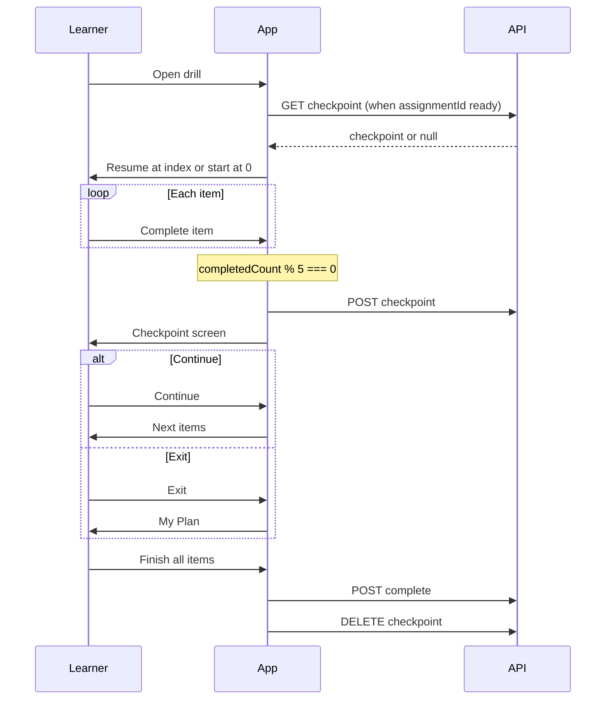
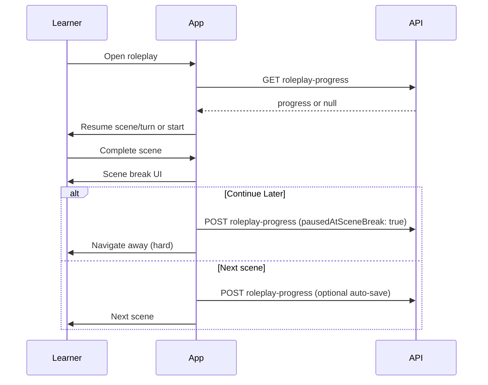

# Mobile Handoff — Drill Checkpoints & Roleplay Progress

> **Prerequisites**: Read `MOBILE_README.md` first for auth, error envelope, and React Query conventions.
>
> **Product spec**: See `docs/DRILL_CHECKPOINTS.md` for checkpoint cadence by drill type.
>
> **Web reference**: `src/lib/drill/drill-checkpoint.ts`, `src/components/drills/shared/CheckpointScreen.tsx`, `src/app/api/v1/drills/[drillId]/checkpoint/route.ts`, `src/app/api/v1/drills/[drillId]/roleplay-progress/route.ts`

---

## 1. Overview

Web implemented **save-and-resume** for drills in June 2026. Mobile should mirror the same behavior so learners can exit mid-drill and continue on either platform.

| Drill category | Checkpoint mechanism | API |
|----------------|------------------------|-----|
| Vocabulary, Pronunciation, Matching, Definition, Grammar, Sentence Writing, Fill in the Blank, Key Phrases | Every **5 completed items** | `GET/POST/DELETE /drills/:drillId/checkpoint` |
| Roleplay | After each **scene** (scene break UI) | `GET/POST/DELETE /drills/:drillId/roleplay-progress` |
| Summary | None — single sitting | N/A |
| Listening | Not in this rollout | N/A |

A drill is only marked **complete** when the learner finishes all items/scenes and calls the existing **complete** endpoint. Checkpoints are cleared on successful completion.

---

## 2. What changed (June 2026)

| Issue | Root cause | Web fix | Mobile action |
|-------|------------|---------|---------------|
| Resume ignored on re-entry | `assignmentId` arrives async; checkpoint load ran once on mount and init logic overwrote restored state | Re-run checkpoint load when `assignmentId` / `drillId` change; merge init + restore in one effect; remount drill when assignment resolves | **Do not** load checkpoint until `assignmentId` is known. Re-fetch checkpoint whenever `assignmentId` or `drillId` changes. Reset drill screen state when assignment context changes (see §6). |
| React `key` warning | `key` was spread via `commonProps` | Pass `key` directly on drill component, not inside spread props | N/A on RN — but **do** remount drill screen when `assignmentId` becomes available (equivalent pattern). |
| Roleplay “Continue Later” runtime error | Soft navigation + awaited cache invalidation caused state updates on unmounting component | Hard navigation after save; fire-and-forget cache invalidation; hide button when progress context is null | After successful roleplay save, **navigate away immediately** (stack reset / `router.replace`). Do not await query invalidation before unmounting. Disable button while saving. |
| Roleplay save 500 (`E11000 duplicate key`) | Legacy MongoDB unique index on `(userId, challengeId, challengeItemIndex)` treated all assignment docs with null challenge fields as one slot | Server: partial unique indexes per `source`, `$unset` challenge fields on assignment saves, dup-key retry | **Client**: always send `source: 'assignment'` with `assignmentId` for My Plan drills; always send `source: 'weekly_challenge'` with `challengeId` + `challengeItemIndex` for weekly challenge. Do not send challenge fields on assignment saves. Server handles migration — no mobile DB work. |

---

## 3. Generic checkpoint API

All paths are relative to `/api/v1`. Auth: Bearer token, role `user`.

### 3.1 Fetch checkpoint

```http
GET /drills/{drillId}/checkpoint?assignmentId={assignmentId}
Authorization: Bearer <token>
Cache-Control: no-store
```

**Response**

```json
{
  "code": "Success",
  "data": {
    "checkpoint": {
      "_id": "...",
      "drillId": "...",
      "drillAssignmentId": "...",
      "drillType": "vocabulary",
      "resumeFromIndex": 5,
      "completedItemCount": 5,
      "partialResults": { },
      "startedAt": "2026-06-23T10:00:00.000Z",
      "lastUpdatedAt": "2026-06-23T10:15:00.000Z"
    }
  }
}
```

`checkpoint` is `null` when no saved progress exists.

### 3.2 Save checkpoint

```http
POST /drills/{drillId}/checkpoint
Authorization: Bearer <token>
Content-Type: application/json
```

**Body**

| Field | Type | Required | Notes |
|-------|------|----------|-------|
| `assignmentId` | string (ObjectId) | yes | Drill assignment ID |
| `drillType` | enum | yes | See §3.4 |
| `resumeFromIndex` | number ≥ 0 | yes | Index of next item to show |
| `completedItemCount` | number ≥ 0 | yes | Items fully completed so far |
| `partialResults` | object | yes | Drill-specific state (§5) |
| `startedAt` | ISO string / Date | no | Session start; set on first checkpoint only |

**Side effect**: Server sets assignment status to `in-progress`.

**Example**

```json
{
  "assignmentId": "674a1b2c3d4e5f6789012345",
  "drillType": "vocabulary",
  "resumeFromIndex": 5,
  "completedItemCount": 5,
  "partialResults": {
    "wordProgress": { "0": { "wordPassed": true, "wordScore": 80, "sentencePassed": true, "sentenceScore": 75 } },
    "sessionReviewAnalytics": []
  },
  "startedAt": "2026-06-23T10:00:00.000Z"
}
```

### 3.3 Clear checkpoint

Call after successful drill completion (non-blocking; ignore errors).

```http
DELETE /drills/{drillId}/checkpoint?assignmentId={assignmentId}
Authorization: Bearer <token>
```

### 3.4 `drillType` enum

| Drill | `drillType` value |
|-------|-------------------|
| Vocabulary | `vocabulary` |
| Pronunciation | `pronunciation` |
| Matching | `matching` |
| Definition | `definition` |
| Grammar | `grammar` |
| Sentence Writing | `sentence` or `sentence_writing` |
| Fill in the Blank | `fill_blank` |
| Key Phrases | `key_phrases` |

### 3.5 Database (reference)

Collection: `drill_checkpoints`. Unique index: `{ userId, drillAssignmentId }` (sparse).

---

## 4. Roleplay progress API

Roleplay uses a **separate** endpoint because checkpoints are per-scene and carry richer state (turn progress, analytics, role mode).

### 4.1 Fetch progress

**Assignment**

```http
GET /drills/{drillId}/roleplay-progress?source=assignment&assignmentId={assignmentId}
```

**Weekly challenge**

```http
GET /drills/{drillId}/roleplay-progress?source=weekly_challenge&challengeId={challengeId}&challengeItemIndex={index}
```

Returns `{ progress: null }` if none saved.

### 4.2 Save progress

```http
POST /drills/{drillId}/roleplay-progress
Authorization: Bearer <token>
Content-Type: application/json
```

**Common fields**

| Field | Type | Notes |
|-------|------|-------|
| `source` | `'assignment' \| 'weekly_challenge'` | Required |
| `currentSceneIndex` | number | Scene to resume at |
| `currentTurnIndex` | number | Turn within scene |
| `pausedAtSceneBreak` | boolean | `true` when saving at scene break / Continue Later |
| `completedSceneIndex` | number? | Last fully completed scene |
| `turnProgress` | `Record<string, { passed, score, attempts }>` | Keyed by turn id |
| `sessionAnalytics` | array | Per-turn analytics (see web `saveRoleplayProgress` in `src/lib/api.ts`) |
| `roleMode` | `'original' \| 'swapped'` | |
| `originalRoleProgress` | turn map | optional |
| `swappedRoleProgress` | turn map | optional |
| `startedAt` | ISO string | optional |

**Assignment-only**: `assignmentId` (required). **Do not** send `challengeId`, `challengeItemIndex`, or `weekStartDate`.

**Weekly challenge-only**: `challengeId`, `challengeItemIndex` (required), `weekStartDate` (recommended for exit navigation). **Do not** send `assignmentId`.

**Continue Later payload** (at scene break): set `pausedAtSceneBreak: true`, `currentSceneIndex` to the **next** scene index, `currentTurnIndex: 0`, and `completedSceneIndex` to the scene just finished.

**Side effect**: Server sets assignment status to `in-progress` for assignment source.

### 4.3 Clear progress

Same query params as GET. Call after successful roleplay completion.

---

## 5. `partialResults` by drill type

Store whatever state is needed to restore the UI. Web implementations:

| Drill | `partialResults` keys | Restore behavior |
|-------|----------------------|------------------|
| Vocabulary | `wordProgress`, `sessionReviewAnalytics` | Set `currentIndex` from `resumeFromIndex`; merge `wordProgress` |
| Pronunciation | `wordProgress`, `sessionReviewAnalytics` | Same as vocabulary |
| Matching | `matchedPairKeys` | Restore matched pairs set/array |
| Definition | `answers` | Map of index → answer string |
| Grammar | `answers` | Map of index → answer |
| Sentence Writing | `answers` | Map of index → answer |
| Fill in the Blank | `answers`, `submittedCount` | Answers map + count of submitted blanks |
| Key Phrases | `itemResults`, `sessionReviewAnalytics` | Per-item results + analytics |

`resumeFromIndex` should always point to the **next uncompleted item** (web sets this to `currentIndex + 1` when saving at the 5-item boundary).

---

## 6. Client implementation pattern

### 6.1 When to save

- **Item drills**: After every **5th completed item** (when `completedCount % 5 === 0` and `completedCount > 0`), POST checkpoint, then show checkpoint UI.
- **Roleplay**: On scene break — auto-save when advancing scenes; explicit save on “Continue Later”.
- **Summary**: No checkpoints.

### 6.2 When to load

```
ON mount OR WHEN assignmentId / drillId changes:
  IF assignmentId is missing:
    initialize empty drill state
    RETURN
  SET loading = true
  FETCH checkpoint (or roleplay progress)
  IF checkpoint exists:
    apply resumeFromIndex + partialResults
    SET checkpointCount = completedItemCount
  ELSE:
    initialize empty drill state
  SET loading = false
```

**Critical**: Do not run a separate “init empty state” effect that races with async restore. Web merged these into one effect with a cancellation flag.

### 6.3 Checkpoint screen UI

Mirror `CheckpointScreen.tsx`:

- Title: “Progress Saved” (or drill title)
- Copy: “You've completed **X** of **Y** items.” + remaining count
- **Continue** — dismiss checkpoint screen, resume drill at `resumeFromIndex`
- **Exit & Resume Later** — navigate to My Plan / drills list (`/account/drills` on web)

Checkpoint screen is shown **after** save succeeds at a 5-item boundary, not on load.

### 6.4 When to clear

After successful `POST /drills/:drillId/complete` (fire-and-forget). Do not clear on exit without completion.

### 6.5 Assignment ID timing (resume bug fix)

`assignmentId` often resolves **after** the drill screen mounts (fetched from learner assignments API). Mobile must:

1. Wait for `assignmentId` before calling checkpoint GET.
2. Re-run load when `assignmentId` transitions from `null` → value.
3. **Remount** or fully reset drill state when assignment context changes — web uses:

   ```ts
   const drillSessionKey = `${drillId}-${assignmentId ?? 'pending'}`;
   // Pass drillSessionKey as React `key` to force remount
   ```

   On React Native, equivalent: change `key` on the drill screen component, or `useEffect` deps `[drillId, assignmentId]` with proper cancellation.

4. Show a loading state while checkpoint fetch is in flight (`isLoadingCheckpoint`).

### 6.6 Roleplay “Continue Later” (client fix)

```ts
async function saveProgressAndExit() {
  if (!progressContext || !sceneBreak) return;

  setIsSavingProgress(true);
  try {
    await api.saveRoleplayProgress(drillId, buildPayload({
      pausedAtSceneBreak: true,
      currentSceneIndex: sceneBreak.nextSceneIndex,
      currentTurnIndex: 0,
      completedSceneIndex: sceneBreak.completedSceneIndex,
    }));

    // Fire-and-forget — do NOT await before navigating
    queryClient.invalidateQueries({ queryKey: ['drills', 'learner'] });

    const exitRoute = progressContext.source === 'weekly_challenge'
      ? `/practice/weekly-challenge/${weekStartDate}`
      : '/drills'; // My Plan

    router.replace(exitRoute); // or navigation.reset — avoid updates after unmount
  } catch (e) {
    setIsSavingProgress(false);
    showError(e);
  }
}
```

- Only show “Continue Later” when `progressContext` is non-null (assignment or weekly challenge resolved).
- Do not use soft back navigation that leaves the drill mounted while async work continues.

### 6.7 Roleplay E11000 (server fix — client contract)

The duplicate-key error happened when multiple assignment progress docs collided on `(userId, null, null)` under a legacy index. Server now:

- Uses **partial unique indexes** scoped by `source`
- `$unset`s `challengeId`, `challengeItemIndex`, `weekStartDate` on assignment saves
- Retries upsert on `E11000` after index migration

**Mobile must**:

- Always set `source` explicitly on every roleplay progress request.
- Never send challenge fields when `source === 'assignment'`.
- Never send `assignmentId` when `source === 'weekly_challenge'`.

If mobile still sees 500 on save after deploying against an updated backend, retry once; persistent failures indicate server index migration did not run (restart API / redeploy).

---

## 7. Suggested mobile module layout

```
lib/drill/
  drill-checkpoint.ts      # saveCheckpoint, loadCheckpoint, clearCheckpoint
  roleplay-progress.ts     # get/save/clear wrappers (or extend existing api client)

components/drills/
  CheckpointScreen.tsx     # shared progress-saved UI

hooks/
  useDrillCheckpoint.ts    # load on assignmentId change, save helper, loading flag
```

API client methods should match web (`src/lib/api.ts` → `getCheckpoint`, `saveCheckpoint`, `clearCheckpoint`, `getRoleplayProgress`, `saveRoleplayProgress`, `clearRoleplayProgress`). Use `cache: false` on GETs.

---

## 8. Flow diagrams

### Item-based drills (every 5 items)



### Roleplay (per scene)



---

## 9. Test plan

### Generic checkpoints

- [ ] Open drill with no prior progress — starts at item 0, no checkpoint screen on load.
- [ ] Complete 5 items — checkpoint screen appears; assignment shows `in-progress` on My Plan.
- [ ] Tap **Exit & Resume Later** — return to drills list; reopen same drill — resumes at item 6 with prior answers/scores intact.
- [ ] Tap **Continue** on checkpoint screen — proceeds without losing state.
- [ ] Complete entire drill — checkpoint cleared; assignment marked complete.
- [ ] Open drill before `assignmentId` resolves — no erroneous empty overwrite after ID arrives.
- [ ] Kill app mid-drill (after checkpoint save) — cold start resume works.

### Roleplay

- [ ] Complete a scene — scene break offers Continue Later.
- [ ] Continue Later — no crash; progress persisted; reopen resumes at next scene.
- [ ] Save assignment roleplay — no 500; multiple different assignment roleplays per user work.
- [ ] Weekly challenge roleplay — save/load with `source: weekly_challenge` params.
- [ ] Complete roleplay — progress document cleared.

### Cross-platform

- [ ] Start on web, resume on mobile (same assignment) — state compatible for same drill types.
- [ ] Start on mobile, resume on web — same.

---

## 10. Web file index

| Area | Path |
|------|------|
| Product spec | `docs/DRILL_CHECKPOINTS.md` |
| Checkpoint model | `src/models/drill-checkpoint.ts` |
| Checkpoint API | `src/app/api/v1/drills/[drillId]/checkpoint/route.ts` |
| Client helpers | `src/lib/drill/drill-checkpoint.ts` |
| Checkpoint UI | `src/components/drills/shared/CheckpointScreen.tsx` |
| Drill router + remount key | `src/components/drills/DrillPracticeInterface.tsx` |
| Roleplay progress API | `src/app/api/v1/drills/[drillId]/roleplay-progress/route.ts` |
| Roleplay index migration | `src/lib/drill/ensure-roleplay-progress-indexes.ts` |
| Roleplay model | `src/models/roleplay-drill-progress.ts` |
| Roleplay drill UI | `src/components/drills/RoleplayDrill.tsx` |
| API client | `src/lib/api.ts` (`getCheckpoint`, `saveCheckpoint`, `clearCheckpoint`, roleplay progress methods) |
| Per-drill checkpoint logic | `src/components/drills/{Vocabulary,Pronunciation,Matching,Definition,Grammar,Sentence,FillBlank,KeyPhrases}Drill.tsx` |
