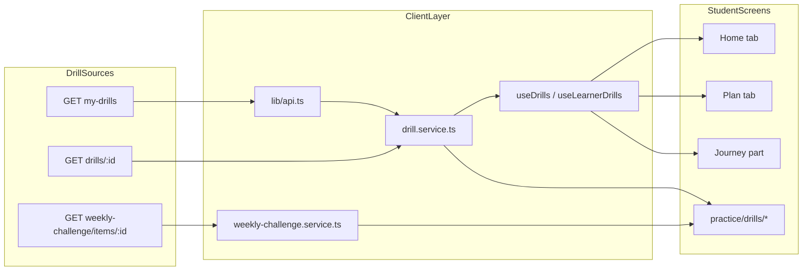
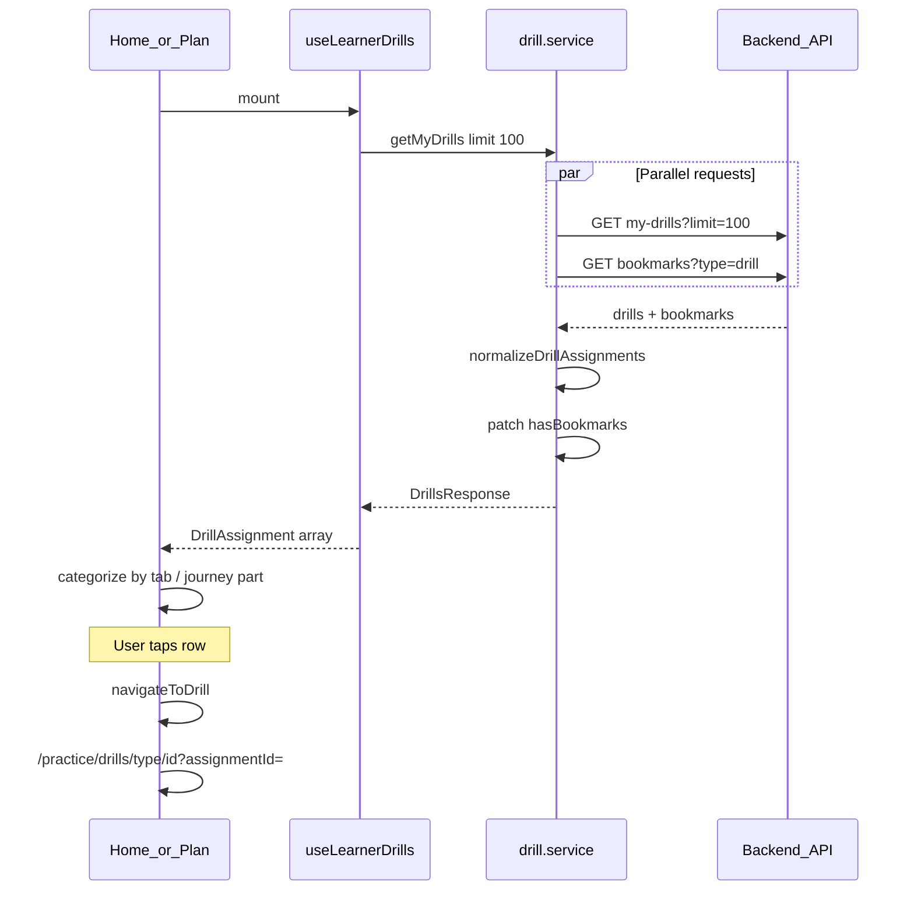

# Student Drills — Backend API Reference

> How the mobile app fetches, resumes, completes, and bookmarks **student drills** from the remote backend.

**Prerequisites:** Read [`MOBILE_README.md`](MOBILE_README.md) for shared conventions. Sections most relevant to drill fetching:

- **Authentication** — Bearer token on every request; 401 clears token and redirects to login ([`lib/api.ts`](lib/api.ts) interceptors)
- **Error Envelope** — Pattern A (`code + data`) used by `GET my-drills` and most drill routes
- **React Query Key Conventions** — generic handoff uses `queryKeys.learnerDrills`; this repo implements `drillKeys` in [`hooks/useDrills.ts`](hooks/useDrills.ts) (see §7 below)
- **SSE (Server-Sent Events)** — AI drill practice streams (see §6.3)
- **Audio on Mobile** — recording for speaking drills; pass `platform: 'ios' \| 'android'` on `POST .../complete` (Development Tips §3)

**Related docs:** [`MOBILE_MY_PLAN.md`](MOBILE_MY_PLAN.md) covers UI flows, completion body schemas, and celebration. This document focuses on **what the app actually calls today** — full `/api/v1/` paths, service functions, hooks, and screen wiring.

---

## 1. Overview

This is an **Expo / React Native client**. There is no local backend in this repo. All drill data is fetched from a remote API via Axios in [`lib/api.ts`](lib/api.ts).

| Setting | Value |
|---------|-------|
| Base URL env var | `EXPO_PUBLIC_API_URL` |
| Default base URL | `http://app.elkan.ai` |
| Path prefix | `/api/v1/...` (app paths always include `/api/v1`) |
| Auth | `Authorization: Bearer <token>` on every request (Axios interceptor) |

> **Note:** [`MOBILE_README.md`](MOBILE_README.md) uses generic handoff examples (e.g. `EXPO_PUBLIC_API_BASE_URL`, `lib/api/config.ts`). This document reflects the **actual** repo setup: `EXPO_PUBLIC_API_URL`, [`lib/api.ts`](lib/api.ts), and the service/hook files linked below.

The base URL is normalized to avoid double `/api` segments when the env var already ends with `/api`.

### Two drill content sources

Students can practice drills from two backend sources:

1. **Assigned drills (My Plan)** — tutor-assigned items from `GET /api/v1/drills/learner/my-drills`
2. **Weekly Challenge** — AI-generated weekly items from `/api/v1/learner/weekly-challenge/*`



### Drill types

The app supports 13 drill types (see [`types/drill.types.ts`](types/drill.types.ts)):

`vocabulary`, `pronunciation`, `roleplay`, `matching`, `definition`, `grammar`, `sentence_writing`, `sentence`, `summary`, `listening`, `fill_blank`, `key_phrases`, `eklan_free_talk`

---

## 2. Core Service Layer

All assigned-drill HTTP calls are centralized in [`services/drill.service.ts`](services/drill.service.ts).

Weekly Challenge calls live in [`services/weekly-challenge.service.ts`](services/weekly-challenge.service.ts).

Practice-time scoring/AI calls use [`services/speechace.service.ts`](services/speechace.service.ts) and [`services/ai.service.ts`](services/ai.service.ts).

---

## 3. Assigned Drills — Fetching Endpoints

### 3.1 List assigned drills

| | |
|---|---|
| **Method** | `GET` |
| **Path** | `/api/v1/drills/learner/my-drills` |
| **Service** | `getMyDrills(params?)` |
| **Hook** | `useDrills(status?, limit?)` / `useLearnerDrills()` |

**Query parameters** (`GetMyDrillsParams`):

| Param | Type | Description |
|-------|------|-------------|
| `limit` | number | Max rows returned (e.g. `100`, `200`) |
| `page` | number | Page number for pagination |
| `status` | `'pending' \| 'in_progress' \| 'completed'` | Filter by assignment status |

**Example URLs:**

```
GET /api/v1/drills/learner/my-drills
GET /api/v1/drills/learner/my-drills?limit=100
GET /api/v1/drills/learner/my-drills?limit=200&status=completed
```

**Backend envelope:**

```json
{
  "code": "Success",
  "message": "...",
  "data": {
    "drills": [ /* raw rows */ ],
    "pagination": { "total": 0, "page": 1, "limit": 100 }
  }
}
```

**Client normalization:**

1. Unwraps `response.data.data || response.data`
2. Runs `normalizeDrillAssignments()` from [`utils/drillAssignment.ts`](utils/drillAssignment.ts) — handles both nested `{ assignmentId, drill }` rows and flat learner rows
3. Merges learning journey fields (`learning_journey_part`, `learning_journey_topic`) from snake_case or camelCase keys

**Parallel bookmark fetch:**

While fetching the list, `getMyDrills()` also calls `GET /api/v1/bookmarks?type=drill` in parallel. The returned drill IDs override each assignment's `hasBookmarks` field so bookmark toggles always reflect the authoritative server state.

**Returns** (`DrillsResponse`):

```ts
{
  drills: DrillAssignment[];
  pagination: { total: number; page: number; limit: number };
}
```

**`DrillAssignment` shape:**

```ts
{
  assignmentId: string;
  drill: Drill;
  assignedBy: string;
  assignedAt: string;
  dueDate?: string;
  status: 'pending' | 'in_progress' | 'completed';
  completedAt?: string;
  latestAttempt?: DrillAttempt;
  hasBookmarks?: boolean;
  itemType?: 'free_talk_scenario';  // Free Talk items only
}
```

---

### 3.2 Fetch single drill detail

| | |
|---|---|
| **Method** | `GET` |
| **Path** | `/api/v1/drills/:drillId` |
| **Optional query** | `?assignmentId=<assignmentId>` |
| **Service** | `getDrillById(drillId, assignmentId?, options?)` |

**Example URLs:**

```
GET /api/v1/drills/507f1f77bcf86cd799439011
GET /api/v1/drills/507f1f77bcf86cd799439011?assignmentId=507f1f77bcf86cd799439012
```

**Response:** `{ drill: Drill }` or `Drill` directly at `data.drill || data`.

**Special case — Free Talk (`eklan_free_talk`):**

`shouldFetchDrillDetail()` returns `false` for Free Talk drills. The app does **not** call this endpoint for them. Navigation goes directly to `/practice/free-talk/session` with a scenario ID resolved from drill metadata.

**Fallback when `assignmentId` is missing:**

`matching/[id].tsx` and `key_phrases/[id].tsx` call `getMyDrills({ limit: 200 })` and use `resolveDrillIdsFromListing()` to resolve IDs from the listing.

---

### 3.3 Fetch assignment attempt history

| | |
|---|---|
| **Method** | `GET` |
| **Path** | `/api/v1/drills/assignments/:assignmentId/attempts` |
| **Service** | `getAssignmentAttempts(assignmentId)` |
| **Screen** | [`app/practice/drills/results.tsx`](app/practice/drills/results.tsx) |

**Returns:**

```ts
{
  assignment: any;
  attempts: DrillAttempt[];
  latestAttempt: DrillAttempt | null;
  pagination?: any;
}
```

---

### 3.4 Complete a drill assignment

| | |
|---|---|
| **Method** | `POST` |
| **Path** | `/api/v1/drills/:drillId/complete` |
| **Service** | `completeDrill(drillId, completionData)` |
| **Hook** | `useCompleteDrill()` |

The service auto-adds `platform: 'ios'` and `deviceInfo: 'mobile'` if not provided.

**Request body** (summary — see [`MOBILE_MY_PLAN.md`](MOBILE_MY_PLAN.md) §5 for full schema):

```ts
{
  drillAssignmentId?: string;
  score: number;           // 0–100
  timeSpent: number;       // seconds
  platform?: 'web' | 'ios' | 'android';
  deviceInfo?: string;
  // One type-specific results field:
  vocabularyResults?, pronunciationResults?, roleplayResults?,
  matchingResults?, definitionResults?, grammarResults?,
  sentenceWritingResults?, sentenceResults?, summaryResults?,
  listeningResults?, fillBlankResults?, keyPhrasesResults?,
  performanceReviewSnapshot?
}
```

**Response** (`CompleteDrillData`):

```ts
{
  drillId: string;
  passed: boolean;
  attempt: { id, score, timeSpent, completedAt };
  badgesUnlocked?: BadgeUnlockCelebration[];
  effects?: { soundUrl, triggerConfetti };
}
```

On success, `invalidateDrillCaches()` refreshes all drill-related React Query caches.

---

### 3.5 Item-drill checkpoints (resume later)

Used by multi-item drills (vocabulary, pronunciation, matching, etc.) to save progress mid-drill.

| Method | Path | Service |
|--------|------|---------|
| `GET` | `/api/v1/drills/:drillId/checkpoint?assignmentId=:id` | `getCheckpoint()` |
| `POST` | `/api/v1/drills/:drillId/checkpoint` | `saveCheckpoint()` |
| `DELETE` | `/api/v1/drills/:drillId/checkpoint?assignmentId=:id` | `clearCheckpoint()` |

**POST body** (`SaveCheckpointBody` — see [`types/drill-checkpoint.types.ts`](types/drill-checkpoint.types.ts)):

```ts
{
  assignmentId: string;
  drillType: DrillCheckpointType;
  resumeFromIndex: number;
  completedItemCount: number;
  partialResults: /* type-specific progress object */;
  startedAt?: string;
}
```

**GET response:** `{ checkpoint: DrillCheckpoint | null }`

Orchestrated by [`hooks/useDrillCheckpoint.ts`](hooks/useDrillCheckpoint.ts). See [`docs/MOBILE_DRILL_CHECKPOINTS.md`](docs/MOBILE_DRILL_CHECKPOINTS.md) for behavior details.

---

### 3.6 Roleplay progress (continue later)

Separate from item checkpoints — used by the roleplay runner for scene/turn state.

| Method | Path | Service |
|--------|------|---------|
| `GET` | `/api/v1/drills/:drillId/roleplay-progress?<query>` | `getRoleplayProgress()` |
| `POST` | `/api/v1/drills/:drillId/roleplay-progress` | `saveRoleplayProgress()` |
| `DELETE` | `/api/v1/drills/:drillId/roleplay-progress?<query>` | `clearRoleplayProgress()` |

Query params vary by source (`assignmentId` for My Plan, or `challengeId` / `weekStartDate` for Weekly Challenge). Shapes in [`types/roleplay-progress.types.ts`](types/roleplay-progress.types.ts).

---

### 3.7 Start attempt (optional)

| | |
|---|---|
| **Method** | `POST` |
| **Path** | `/api/v1/drills/:drillId/start` |
| **Service** | `startDrillAttempt(drillId)` |

Optional — attempts are primarily created on completion. A `404` response is tolerated silently.

---

## 4. Bookmark Endpoints (drill save state)

All bookmark functions are in [`services/drill.service.ts`](services/drill.service.ts).

| Method | Path | Service function | Purpose |
|--------|------|------------------|---------|
| `GET` | `/api/v1/bookmarks?type=drill` | `getDrillBookmarkStatus()` | Set of bookmarked drill IDs (merged into `my-drills`) |
| `GET` | `/api/v1/bookmarks` | `getSavedDrills()` | All bookmarks, filtered client-side to `type === 'drill'` |
| `POST` | `/api/v1/bookmarks` | `saveDrill(drillId)` | Save entire drill |
| `POST` | `/api/v1/bookmarks` | `bookmarkWord(word, drillId, opts?)` | Save a word/sentence from a drill |
| `DELETE` | `/api/v1/bookmarks/by-drill/:drillId` | `unsaveDrillByDrillId(drillId)` | Remove drill bookmark by drill ID |
| `DELETE` | `/api/v1/bookmarks/:bookmarkId` | `unsaveDrill(bookmarkId)` | Remove bookmark by bookmark ID |

**POST body for saving a drill:**

```json
{ "drillId": "...", "type": "drill", "content": "..." }
```

**POST body for saving a word:**

```json
{ "drillId": "...", "type": "word", "content": "...", "translation": "...", "context": "..." }
```

Hooks: [`hooks/useSaveDrill.ts`](hooks/useSaveDrill.ts), [`hooks/useToggleDrillBookmark.ts`](hooks/useToggleDrillBookmark.ts)

---

## 5. Weekly Challenge Endpoints

Service: [`services/weekly-challenge.service.ts`](services/weekly-challenge.service.ts)

Base path: `/api/v1/learner/weekly-challenge`

| Method | Path | Service function | Purpose |
|--------|------|------------------|---------|
| `GET` | `/api/v1/learner/weekly-challenge/history` | `getWeeklyChallengeHistory()` | All weeks (triggers current-week generation) |
| `GET` | `/api/v1/learner/weekly-challenge` | `getWeeklyChallenge(weekStartDate?)` | One week; optional `?weekStartDate=` |
| `GET` | `/api/v1/learner/weekly-challenge/items/:itemId` | `getWeeklyChallengeItem(itemId, weekStartDate?)` | Full generated drill content |
| `POST` | `/api/v1/learner/weekly-challenge/items/:itemId/complete` | `completeWeeklyChallengeItem(itemId, data?)` | Mark WC item complete |

**Important:** Weekly Challenge items are **not** fetched via `getDrillById`. The flow is:

1. `getWeeklyChallengeItem()` returns generated content
2. `toDrillShape()` in [`utils/challengeDrillAdapter.ts`](utils/challengeDrillAdapter.ts) adapts it to a `Drill` object
3. `setCachedWCDrill()` stores it in memory ([`utils/weeklyChallengeDrillCache.ts`](utils/weeklyChallengeDrillCache.ts))
4. Drill runners read from `getCachedWCDrill(drillId)` when `source=weekly_challenge` is in route params
5. Completion uses `completeWeeklyChallengeItem()`, **not** `completeDrill()`

See [`docs/mobile-weekly-challenge.md`](docs/mobile-weekly-challenge.md) for full WC spec.

---

## 6. Practice-Time Supporting Endpoints

These are called **during** drill execution, not for initial fetch.

### 6.1 Pronunciation scoring

| | |
|---|---|
| **Method** | `POST` |
| **Path** | `/api/v1/speechace/score` |
| **Service** | `speechaceService.scorePronunciation(text, audioBase64)` |

**Request body:**

```json
{
  "text": "reference sentence",
  "audioBase64": "...",
  "questionInfo": { "questionId": "vocabulary-drill" }
}
```

Used by vocabulary, pronunciation, and key phrases drill runners.

### 6.2 Persist pronunciation attempt

| | |
|---|---|
| **Method** | `POST` |
| **Path** | `/api/v1/pronunciations/drill-attempt` |
| **Called from** | [`app/practice/drills/vocabulary/[id].tsx`](app/practice/drills/vocabulary/[id].tsx), [`app/practice/drills/pronunciation/[id].tsx`](app/practice/drills/pronunciation/[id].tsx) |

**Request body:**

```json
{
  "text": "...",
  "audioBase64": "...",
  "drillId": "...",
  "drillType": "vocabulary",
  "passingThreshold": 70
}
```

Non-critical — failures are logged but do not block the user.

### 6.3 AI drill practice (SSE)

| Method | Path | Service | Purpose |
|--------|------|---------|---------|
| `GET` (SSE) | `/api/v1/ai/drill-practice/greeting?drillId=:id` | `aiService.streamDrillPracticeGreeting()` | Opening greeting for drill-linked AI |
| `POST` (SSE) | `/api/v1/ai/drill-practice` | `aiService.streamDrillPracticeMessage()` | AI turn during drill practice |

SSE streams are handled via XHR in [`services/ai.service.ts`](services/ai.service.ts) (`_processSSEStreamXHR`).

---

## 7. React Query / Hook Layer

Defined in [`hooks/useDrills.ts`](hooks/useDrills.ts) and [`hooks/useLearnerDrills.ts`](hooks/useLearnerDrills.ts).

### Query keys

```ts
drillKeys = {
  all: ['drills'],
  lists: () => ['drills', 'list'],
  list: (status?, limit?) => ['drills', 'list', { status, limit }],
  details: () => ['drills', 'detail'],
  detail: (id, assignmentId?) => ['drills', 'detail', id, assignmentId ?? ''],
}
```

### Hooks

| Hook | Calls | Stale time | Used by |
|------|-------|------------|---------|
| `useLearnerDrills()` | `getMyDrills({ limit: 100 })` | 2 min | Home, Plan, Journey, Saved Drills |
| `useDrills(status?, limit?)` | `getMyDrills({ status, limit })` | 2 min | AI practice (completed), filtered lists |
| `useDrill(drillId, opts?)` | `getDrillById()` | 10 min | **Defined but not used by drill runners** |
| `useCompleteDrill()` | `completeDrill()` | — | Mutation; invalidates caches on success |
| `useRefreshDrills()` | invalidates list queries | — | Manual refresh |

**Constants:**

- `LEARNER_DRILLS_LIMIT = 100` — Plan / Home / Journey listing
- `MY_DRILLS_FULL_LIST_LIMIT = 200` — Profile, prefetch, ID-resolution fallback

### Cache invalidation

`invalidateDrillCaches(queryClient)` runs after every successful `completeDrill()` and invalidates:

- `drillKeys.all`
- `['home-progress']`
- `progressScorecardQueryKey`
- `['learner-drills-profile']`
- `['confidence-metrics']`
- Learner activity caches

### Prefetch

[`hooks/usePrefetch.ts`](hooks/usePrefetch.ts) + [`components/BackgroundPrefetcher.tsx`](components/BackgroundPrefetcher.tsx):

- On auth + app foreground: `prefetchCommonData()` → `getMyDrills({ limit: 200 })`
- Also prefetches `pending` and `in_progress` filtered lists
- `prefetchDrillAssignment()` → `getDrillById()` into React Query cache before navigation
- Skips prefetch for `eklan_free_talk` drills

---

## 8. Data Flows

### Flow A — Listing (Home / Plan / Journey)



1. Screen mounts → `useLearnerDrills()`
2. `getMyDrills({ limit: 100 })` + parallel bookmark fetch
3. UI categorizes via `categorizeDrillsByPlanTab()` ([`utils/drillPlanTab.ts`](utils/drillPlanTab.ts)), `groupDrillsByJourney()` ([`domain/learning-journey/group-journey-drills.ts`](domain/learning-journey/group-journey-drills.ts)), etc.
4. User taps → `navigateToDrill()` ([`utils/drillNavigation.ts`](utils/drillNavigation.ts)) → `/practice/drills/{type}/{id}?assignmentId=...`

### Flow B — Drill detail (standard assignment)

1. Runner screen mounts with route params `id`, `assignmentId`
2. `getDrillById(drillId, assignmentId)` in `useEffect` → `GET /api/v1/drills/:id`
3. Optional: `useDrillCheckpoint` loads `GET .../checkpoint`
4. User completes → `POST .../complete` → `invalidateDrillCaches()`

**All drill runners** under [`app/practice/drills/`](app/practice/drills/) call `getDrillById` directly — they do not use the `useDrill()` hook.

### Flow C — Weekly Challenge

1. User opens `/practice/weekly-challenge/{weekStartDate}/{index}`
2. `getWeeklyChallengeItem(itemId)` → `GET /api/v1/learner/weekly-challenge/items/:itemId`
3. `toDrillShape()` → `setCachedWCDrill()` → navigate to drill runner with `source=weekly_challenge`
4. Runner reads `getCachedWCDrill(drillId)` instead of calling `getDrillById`
5. Complete via `completeWeeklyChallengeItem()`, not `completeDrill()`

### Flow D — Free Talk (`eklan_free_talk`)

- Listed in `my-drills` response
- Skips `GET /api/v1/drills/:id` (`shouldFetchDrillDetail()` returns false)
- Navigates to `/practice/free-talk/session` with scenario ID from drill metadata

### Flow E — Results screen

1. Completed plan row → `/practice/drills/results?drillId=&assignmentId=`
2. `getAssignmentAttempts(assignmentId)` → `GET /api/v1/drills/assignments/:id/attempts`
3. Renders score and breakdown from `latestAttempt`

---

## 9. Screen → Endpoint Map

| Screen | Hook / service call | Endpoint(s) |
|--------|---------------------|-------------|
| [`app/(tabs)/index.tsx`](app/(tabs)/index.tsx) | `useLearnerDrills()` | `GET my-drills?limit=100` |
| [`app/(tabs)/plan/index.tsx`](app/(tabs)/plan/index.tsx) | `useLearnerDrills()` | `GET my-drills?limit=100` |
| [`app/(tabs)/plan/journey/[part].tsx`](app/(tabs)/plan/journey/[part].tsx) | `useLearnerDrills()` | `GET my-drills?limit=100` |
| [`components/learning-journey/SavedDrillsSection.tsx`](components/learning-journey/SavedDrillsSection.tsx) | `useLearnerDrills()` | `GET my-drills?limit=100` |
| [`app/(tabs)/profile.tsx`](app/(tabs)/profile.tsx) | `getMyDrills({ limit: 200 })` | `GET my-drills?limit=200` |
| [`app/practice/ai/index.tsx`](app/practice/ai/index.tsx) | `useDrills('completed', 100)` | `GET my-drills?status=completed&limit=100` |
| [`components/BackgroundPrefetcher.tsx`](components/BackgroundPrefetcher.tsx) | `prefetchDrills()` | `GET my-drills?limit=200` (+ status filters) |
| [`app/practice/drills/*/[id].tsx`](app/practice/drills/) | `getDrillById()` | `GET drills/:id?assignmentId=` |
| [`app/practice/drills/matching/[id].tsx`](app/practice/drills/matching/[id].tsx) | `getMyDrills({ limit: 200 })` (fallback) | `GET my-drills?limit=200` |
| [`app/practice/drills/key_phrases/[id].tsx`](app/practice/drills/key_phrases/[id].tsx) | `getMyDrills({ limit: 200 })` (fallback) | `GET my-drills?limit=200` |
| [`app/practice/weekly-challenge/...`](app/practice/weekly-challenge/) | `getWeeklyChallengeItem()` | `GET weekly-challenge/items/:id` |
| [`app/practice/drills/results.tsx`](app/practice/drills/results.tsx) | `getAssignmentAttempts()` | `GET assignments/:id/attempts` |
| [`components/bookmarks/BookmarkCard.tsx`](components/bookmarks/BookmarkCard.tsx) | `getDrillById()` | `GET drills/:id` |

### Drill runner → route mapping

From [`utils/drillNavigation.ts`](utils/drillNavigation.ts):

| Drill type | Mobile route |
|------------|--------------|
| `vocabulary` | `/practice/drills/vocabulary/:id` |
| `pronunciation` | `/practice/drills/pronunciation/:id` |
| `roleplay` | `/practice/drills/roleplay/:id` |
| `matching` | `/practice/drills/matching/:id` |
| `definition` | `/practice/drills/definition/:id` |
| `grammar` | `/practice/drills/grammar/:id` |
| `sentence_writing` | `/practice/drills/sentence_writing/:id` |
| `sentence` | `/practice/drills/sentence/:id` |
| `summary` | `/practice/drills/summary/:id` |
| `listening` | `/practice/drills/listening/:id` |
| `fill_blank` | `/practice/drills/fill_blank/:id` |
| `key_phrases` | `/practice/drills/key_phrases/:id` |
| `eklan_free_talk` | `/practice/free-talk/session` |

---

## 10. Key Types Reference

| Type | File | Description |
|------|------|-------------|
| `Drill`, `DrillType`, `DrillDifficulty` | [`types/drill.types.ts`](types/drill.types.ts) | Full drill content and type enum |
| `DrillAssignment`, `DrillsResponse`, `DrillStatus` | [`types/drill.types.ts`](types/drill.types.ts) | Listing rows and pagination |
| `DrillAttempt`, `CompleteDrillData` | [`types/drill.types.ts`](types/drill.types.ts) | Attempt history and completion response |
| `DrillCheckpoint`, `SaveCheckpointBody` | [`types/drill-checkpoint.types.ts`](types/drill-checkpoint.types.ts) | Item-drill resume state |
| `RoleplayCheckpoint`, `SaveRoleplayProgressBody` | [`types/roleplay-progress.types.ts`](types/roleplay-progress.types.ts) | Roleplay resume state |
| `WeeklyChallengeItemResponse` | [`types/weekly-challenge.types.ts`](types/weekly-challenge.types.ts) | Generated WC drill content |

### Normalization utilities

| Utility | File | Purpose |
|---------|------|---------|
| `normalizeDrillAssignments()` | [`utils/drillAssignment.ts`](utils/drillAssignment.ts) | Normalize API listing rows |
| `shouldFetchDrillDetail()` | [`utils/drillAssignment.ts`](utils/drillAssignment.ts) | Skip detail fetch for Free Talk |
| `resolveDrillIdsFromListing()` | [`utils/drillAssignment.ts`](utils/drillAssignment.ts) | Resolve IDs when assignmentId missing |
| `toDrillShape()` | [`utils/challengeDrillAdapter.ts`](utils/challengeDrillAdapter.ts) | WC item → Drill adapter |
| `getCachedWCDrill()` / `setCachedWCDrill()` | [`utils/weeklyChallengeDrillCache.ts`](utils/weeklyChallengeDrillCache.ts) | In-memory WC drill cache |

---

## 11. Complete Endpoint Summary

Quick reference of every backend path the student drill system touches:

| Method | Path | Category |
|--------|------|----------|
| `GET` | `/api/v1/drills/learner/my-drills` | Listing |
| `GET` | `/api/v1/drills/:drillId` | Detail |
| `GET` | `/api/v1/drills/assignments/:assignmentId/attempts` | History |
| `POST` | `/api/v1/drills/:drillId/complete` | Completion |
| `GET` | `/api/v1/drills/:drillId/checkpoint` | Checkpoint |
| `POST` | `/api/v1/drills/:drillId/checkpoint` | Checkpoint |
| `DELETE` | `/api/v1/drills/:drillId/checkpoint` | Checkpoint |
| `GET` | `/api/v1/drills/:drillId/roleplay-progress` | Roleplay resume |
| `POST` | `/api/v1/drills/:drillId/roleplay-progress` | Roleplay resume |
| `DELETE` | `/api/v1/drills/:drillId/roleplay-progress` | Roleplay resume |
| `POST` | `/api/v1/drills/:drillId/start` | Optional attempt start |
| `GET` | `/api/v1/bookmarks?type=drill` | Bookmarks |
| `GET` | `/api/v1/bookmarks` | Bookmarks |
| `POST` | `/api/v1/bookmarks` | Bookmarks |
| `DELETE` | `/api/v1/bookmarks/by-drill/:drillId` | Bookmarks |
| `DELETE` | `/api/v1/bookmarks/:bookmarkId` | Bookmarks |
| `GET` | `/api/v1/learner/weekly-challenge/history` | Weekly Challenge |
| `GET` | `/api/v1/learner/weekly-challenge` | Weekly Challenge |
| `GET` | `/api/v1/learner/weekly-challenge/items/:itemId` | Weekly Challenge |
| `POST` | `/api/v1/learner/weekly-challenge/items/:itemId/complete` | Weekly Challenge |
| `POST` | `/api/v1/speechace/score` | Practice scoring |
| `POST` | `/api/v1/pronunciations/drill-attempt` | Practice logging |
| `GET` | `/api/v1/ai/drill-practice/greeting` | AI drill (SSE) |
| `POST` | `/api/v1/ai/drill-practice` | AI drill (SSE) |

---

## 12. Further Reading

| Document | Contents |
|----------|----------|
| [`MOBILE_MY_PLAN.md`](MOBILE_MY_PLAN.md) | Full My Plan handoff — completion schemas, celebration, UI routes |
| [`docs/MOBILE_DRILL_CHECKPOINTS.md`](docs/MOBILE_DRILL_CHECKPOINTS.md) | Checkpoint save/resume behavior |
| [`docs/MOBILE_DRILL_CELEBRATION.md`](docs/MOBILE_DRILL_CELEBRATION.md) | Post-completion effects and badges |
| [`docs/mobile-practice-feedback.md`](docs/mobile-practice-feedback.md) | Per-item pass/fail haptics + sounds during drill practice |
| [`docs/mobile-weekly-challenge.md`](docs/mobile-weekly-challenge.md) | Weekly Challenge spec |
| [`docs/eklan-mobile-learning-journey-spec.md`](docs/eklan-mobile-learning-journey-spec.md) | Learning journey grouping |
| [`docs/VOCABULARY_DRILL.md`](docs/VOCABULARY_DRILL.md) | Vocabulary runner spec |
| [`docs/PRONUNCIATION_DRILL.md`](docs/PRONUNCIATION_DRILL.md) | Pronunciation runner spec |
| [`docs/KEY_PHRASES_DRILL.md`](docs/KEY_PHRASES_DRILL.md) | Key Phrases runner spec |
| [`docs/SENTENCE_WRITING_DRILL.md`](docs/SENTENCE_WRITING_DRILL.md) | Sentence Writing runner spec |
| [`docs/SCENARIO_DRILL_UI.md`](docs/SCENARIO_DRILL_UI.md) | Roleplay / scenario UI spec |
| [`MOBILE_MATCHING_DRILL.md`](MOBILE_MATCHING_DRILL.md) | Matching drill runner spec |
| [`MOBILE_DRILL_BUILDER_LIST.md`](MOBILE_DRILL_BUILDER_LIST.md) | Tutor/admin drill builder list (out of student-app scope; linked for completeness) |
| [`docs/eklan-free-talk-mobile-spec.md`](docs/eklan-free-talk-mobile-spec.md) | Free Talk integration |
