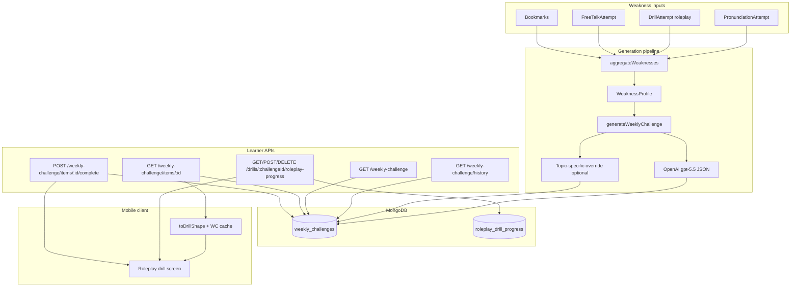

# Weekly Challenge Roleplay — Backend Audit

> **Scope:** How the backend generates, stores, serves, and tracks **roleplay drills inside the Weekly Challenge** only. This does not cover My Plan / tutor-assigned roleplay drills.
>
> **Backend source of truth:** `eklana-ai-frontend` repo (`/home/vahalla/Desktop/eklana-ai-frontend`). Primary reference doc: `docs/weekly-challenge.md`.
>
> **Mobile consumer:** This repo (`mobile`) — see §10 for how the client reads the APIs.

---

## 1. Executive summary

Weekly Challenge roleplay is **not** a document in the `drills` MongoDB collection. It is:

1. **AI-generated JSON** produced at challenge-generation time (OpenAI `gpt-5.5` by default, via `OPENAI_CHALLENGE_MODEL`).
2. **Embedded** in `weekly_challenges.content.drillSequence[]` as a `ChallengeDrillItem` with `drillType: 'roleplay'`.
3. **Served** through learner weekly-challenge REST APIs — never through `GET /api/v1/drills/:drillId`.
4. **Identified client-side** by a synthetic id `{challengeId}-{index}` (e.g. `674a1b2c3d4e5f6789012345-2`).
5. **Resumed** via `GET/POST/DELETE /api/v1/drills/{challengeId}/roleplay-progress` with `source=weekly_challenge`.

Every generated challenge always includes **exactly one roleplay item** as one of four fixed drill slots (`pronunciation`, `vocabulary`, `roleplay`, `key_phrases`). Fluency weaknesses from the learner's history inform the `targetWeakness` metadata and prompt context, but roleplay is generated regardless of whether fluency is the top weakness.

---

## 2. Architecture overview



---

## 3. Key principle: no `Drill` document

| Concept | Assignment roleplay | Weekly Challenge roleplay |
|---------|---------------------|---------------------------|
| Storage | `drills` collection | `weekly_challenges.content.drillSequence[i].generatedContent` |
| Fetch API | `GET /api/v1/drills/:drillId` | `GET /api/v1/learner/weekly-challenge/items/:itemId` |
| Drill `_id` | Real MongoDB ObjectId | Synthetic string `{challengeId}-{index}` |
| Progress `drillId` in URL | Assignment drill `_id` | **`challengeId`** (WeeklyChallenge `_id`) |
| Completion API | `POST /api/v1/drills/:drillId/complete` | `POST /api/v1/learner/weekly-challenge/items/:index/complete` |
| Server-side TTS/audio | `generateDrillAudio()` → Cloudinary URLs on drill | **Not generated** — `audioUrl` optional; client TTS fallback |

---

## 4. APIs that touch weekly challenge roleplay

Base path: `/api/v1`. All learner weekly-challenge routes require `user` role (`withRole(['user'])`). Roleplay-progress requires auth (`withAuth`).

### 4.1 List / trigger generation

| Method | Path | Backend file | Role for roleplay |
|--------|------|--------------|-------------------|
| `GET` | `/learner/weekly-challenge/history` | `src/app/api/v1/learner/weekly-challenge/history/route.ts` | Returns all weeks; each `drillSequence[]` entry with `drillType: 'roleplay'` shows label/instructions only (no `generatedContent`) |
| `GET` | `/learner/weekly-challenge` | `src/app/api/v1/learner/weekly-challenge/route.ts` | Same list shape for one week; triggers generation if missing |

**List item shape** (roleplay entry in `drillSequence`):

```json
{
  "index": 2,
  "itemId": "674a1b2c3d4e5f6789012345-2",
  "drillType": "roleplay",
  "label": "Role-play",
  "instructions": "Practice speaking at a steady pace…",
  "estimatedMinutes": 7,
  "completed": false
}
```

No scenes or dialogue at list time — only metadata.

### 4.2 Fetch full roleplay content (primary content API)

| Method | Path | Service | Purpose |
|--------|------|---------|---------|
| `GET` | `/learner/weekly-challenge/items/{itemId}` | `getWeeklyChallengeItem()` in `weekly-challenge.service.ts` | Returns full `ChallengeDrillItem` including `generatedContent.roleplay_scenes` |

**Path params:**

- `itemId` — numeric index (`0`, `1`, `2`, `3`) **or** composite `{challengeId}-{index}`

**Query params:**

- `weekStartDate` (optional ISO datetime) — disambiguates week when not using composite id

**Backend resolution** (`getWeeklyChallengeItem`):

1. If `challengeId` parsed from composite id → `WeeklyChallengeModel.findOne({ _id: challengeId, learnerId })`
2. Else → find by `learnerId + weekStartDate`
3. Require `doc.status === 'ready'`
4. Read `doc.content.drillSequence[index]`
5. Return wrapped response:

```typescript
interface WeeklyChallengeItemResponse {
  challengeId: string;       // WeeklyChallenge._id
  itemId: string;            // "{challengeId}-{index}"
  weekStartDate: string;
  index: number;
  item: ChallengeDrillItem;  // drillType + generatedContent + targetWeakness
  completed: boolean;
}
```

**Route file:** `src/app/api/v1/learner/weekly-challenge/items/[index]/route.ts`

This is the **only** API that delivers roleplay scenes, dialogue, and character names for weekly challenge practice.

### 4.3 Mark roleplay complete

| Method | Path | Service |
|--------|------|---------|
| `POST` | `/learner/weekly-challenge/items/{itemId}/complete` | `markWeeklyChallengeItemComplete()` |

**Body:** `{ score?: number }` (0–100, optional)

**Query:** `weekStartDate?`

**Effect:** `$addToSet` on `weekly_challenges.completedItemIndexes` for the numeric index. Does **not** create a `DrillAttempt` tied to a real drill document.

Alternate legacy route also exists: `POST /learner/weekly-challenge/[weekStartDate]/complete-item` with body `{ itemIndex }`.

### 4.4 Mid-session roleplay progress (resume / Continue Later)

| Method | Path | Model |
|--------|------|-------|
| `GET` | `/drills/{drillId}/roleplay-progress` | `roleplay_drill_progress` |
| `POST` | `/drills/{drillId}/roleplay-progress` | upsert progress |
| `DELETE` | `/drills/{drillId}/roleplay-progress` | clear on submit/restart |

**Critical:** For weekly challenge, `{drillId}` in the URL path is the **`WeeklyChallenge._id`** (same value as `challengeId`), **not** the synthetic `{challengeId}-{index}` route id.

**Query (GET/DELETE) / body (POST) for weekly challenge:**

```
source=weekly_challenge
challengeId=<WeeklyChallenge._id>
challengeItemIndex=<0-based index in drillSequence>
weekStartDate=<optional ISO string>
```

**Filter builder** (`roleplay-progress/route.ts`):

```typescript
{
  userId,
  source: 'weekly_challenge',
  challengeId: ObjectId(challengeId),
  challengeItemIndex: idx,
}
```

**POST body fields** (Zod-validated): scene/turn position, `turnProgress`, `sessionAnalytics`, `roleMode`, `pausedAtSceneBreak`, etc. — same shape as assignment roleplay, plus weekly challenge identifiers.

**Unique index** (`roleplay-drill-progress.ts`):

```typescript
{ userId: 1, challengeId: 1, challengeItemIndex: 1 }
// partialFilterExpression: { source: 'weekly_challenge' }
```

### 4.5 Weekly challenge item checkpoints (non-roleplay-specific, scene-break alternate)

Separate from `roleplay_drill_progress`, the `weekly_challenges` document has a `checkpoints` Map keyed by item index string:

| Method | Path |
|--------|------|
| `GET/POST/DELETE` | `/learner/weekly-challenge/[weekStartDate]/items/[index]/checkpoint` |

Stores `{ drillType, resumeFromIndex, completedCount, partialResults, savedAt }` on the challenge doc itself. The mobile roleplay screen uses **`roleplay-progress`** as the primary resume mechanism; this checkpoint API is an alternate path used more heavily on web for non-roleplay drill types.

### 4.6 Cron batch generation

| Method | Path | Schedule |
|--------|------|----------|
| `GET` | `/cron/weekly-challenge` | Vercel cron `0 6 * * *` (06:00 UTC daily) |

Batch-generates challenges for subscribed learners on their personal "challenge day" (subscription-aware Sunday). Same `generateWeeklyChallenge()` pipeline as on-demand generation.

---

## 5. Generation pipeline (how roleplay content is created)

### 5.1 Triggers

| Trigger | Entry point |
|---------|-------------|
| Learner opens history / week view | `GET /learner/weekly-challenge` → `ensureCurrentWeekChallenge()` → `ChallengeService.getOrGenerateChallenge()` |
| Cron job | `GET /cron/weekly-challenge` → per-learner `generateWeeklyChallenge()` |

### 5.2 Step-by-step

```
1. aggregateWeaknesses(learnerId, weekStartDate)
     ├─ PronunciationAttempt (10-day window)
     ├─ DrillAttempt grouped by drill type (all-time analytics)
     ├─ FreeTalkAttempt
     └─ Bookmarks (10-day window)
     → WeaknessProfile { weaknesses[], topWeaknesses[≤4], primaryMission, primaryTopic, country }

2. generateWeeklyChallenge(profile, context?)
     ├─ generateBaselineChallenge() — single OpenAI call, buildPrompt()
     │    └─ Prompt mandates exactly 4 items: pronunciation, vocabulary, roleplay, key_phrases
     └─ Optional per-type override via topic prompts (mission/topic templates)

3. Persist to weekly_challenges
     ├─ weaknessProfile snapshot
     ├─ content: { drillSequence, totalEstimatedMinutes, summaryMessage }
     ├─ status: 'ready' | 'generating' | 'failed'
     └─ generatedAt timestamp
```

**Key files:**

| File | Role |
|------|------|
| `src/domain/challenges/weakness-aggregator.ts` | `aggregateWeaknesses()` |
| `src/domain/challenges/challenge-generator.ts` | `generateWeeklyChallenge()`, prompt, Zod validation |
| `src/services/openai.service.ts` | `generateChallengeCompletion()` — `gpt-5.5`, `response_format: json_object` |
| `src/domain/challenges/challenge.service.ts` | Orchestration + cache (`status === 'ready'` → return cached) |
| `src/domain/challenges/weekly-challenge.service.ts` | HTTP-facing service layer |
| `src/models/weekly-challenge.ts` | Mongoose schema |

### 5.3 AI provider

- **Runtime:** OpenAI Chat Completions (`OPENAI_CHALLENGE_MODEL` env, default `gpt-5.5`)
- **Output:** Single JSON object with `drillSequence[]`
- **Note:** Some error strings and older docs still say "Gemini" — the implementation uses OpenAI

### 5.4 Roleplay is always one of four fixed slots

The baseline prompt **always** requests one roleplay drill. It is not dynamically chosen from a category→type mapping at runtime:

```
Generate exactly 4 ChallengeDrillItems — one for each drill type:
1. pronunciation
2. vocabulary
3. roleplay
4. key_phrases
```

The documented mapping `fluency → roleplay` (see §6) describes **what weakness category the roleplay item should target**, not whether a roleplay item exists.

### 5.5 Topic-specific roleplay override

After baseline generation, `generateWeeklyChallenge()` may replace the roleplay item if a mission/topic template exists:

```typescript
const drillTypes = ['pronunciation', 'vocabulary', 'roleplay', 'key_phrases'];
for (const drillType of drillTypes) {
  const template = getTopicPrompt(primaryMission, primaryTopic, drillType);
  if (!template) continue;
  const item = await generateTopicSpecificDrill(drillType, template, profile, context);
  // replace matching index in drillSequence
}
```

**Templates:** `src/domain/challenges/topic-prompts/mission-*.ts`

- Mission 2 has detailed multi-scene roleplay prompts with `{{practiced_scenarios}}` placeholder
- Missions 3–4 roleplay entries are still `TODO` — baseline generation applies

For topic-specific roleplay, `targetWeakness` is chosen via:

```typescript
profile.topWeaknesses.find(w => w.drillType === 'roleplay') ?? topWeaknesses[0]
```

### 5.6 Post-generation validation (roleplay)

Zod schema in `challenge-generator.ts`:

```typescript
const roleplayContentSchema = z.object({
  student_character_name: z.string(),
  ai_character_names: z.array(z.string()),
  context: z.string().optional(),
  roleplay_scenes: z.array(z.object({
    scene_name: z.string().optional(),
    scene_title: z.string().optional(),  // normalized → scene_name
    dialogue: z.array(z.object({
      speaker: z.string(),
      text: z.string(),
    })),
  })),
});
```

Post-process normalizes `scene_title` → `scene_name`. Does **not** validate or populate `audioUrl` or `translation`.

### 5.7 Prompt constraints for roleplay content

From `buildPrompt()` in `challenge-generator.ts`:

| Constraint | Detail |
|------------|--------|
| Speakers | `"student"` or `"ai_0"`, `"ai_1"`, … — **never** character display names |
| Character names | Concrete names in `ai_character_names[]` (e.g. `'Nurse Sarah Chen'`) — no `[Name]` placeholders |
| Dialogue | Complete sentences only — no `___`, `---`, or bracket placeholders |
| Scenes | Prompt asks for 2–3 scenes; **actual output is usually 1 scene** (known limitation) |
| Focus | "fluency and conversational scenarios" — realistic clinical nursing contexts |
| Personalization | Incorporate weakness evidence; avoid repeating exact words from pronunciation/vocabulary items in same challenge |

---

## 6. Fluency weakness → roleplay connection

### 6.1 Signals that feed generation

| Source | Condition | Signal |
|--------|-----------|--------|
| `PronunciationAttempt` | `avgFluency < 80` | `{ drillType: 'pronunciation', category: 'fluency', label: 'Fluency' }` |
| `DrillAttempt` (roleplay) | `avgFluency < 75` per scene | `{ drillType: 'roleplay', category: 'fluency', label: 'Roleplay fluency' }` |
| `DrillAttempt` (roleplay) | `avgPron < 75` per scene | `{ drillType: 'roleplay', category: 'pronunciation', … }` |
| `FreeTalkAttempt` | weak behaviours | `{ drillType: 'free_talk', category: 'fluency', … }` |

**Extractor:** `extractRoleplaySignals()` in `weakness-aggregator.ts` — reads `attempt.roleplayResults.sceneScores[].fluencyScore`.

### 6.2 How signals become roleplay content

1. All signals sorted by `severity` (descending)
2. `pickTopFour()` prefers one signal per drill type: `pronunciation → vocabulary → roleplay → key_phrases`
3. Baseline OpenAI prompt receives full `weaknesses[]` and `topWeaknesses[]`
4. Model assigns `targetWeakness` on each `ChallengeDrillItem` — the roleplay item often gets `category: 'fluency'` even when the linked signal's `drillType` is `pronunciation` (see sample in `docs/weekly-challenge.md` §8)
5. Model writes `instructions` + `generatedContent` scenario targeting that weakness

### 6.3 Documented category → drill type mapping (reference)

| Weakness `category` | Typical challenge drill type |
|---------------------|------------------------------|
| `pronunciation` | `pronunciation` or `key_phrases` |
| **`fluency`** | **`roleplay`** |
| `vocabulary` | `fill_blank` / `vocabulary` or `key_phrases` |
| `grammar` | `fill_blank` |

This is **prompt guidance**, not runtime `if (fluency) insert roleplay` logic. Roleplay is always present as slot 3 of 4.

---

## 7. Content shape (`RoleplayGeneratedContent`)

### 7.1 TypeScript definition

Source: `src/domain/challenges/types.ts`

```typescript
interface RoleplayGeneratedContent {
  student_character_name: string;
  ai_character_names: string[];
  context?: string;
  drill_intro?: string;
  roleplay_scenes: Array<{
    scene_name?: string;
    context?: string;
    dialogue: Array<{
      speaker: string;      // "student" | "ai_0" | "ai_1" …
      text: string;
      translation?: string;
      audioUrl?: string;    // allowed but not populated at generation
    }>;
  }>;
}

interface ChallengeDrillItem {
  drillType: 'roleplay';  // among 4 possible types
  targetWeakness: WeaknessSignal;
  instructions: string;
  generatedContent: RoleplayGeneratedContent;
  estimatedMinutes: number;
}
```

### 7.2 Storage location in MongoDB

```
weekly_challenges
  └── content
        └── drillSequence[N]          // N = index of roleplay in sequence (often 2)
              ├── drillType: "roleplay"
              ├── targetWeakness: { … }
              ├── instructions: "…"
              ├── estimatedMinutes: 7
              └── generatedContent
                    ├── student_character_name: "Nurse"
                    ├── ai_character_names: ["Patient"]
                    ├── context: "…"
                    └── roleplay_scenes: [ { scene_name, dialogue: [...] } ]
```

### 7.3 Example (from backend docs)

```json
{
  "drillType": "roleplay",
  "targetWeakness": {
    "drillType": "pronunciation",
    "category": "fluency",
    "severity": 0.33,
    "evidence": ["Average fluency score: 66.7"],
    "label": "Fluency"
  },
  "instructions": "Practice speaking at a steady pace, using natural pauses…",
  "generatedContent": {
    "student_character_name": "Nurse",
    "ai_character_names": ["Patient"],
    "context": "You are a nurse checking in on a patient who has just had surgery…",
    "roleplay_scenes": [
      {
        "scene_name": "Post-operative Check-in",
        "dialogue": [
          { "speaker": "student", "text": "Good morning, Mr. Smith…" },
          { "speaker": "ai_0", "text": "Morning, nurse. I'm a bit sore…" }
        ]
      }
    ]
  },
  "estimatedMinutes": 7
}
```

### 7.4 Audio

- Schema allows `audioUrl` per dialogue line
- **Generation pipeline does not call TTS or Cloudinary**
- At practice time, clients use `turn.audioUrl` if present, otherwise on-device TTS (`tts.service.ts` on mobile)

---

## 8. MongoDB schemas

### 8.1 `weekly_challenges`

File: `src/models/weekly-challenge.ts`

| Field | Type | Notes |
|-------|------|-------|
| `learnerId` | ObjectId → User | required |
| `weekStartDate` | Date | unique with `learnerId` |
| `weaknessProfile` | Mixed | full snapshot at generation time |
| `challengeType` | String | `'structured_drill_sequence'` |
| `content` | Mixed | `{ drillSequence[], totalEstimatedMinutes, summaryMessage }` |
| `status` | enum | `pending \| generating \| ready \| failed` |
| `generatedAt` | Date | set when `ready` |
| `completedItemIndexes` | `[Number]` | which items finished |
| `checkpoints` | Map\<string, Mixed\> | per-item lightweight checkpoints |

**Index:** `{ learnerId: 1, weekStartDate: 1 }` unique

### 8.2 `roleplay_drill_progress`

File: `src/models/roleplay-drill-progress.ts`

Weekly-challenge-specific fields:

| Field | Notes |
|-------|-------|
| `source` | `'weekly_challenge'` |
| `challengeId` | ObjectId → `weekly_challenges._id` |
| `challengeItemIndex` | number (0-based index in `drillSequence`) |
| `weekStartDate` | optional ISO string |
| `drillId` | ObjectId (stores challenge id, not a real Drill) |
| `currentSceneIndex`, `currentTurnIndex` | playback position |
| `pausedAtSceneBreak` | between-scene pause |
| `turnProgress` | per-turn pass/fail/score |
| `sessionAnalytics` | Speechace analytics per turn |
| `roleMode` | `'original' \| 'swapped'` |

---

## 9. End-to-end request flow (roleplay item)

```
Sunday / first visit
  → GET /learner/weekly-challenge/history
  → Backend: aggregateWeaknesses + generateWeeklyChallenge (if needed)
  → Response: drillSequence[2].drillType === "roleplay" (metadata only)

Learner taps roleplay row
  → GET /learner/weekly-challenge/items/2?weekStartDate=...
  → Backend: read weekly_challenges.content.drillSequence[2]
  → Response: full RoleplayGeneratedContent

Mobile adapter
  → toDrillShape() → synthetic _id "{challengeId}-2"
  → setCachedWCDrill()
  → navigate to /practice/drills/roleplay/{challengeId}-2
     with params: source=weekly_challenge, challengeId, challengeItemIndex, weekStartDate

Roleplay screen load
  → getCachedWCDrill("{challengeId}-2")     // NOT getDrillById
  → GET /drills/{challengeId}/roleplay-progress?source=weekly_challenge&challengeId=…&challengeItemIndex=2

During practice (student turn)
  → POST /speechace/score (pronunciation scoring — separate API)
  → POST /drills/{challengeId}/roleplay-progress (save on Continue Later / scene break)

On finish
  → POST /learner/weekly-challenge/items/2/complete { score }
  → DELETE /drills/{challengeId}/roleplay-progress
```

---

## 10. Mobile client mapping (for cross-reference)

| Mobile file | Backend interaction |
|-------------|---------------------|
| `services/weekly-challenge.service.ts` | `getWeeklyChallengeItem()` → §4.2 |
| `utils/challengeDrillAdapter.ts` | Spreads `generatedContent` into synthetic `Drill` |
| `utils/weeklyChallengeDrillCache.ts` | In-memory cache between adapter screen and drill runner |
| `utils/drillNavigation.ts` | `navigateToWeeklyChallengeRoleplay()` — passes WC route params |
| `utils/roleplayProgressContext.ts` | `progressDrillId = challengeId` for API calls |
| `app/practice/drills/roleplay/[id].tsx` | Cache load + `getRoleplayProgress` / `saveRoleplayProgress` / `completeWeeklyChallengeItem` |

**ID split (important for debugging):**

| ID | Value | Used for |
|----|-------|----------|
| Route / cache id | `{challengeId}-{index}` | Expo route `[id]`, `getCachedWCDrill()` |
| Progress API `drillId` | `{challengeId}` only | `GET/POST/DELETE /drills/{challengeId}/roleplay-progress` |

---

## 11. Known limitations and inconsistencies

| Issue | Detail |
|-------|--------|
| **Gemini vs OpenAI** | Docs/error strings mention Gemini; runtime uses OpenAI `gpt-5.5` |
| **Single-scene output** | Prompt requests 2–3 scenes; generation usually returns 1 |
| **No server TTS** | Unlike assignment roleplay, `audioUrl` is never populated during WC generation |
| **No `DrillAttempt` on WC complete** | Completion only updates `completedItemIndexes`; does not create standard drill attempt rows |
| **Fluency loop is indirect** | Past roleplay attempts feed `extractRoleplaySignals()` → future challenge `targetWeakness`; WC roleplay practice itself does not write back to `DrillAttempt` the same way assignment completion does |
| **Dual generation paths** | On-demand (`getOrGenerateChallenge`) vs cron (`getOrCreateWeeklyChallenge`) with different day-gating |
| **`vocabulary` vs `fill_blank`** | Generator emits `vocabulary`; types also list `fill_blank`; mobile adapter maps vocabulary → fill_blank UI |
| **Topic prompts incomplete** | Missions 3–4 roleplay templates are `TODO` |

---

## 12. Backend file index (roleplay in weekly challenge)

| Area | Path in `eklana-ai-frontend` |
|------|-------------------------------|
| Main docs | `docs/weekly-challenge.md` |
| Types | `src/domain/challenges/types.ts` |
| Weakness → fluency signals | `src/domain/challenges/weakness-aggregator.ts` (`extractRoleplaySignals`) |
| AI generation + roleplay prompt | `src/domain/challenges/challenge-generator.ts` |
| OpenAI wrapper | `src/services/openai.service.ts` |
| Service layer | `src/domain/challenges/weekly-challenge.service.ts` |
| Orchestration | `src/domain/challenges/challenge.service.ts` |
| Weekly challenge model | `src/models/weekly-challenge.ts` |
| Roleplay progress model | `src/models/roleplay-drill-progress.ts` |
| Roleplay progress route | `src/app/api/v1/drills/[drillId]/roleplay-progress/route.ts` |
| Item fetch route | `src/app/api/v1/learner/weekly-challenge/items/[index]/route.ts` |
| Item complete route | `src/app/api/v1/learner/weekly-challenge/items/[index]/complete/route.ts` |
| Topic roleplay prompts | `src/domain/challenges/topic-prompts/mission-2.ts` (missions 3–4 TODO) |
| Cron | `src/app/api/v1/cron/weekly-challenge/route.ts` |

---

## 13. Quick API cheat sheet (roleplay only)

```
# List (metadata — no scenes)
GET /api/v1/learner/weekly-challenge/history
GET /api/v1/learner/weekly-challenge?weekStartDate=<ISO>

# Full roleplay content
GET /api/v1/learner/weekly-challenge/items/{index|challengeId-index}?weekStartDate=<ISO>

# Complete
POST /api/v1/learner/weekly-challenge/items/{index}/complete
Body: { "score": 85 }
Query: weekStartDate=<ISO>

# Mid-session resume
GET  /api/v1/drills/{challengeId}/roleplay-progress?source=weekly_challenge&challengeId={challengeId}&challengeItemIndex={index}
POST /api/v1/drills/{challengeId}/roleplay-progress
Body: { source, challengeId, challengeItemIndex, weekStartDate?, currentSceneIndex, currentTurnIndex, … }
DELETE /api/v1/drills/{challengeId}/roleplay-progress?source=weekly_challenge&challengeId={challengeId}&challengeItemIndex={index}
```
