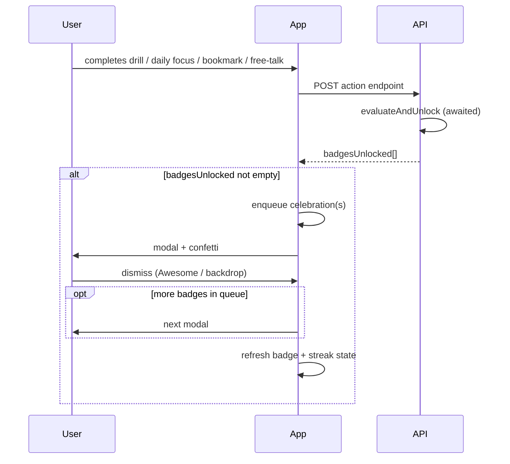

# Badge Unlock Celebration Modal

Specification for the learner badge achievement popup introduced on web (June 2026). Mobile should mirror this behavior, copy, and API handling so unlock moments feel identical across platforms.

Related docs: [eklan-app-badges.md](./eklan-app-badges.md) (badge catalog and earn rules).

---

## Summary

When a learner earns a new badge during an action (drill, daily focus, bookmark, free-talk), the app shows a **centered celebration modal** with:

- Gold confetti
- Badge emoji icon
- Badge name
- Outcome description (`afterOutcome`)
- Humorous line (`humorousLine`)
- Primary CTA: **Awesome!** (dismiss)
- Secondary CTA: **View badges** (navigate to badge gallery)

The modal is **not** a toast and **not** an inline banner. Generic success toasts for the underlying action (e.g. “Drill completed”) may still appear separately.

---

## When to show the modal

Show the celebration modal immediately after a successful API response that includes one or more items in `badgesUnlocked`.

| User action | API | Method | Show modal? |
|-------------|-----|--------|-------------|
| Complete a drill | `/api/v1/drills/{drillId}/complete` | `POST` | Yes, if `badgesUnlocked.length > 0` |
| Complete daily focus | `/api/v1/daily-focus/{id}/complete` | `POST` | Yes, if `badgesUnlocked.length > 0` |
| Create bookmark | `/api/v1/bookmarks` | `POST` | Yes, if `badgesUnlocked.length > 0` (201 only; skip on “Already bookmarked”) |
| Save free-talk attempt | `/api/v1/ai/free-talk/attempts` | `POST` | Yes, if `badgesUnlocked.length > 0` |
| Fetch badge gallery | `/api/v1/badges` | `GET` | **No** — gallery only; no unlock celebration |

Do **not** show the modal on `GET /api/v1/badges` even though that endpoint re-evaluates badges server-side.

---

## Flow



---

## Data contract

### `BadgeUnlockCelebration`

Each item in `badgesUnlocked` uses this shape:

```ts
type BadgeUnlockCelebration = {
  badgeId: BadgeId;
  badgeName: string;
  icon: string;           // emoji, e.g. "👣"
  afterOutcome: string;   // outcome copy shown in modal body
  humorousLine: string;   // italic tagline below outcome
};

type BadgeId =
  | 'first-steps'
  | 'seven-day-stretch'
  | 'done-and-dusted'
  | 'deja-vu'
  | 'monthly-challenge'
  | 'master-collector'
  | 'medication-master'
  | 'handover-hero'
  | 'nightingale-award'
  | 'skill-keeper';
```

If the API returns only `badgeId` and `badgeName` (legacy), resolve full copy from the badge catalog below using `badgeId`.

### Legacy field

Daily focus responses also include `badgeUnlocked` (single object or `null`) — the **first** item from `badgesUnlocked`. Prefer `badgesUnlocked`; use `badgeUnlocked` only as fallback.

---

## Parsing API responses

Response wrappers differ by endpoint. Extract `badgesUnlocked` using this logic:

1. If the root has a `data` object, read from `data`; otherwise read from the root.
2. If `badgesUnlocked` is a non-empty array → show modal for each item (queued).
3. Else if `badgeUnlocked` is a single object → show modal for that one item.
4. Else → no modal.

### 1. Drill complete

**Request:** `POST /api/v1/drills/{drillId}/complete`

**Response:**

```json
{
  "code": "Success",
  "data": {
    "attempt": {
      "id": "...",
      "score": 85,
      "timeSpent": 120,
      "completedAt": "2026-06-22T12:00:00.000Z"
    },
    "badgesUnlocked": [
      {
        "badgeId": "first-steps",
        "badgeName": "First Steps",
        "icon": "👣",
        "afterOutcome": "You've earned this award for completing your first drill...",
        "humorousLine": "Looks like someone's been busy."
      }
    ]
  }
}
```

### 2. Daily focus complete

**Request:** `POST /api/v1/daily-focus/{id}/complete`

**Response:**

```json
{
  "code": "Success",
  "data": {
    "message": "Daily focus completed successfully",
    "score": 90,
    "streakUpdated": true,
    "badgesUnlocked": [ /* BadgeUnlockCelebration[] */ ],
    "badgeUnlocked": { /* first item or null — legacy */ }
  }
}
```

### 3. Bookmark create

**Request:** `POST /api/v1/bookmarks`

**Response (201):**

```json
{
  "bookmark": { /* ... */ },
  "badgesUnlocked": [ /* BadgeUnlockCelebration[] */ ]
}
```

No modal when response is 200 with `"message": "Already bookmarked"`.

### 4. Free-talk attempt save

**Request:** `POST /api/v1/ai/free-talk/attempts` (multipart)

**Response:**

```json
{
  "success": true,
  "attempt": { /* ... */ },
  "badgesUnlocked": [ /* BadgeUnlockCelebration[] */ ]
}
```

---

## Queue behavior (multiple unlocks)

If `badgesUnlocked` contains more than one badge from a single action:

1. Show the **first** badge in a modal.
2. On dismiss, show the **next** badge.
3. Repeat until the queue is empty.

Do not stack modals. Do not merge multiple badges into one modal.

---

## UI specification

### Layout

Centered dialog over a dimmed full-screen backdrop.

```
┌─────────────────────────────────────┐
│           (dimmed backdrop)         │
│    ┌─────────────────────────┐      │
│    │      ┌─────────┐        │      │
│    │      │  👣 80px │        │      │
│    │      └─────────┘        │      │
│    │   BADGE UNLOCKED!       │      │
│    │   First Steps           │      │
│    │                         │      │
│    │   [afterOutcome text]   │      │
│    │   [humorousLine italic] │      │
│    │                         │      │
│    │  [ Awesome! ] [ View ]  │      │
│    └─────────────────────────┘      │
└─────────────────────────────────────┘
```

### Visual tokens (match web)

| Element | Value |
|---------|--------|
| Backdrop | `rgba(0, 0, 0, 0.4)` — tap to dismiss |
| Dialog width | `min(92vw, 400px)` |
| Dialog background | White (`#FFFFFF`) |
| Dialog radius | `16px` (`rounded-2xl`) |
| Dialog padding | `24px` |
| Dialog shadow | Large elevation / `shadow-xl` |
| Icon circle size | `80×80px` |
| Icon circle gradient | `#FBBF24` → `#F97316` (yellow-400 → orange-400), top-left to bottom-right |
| Icon emoji size | ~`36px` (`text-4xl`) |
| Label “Badge Unlocked!” | `14px`, medium weight, uppercase, wide tracking, color `#EA580C` (orange-600) |
| Title (badge name) | `24px`, bold |
| Outcome body | `14px`, muted gray |
| Humorous line | `14px`, italic, slightly softer than body |
| Primary button | Brand green `#3B883E`, white text, label **Awesome!** |
| Secondary button | Outlined / ghost, label **View badges** |

### Confetti

Fire once when each modal opens (not on dismiss).

| Property | Value |
|----------|--------|
| Particle count | `200` |
| Spread | `120` |
| Origin Y | `0.5` (center of screen) |
| Colors | `#FBBF24`, `#F59E0B`, `#D97706`, `#92400E` |

Use platform-native confetti / particle animation with equivalent gold palette.

### Accessibility & interaction

| Behavior | Web implementation | Mobile equivalent |
|----------|-------------------|-------------------|
| Dismiss primary CTA | “Awesome!” button | Same label |
| Dismiss backdrop | Tap outside dialog | Tap outside or swipe down (if sheet) — centered modal preferred |
| Dismiss hardware back | N/A | Close current modal; if queue non-empty, do not exit screen until queue drained |
| Block background scroll | `body overflow: hidden` | Disable interaction behind modal |
| Screen reader | `role="dialog"`, `aria-modal="true"`, title = badge name | Announce “Badge unlocked: {badgeName}” |

### Navigation

| CTA | Destination |
|-----|-------------|
| **View badges** | Badge gallery screen (`/account/badges` on web) |
| **Awesome!** | Close modal only; stay on current screen |

After any unlock, refresh:

- Badge gallery / home featured badge
- Streak data (if shown elsewhere)

On web this is done via cache invalidation after the action. Mobile should refetch `GET /api/v1/badges` and streak endpoints after dismiss or in parallel after showing the modal.

---

## Copy shown in the modal (all badges)

Use API payload when present. Fallback catalog:

| badgeId | badgeName | icon | afterOutcome | humorousLine |
|---------|-----------|------|--------------|--------------|
| `first-steps` | First Steps | 👣 | You've earned this award for completing your first drill and officially started your journey toward confident nursing communication. | Looks like someone's been busy. |
| `seven-day-stretch` | 7-Day Stretch | 🔥 | You've earned this award for practicing for at least 5 minutes every day for 7 consecutive days. | At this point, your phone expects to see you. |
| `done-and-dusted` | Done & Dusted | 🏆 | You've earned this award for completing all drills for the week. | And they all lived happily ever after... or not. Next? |
| `deja-vu` | Déjà Vu | 🔭 | You've earned this award for practising a difficult drill at least 10 times. | If this drill could talk, it would know your voice by now. |
| `monthly-challenge` | Monthly Challenge | 📅 | You've earned this award for practicing at least 5 minutes everyday for 14 consecutive days within a single month. | Not every hero wears a cape... Turns out consistency is a superpower. |
| `master-collector` | Master Collector | 📚 | You've earned this award for saving difficult drills to revisit and master later. | This difficult drill is already getting nervous. We love seeing it. |
| `medication-master` | Medication Master | 💊 | You've earned this award for correctly practicing 50 medication names and explanations. | Metoprolol is even scared of you now... You're in charge. |
| `handover-hero` | Handover Hero | 📋 | You've earned this award for completing handover drills. | Clear. Concise. Complete. Look at you! |
| `nightingale-award` | Nightingale Award | 👑 | You've earned this award for completing Zero Pause Challenge. | Florence is looking down on you and smiling. |
| `skill-keeper` | Skill Keeper | 🔄 | You've earned this award for completing your assigned daily refresh. | You keep showing up. That's what stars do. |

**Modal chrome (fixed strings, English only for now):**

- Label: `Badge Unlocked!`
- Primary button: `Awesome!`
- Secondary button: `View badges`

---

## What not to do

- Do not show a separate toast that duplicates the badge name (web removed “🎉 Badge Unlocked: …” toast).
- Do not show an inline banner on the results screen instead of the modal.
- Do not show the modal on passive badge refresh (`GET /api/v1/badges`).
- Do not fail the parent action if badge evaluation errors; `badgesUnlocked` will simply be empty.

---

## Mobile implementation checklist

- [x] Global celebration coordinator (singleton / context) with FIFO queue
- [x] Parse `badgesUnlocked` from all four POST endpoints above
- [x] Fallback: resolve copy from `badgeId` if API returns partial payload
- [x] Centered modal matching layout and colors
- [x] Confetti on open (gold palette)
- [x] Success haptic on modal open (native equivalent of web vibration)
- [x] **Awesome!** dismisses current item; show next in queue if any
- [x] **View badges** navigates to gallery and closes modal
- [x] Refetch `GET /api/v1/badges` after unlock
- [x] Refetch streak state if app displays streak/badges on home
- [x] Handle legacy `badgeUnlocked` on daily focus responses
- [x] Drill-end celebration (`playDrillEndCelebration`) on completion screen mount
- [x] Key phrases inline `DrillCompletedScreen` with celebration (not results-only flow)

---

## Web reference files

| Purpose | Path |
|---------|------|
| Modal UI | `src/components/badges/BadgeUnlockModal.tsx` |
| Queue provider | `src/components/badges/BadgeUnlockProvider.tsx` |
| Celebration trigger | `src/lib/badges/celebrate-badge-unlock.ts` |
| Response parsing | `src/lib/badges/badge-unlock.ts` |
| Badge catalog | `src/domain/badges/badge.definitions.ts` |
| Badge evaluation | `src/services/streak.service.ts` → `triggerBadgeEvaluation` |
| Gallery screen | `/account/badges` |

---

## Badge gallery (separate screen)

`GET /api/v1/badges` returns full state for the gallery — not for the unlock modal:

```ts
type BadgeStateResponse = {
  badges: BadgeView[];      // all 10 badges with locked/unlocked + progress
  featuredBadge: BadgeView; // most recent unlock, or first locked
};
```

The unlock modal uses only `BadgeUnlockCelebration` fields. The gallery uses `beforeDescription` for locked badges and the same `afterOutcome` / `humorousLine` for unlocked cards.
