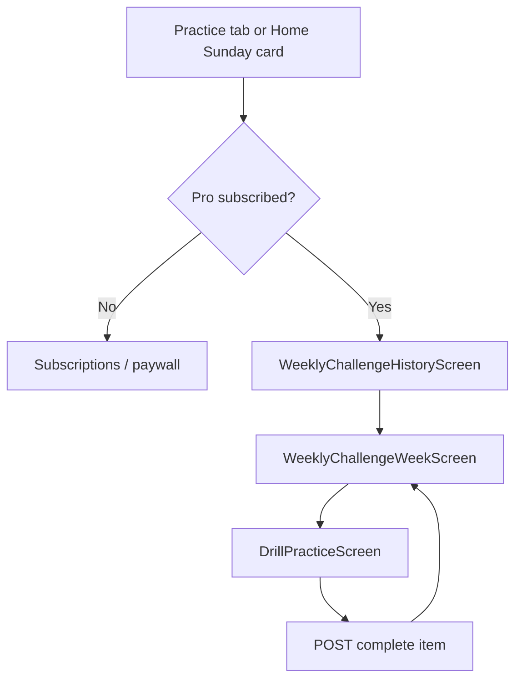

# Mobile Handoff — Weekly Challenge

> **Prerequisites**: Read `MOBILE_README.md` first for auth, error envelope, shared types, and stack conventions.  
> **Backend reference**: `docs/weekly-challenge.md` (generation pipeline) and `docs/weekly-challenge-ui-spec.md` (original web UI spec).  
> **Web source of truth**: mirror the web implementation in `src/app/(student)/account/practice/weekly-challenge/` and `src/components/weekly-challenge/`.

---

## 1. Feature overview

The **Weekly Challenge** is a personalized drill sequence generated from the learner's weaknesses over the past 7 days. It unlocks on **Sunday** (subscription-aware — see §12) and is **Pro-gated**.

### User journey



1. Learner opens **Practice** and taps **Eklan Weekly Challenge** (or taps the Sunday promo card on Home).
2. **History** lists all past weeks with drills, newest first.
3. Tapping a week opens the **week view** — hero banner + drill list.
4. Tapping a drill opens the **existing drill runner** with `weeklyChallengeMeta` so completion is tracked against the challenge (not My Plan).
5. On finish, learner returns to the week view; completed drills show a checkmark.

### What the mobile app does NOT implement

- Challenge **generation** (Gemini, weakness aggregation) — backend only.
- Category → drill type mapping — determined at generation time.
- Any admin/tutor surfaces.

---

## 2. Screen hierarchy and navigation

| Web route | Mobile screen | Params |
|-----------|---------------|--------|
| `/account/practice` (entry card) | `practice/index.tsx` | — |
| `/account/practice/weekly-challenge` | `practice/weekly-challenge/index.tsx` | — |
| `/account/practice/weekly-challenge/[weekStartDate]` | `practice/weekly-challenge/[weekStartDate].tsx` | `weekStartDate: string` (URL-encoded ISO) |
| `/account/practice/weekly-challenge/[weekStartDate]/[index]` | `practice/weekly-challenge/[weekStartDate]/[index].tsx` | `weekStartDate`, `index: number` |

### Stack structure

```
PracticeStack
  practice/index.tsx
  practice/weekly-challenge/index.tsx          ← WeeklyChallengeHistoryScreen
  practice/weekly-challenge/[weekStartDate].tsx ← WeeklyChallengeWeekScreen
  practice/weekly-challenge/[weekStartDate]/[index].tsx ← DrillPracticeScreen
```

### Optional: Home Sunday promo card

On web, `TodaysFocusCard` shows `WeeklyChallengeCard` on Sunday when there are no active plan drills. Mirror this on the Home tab if the mobile app has an equivalent "Today's Focus" section:

- Call `GET /learner/weekly-challenge` (no `weekStartDate`) only when `isSunday` is true.
- Show promo card when `status === 'ready'` and `drillSequence.length > 0`, or when `status === 'generating' | 'failed'`.
- **Start** / **Resume** button navigates to `practice/weekly-challenge/index.tsx`.

---

## 3. Auth and subscription gate

All endpoints require `Authorization: Bearer <token>`.

**Pro gate** — match web `learnerHasProAccess`:

```typescript
function learnerHasProAccess(user: { isSubscribed?: boolean; subscriptionPlan?: string } | null | undefined): boolean {
  if (!user) return false;
  if (user.isSubscribed === true) return true;
  return String(user.subscriptionPlan || '').toLowerCase() === 'premium';
}
```

On every weekly challenge screen:

1. Fetch current user (`GET /user/current` or equivalent).
2. If `!learnerHasProAccess(user)` → redirect to subscriptions/paywall.
3. On Practice entry card, show locked state when not subscribed (same as Free Talk card).

---

## 4. API reference

Base path: `/api/v1`. All responses use the standard envelope `{ code: string, data: T }`. Unwrap `data` before use.

### 4.1 `GET /learner/weekly-challenge/history`

Fetches all challenges for the learner, **newest first**. Also triggers current-week generation on the backend if needed.

| | |
|---|---|
| **Query** | none |
| **Cache** | `cache: false` on web — always fresh |

**Response `data`:**

```typescript
interface WeeklyChallengeHistoryResponse {
  challenges: WeeklyChallengeListResponse[];
}
```

### 4.2 `GET /learner/weekly-challenge`

Get one week (or current week when `weekStartDate` omitted).

| | |
|---|---|
| **Query** | `weekStartDate?: string` — ISO datetime (e.g. `2026-06-02T00:00:00.000Z`) |

**Response `data`:** `WeeklyChallengeListResponse`

### 4.3 `GET /learner/weekly-challenge/items/{itemId}`

Fetch full drill content for practice.

| | |
|---|---|
| **Path** | `itemId` — numeric index (`0`, `1`, …) **or** composite `{challengeId}-{index}` |
| **Query** | `weekStartDate?: string` — pass when fetching a specific week |

**Response `data`:**

```typescript
interface WeeklyChallengeItemResponse {
  challengeId: string;
  itemId: string;       // "{challengeId}-{index}"
  weekStartDate: string;
  index: number;
  item: ChallengeDrillItem;
  completed: boolean;
}
```

### 4.4 `POST /learner/weekly-challenge/items/{itemId}/complete`

Mark a drill item complete.

| | |
|---|---|
| **Path** | `itemId` — numeric index or composite |
| **Query** | `weekStartDate?: string` |
| **Body** | `{ score?: number }` — optional 0–100 score |

**Response `data`:**

```typescript
interface WeeklyChallengeCompleteResponse {
  challengeId: string;
  itemId: string;
  index: number;
  completed: boolean;
  completedItemIndexes: number[];
  totalItems: number;
}
```

### 4.5 Roleplay mid-session progress (roleplay drills only)

| Method | Path | Notes |
|--------|------|-------|
| `GET` | `/drills/{drillId}/roleplay-progress` | Query: `source=weekly_challenge`, `challengeId`, `challengeItemIndex` |
| `POST` | `/drills/{drillId}/roleplay-progress` | Body includes `source: 'weekly_challenge'`, `challengeId`, `challengeItemIndex`, `weekStartDate?`, turn/scene state |

Use `drillId` = synthetic id from adapter: `${challengeId}-${index}`.

---

## 5. TypeScript types

Copy these into the mobile app's shared types module. Source: `src/domain/challenges/types.ts` and `src/domain/challenges/weekly-challenge.service.ts`.

### 5.1 List / history types

```typescript
export interface WeeklyChallengeListItem {
  index: number;
  itemId: string;           // "{challengeId}-{index}"
  drillType: string;
  label: string;
  instructions: string;
  estimatedMinutes: number;
  completed: boolean;
}

export interface WeeklyChallengeListResponse {
  challengeId: string | null;
  weekStartDate: string;    // ISO datetime
  generatedAt?: string | null;
  weekNumber?: number;
  status: 'ready' | 'generating' | 'failed' | 'unavailable';
  summaryMessage: string;
  totalEstimatedMinutes: number;
  drillSequence: WeeklyChallengeListItem[];
  isSunday: boolean;
}
```

### 5.2 Drill item types

```typescript
export interface WeaknessSignal {
  drillType: string;
  category: 'pronunciation' | 'fluency' | 'vocabulary' | 'grammar';
  severity: number;         // 0–1
  evidence: string[];
  label: string;
}

export interface PronunciationGeneratedContent {
  pronunciation_items: Array<{
    word: string;
    sentence: string;
    sound?: string;           // IPA string
    wordAudioUrl?: string;
    sentenceAudioUrl?: string;
  }>;
}

export interface FillBlankGeneratedContent {
  fill_blank_items: Array<{
    sentence: string;         // contains ___ per blank
    blanks: Array<{
      position: number;
      correctAnswer: string;
      options: string[];
      hint?: string;
    }>;
    translation?: string;
    audioUrl?: string;
  }>;
}

export interface KeyPhrasesGeneratedContent {
  key_phrase_items: Array<{
    prompt: string;
    options: string[];
    correctAnswer: string;    // must exactly match one entry in options[]
    respondentName?: string;
    promptAudioUrl?: string;
  }>;
}

export interface RoleplayGeneratedContent {
  student_character_name: string;
  ai_character_names: string[];
  context?: string;
  drill_intro?: string;
  roleplay_scenes: Array<{
    scene_name?: string;
    context?: string;
    dialogue: Array<{
      speaker: string;        // "student" | "ai_0" | "ai_1" … NEVER a display name
      text: string;
      translation?: string;
      audioUrl?: string;
    }>;
  }>;
}

export interface ChallengeDrillItem {
  drillType: 'pronunciation' | 'vocabulary' | 'fill_blank' | 'key_phrases' | 'roleplay';
  targetWeakness: WeaknessSignal;
  instructions: string;
  generatedContent:
    | PronunciationGeneratedContent
    | FillBlankGeneratedContent
    | KeyPhrasesGeneratedContent
    | RoleplayGeneratedContent;
  estimatedMinutes: number;
}
```

### 5.3 Weekly challenge meta (passed into drill runner)

```typescript
export interface WeeklyChallengeMeta {
  challengeId: string;
  itemIndex: number;
  itemId: string;
  weekStartDate: string;
}
```

---

## 6. State management (React Query)

Mirror `src/hooks/useWeeklyChallenge.ts` and `src/lib/react-query.ts`.

### 6.1 Query keys

```typescript
const weeklyChallengeKeys = {
  all: ['weeklyChallenge'] as const,
  history: () => [...weeklyChallengeKeys.all, 'history'] as const,
  current: () => [...weeklyChallengeKeys.all, 'current'] as const,
  week: (weekStartDate: string) =>
    [...weeklyChallengeKeys.all, 'week', weekStartDate] as const,
  item: (weekStartDate: string, index: number) =>
    [...weeklyChallengeKeys.all, 'item', weekStartDate, index] as const,
};
```

### 6.2 Hooks

```typescript
const GENERATING_POLL_MS = 3000;
const STALE_TIME_MS = 1000 * 60 * 2;

function useWeeklyChallengeHistory(options?: { enabled?: boolean }) {
  return useQuery({
    queryKey: weeklyChallengeKeys.history(),
    queryFn: async () => {
      const res = await api.get('/learner/weekly-challenge/history');
      return res.data?.challenges ?? [];
    },
    enabled: options?.enabled ?? true,
    staleTime: STALE_TIME_MS,
    refetchInterval: (query) => {
      const challenges = query.state.data ?? [];
      return challenges.some((c) => c.status === 'generating') ? GENERATING_POLL_MS : false;
    },
  });
}

function useWeeklyChallenge(weekStartDate?: string, options?: { enabled?: boolean }) {
  return useQuery({
    queryKey: weekStartDate
      ? weeklyChallengeKeys.week(weekStartDate)
      : weeklyChallengeKeys.current(),
    queryFn: async () => {
      const res = await api.get('/learner/weekly-challenge', {
        params: weekStartDate ? { weekStartDate } : undefined,
      });
      return res.data ?? null;
    },
    enabled: options?.enabled ?? true,
    staleTime: STALE_TIME_MS,
    refetchInterval: (query) =>
      query.state.data?.status === 'generating' ? GENERATING_POLL_MS : false,
  });
}

function useWeeklyChallengeItem(
  index: number,
  weekStartDate?: string,
  options?: { enabled?: boolean; itemId?: string },
) {
  return useQuery({
    queryKey: weeklyChallengeKeys.item(weekStartDate ?? '', index),
    queryFn: async () => {
      const itemId = options?.itemId ?? index;
      const res = await api.get(`/learner/weekly-challenge/items/${itemId}`, {
        params: weekStartDate ? { weekStartDate } : undefined,
      });
      return res.data ?? null;
    },
    enabled: (options?.enabled ?? true) && index >= 0,
  });
}
```

### 6.3 Completion helper

Mirror `src/lib/challenges/weekly-challenge-client.ts`:

```typescript
async function completeWeeklyChallengeItem(
  queryClient: QueryClient,
  itemId: string | number,
  data?: { score?: number; weekStartDate?: string },
) {
  const numericIndex =
    typeof itemId === 'string'
      ? parseInt(itemId.split('-').pop() ?? '0', 10)
      : itemId;

  const response = await api.post(
    `/learner/weekly-challenge/items/${numericIndex}/complete`,
    data?.score != null ? { score: data.score } : undefined,
    { params: data?.weekStartDate ? { weekStartDate: data.weekStartDate } : undefined },
  );

  await queryClient.refetchQueries({ queryKey: weeklyChallengeKeys.all });
  return response;
}
```

**Critical:** After completion, refetch the entire `weeklyChallenge` namespace so history, week view, and item queries all update.

---

## 7. URL encoding for `weekStartDate`

ISO datetimes contain `:` characters. Always encode in navigation params.

```typescript
export function encodeWeekStartDate(weekStartDate: string): string {
  return encodeURIComponent(weekStartDate);
}

export function decodeWeekStartDate(encoded: string): string {
  return decodeURIComponent(encoded);
}
```

Web example: navigate to  
`/practice/weekly-challenge/${encodeWeekStartDate(challenge.weekStartDate)}/${item.index}`

---

## 8. Screen-by-screen implementation

### 8.1 Practice entry card

**Web:** `src/app/(student)/account/practice/page.tsx` — second card below Free Talk.

| Property | Value |
|----------|-------|
| Title | `Eklan Weekly Challenge` |
| Subtitle | `Personalized to address your weakest areas` |
| Icon background | emerald (`#047857` / `bg-emerald-700`) |
| Locked | when `!learnerHasProAccess(user)` |
| Tap action | navigate to `practice/weekly-challenge/index` |

Match the Free Talk card layout (rounded card, icon left, title + subtitle, chevron, `active:scale-[0.98]` press feedback).

### 8.2 WeeklyChallengeHistoryScreen

**Web:** `src/app/(student)/account/practice/weekly-challenge/page.tsx`

**On mount:**

1. Subscription gate (redirect if not Pro).
2. `useWeeklyChallengeHistory()` — backend auto-triggers current-week generation; no separate `getCurrent()` call needed.

**Filter:** Only show challenges where `drillSequence.length > 0`.

**Empty state:** Trophy icon + `No weekly challenges yet` / `Your personalized weekly challenges will appear here after your first Sunday unlock.`

**List:** `WeeklyChallengeWeekCard` per challenge, sorted newest first (API order). Assign display `weekNumber` as `index + 1` in the list (web does this client-side).

#### WeeklyChallengeWeekCard layout

| Area | Content |
|------|---------|
| Thumbnail | 56×56, emerald gradient, Trophy icon |
| Title | `Week {number} Challenge` or fallback summary |
| Status badge | see §8.2.1 |
| Date line | `Generated {Mon D, YYYY}` from `generatedAt` (optional) |
| Summary | `summaryMessage` with override (see below) |
| Meta row | drill count · estimated minutes · `{completed}/{total} completed` |
| Trailing | chevron |

**Summary override:** If `summaryMessage.startsWith('This week focus on:')`, display  
`Personalized to address your weakest areas` instead.

**Tap:** navigate to week screen with encoded `weekStartDate`.

#### 8.2.1 Status badges

Compute from `drillSequence` completion counts:

```typescript
const completedCount = drillSequence.filter((d) => d.completed).length;
const totalDrills = drillSequence.length;
const isCompleted = completedCount > 0 && completedCount === totalDrills;
const isOngoing = completedCount > 0 && completedCount < totalDrills;
```

| Condition | Label | Colors (web → RN) |
|-----------|-------|-------------------|
| `status === 'generating'` | Generating | amber text on amber-100 bg + spinner |
| `status === 'failed'` | Failed | red-700 on red-100 |
| `status === 'ready'` && `isCompleted` | Completed | emerald-700 on emerald-100 |
| `status === 'ready'` && `isOngoing` | Ongoing | blue-700 on blue-100 |
| `status === 'ready'` && neither | Ready | emerald-700 on emerald-100 |

### 8.3 WeeklyChallengeWeekScreen

**Web:** `src/app/(student)/account/practice/weekly-challenge/[weekStartDate]/page.tsx`

**Params:** decode `weekStartDate` from route.

**Data:** `useWeeklyChallenge(weekStartDate)` — polls every 3 s while `status === 'generating'`.

**Render states (mutually exclusive sections):**

| State | UI |
|-------|-----|
| Loading | full-screen spinner |
| `status === 'generating'` | centered card, emerald spinner, "Building your personalized challenge…" + hint |
| `status === 'failed'` | amber-bordered card, failed message |
| `status === 'ready'` && drills | hero banner + drill row list |
| `status === 'ready'` && no drills | empty state (different copy if `isSunday`) |
| `status === 'unavailable'` or null | empty state |

#### Hero banner (ready + drills)

Emerald gradient card (`#059669` → `#047857`):

- Badge pill: "Your Weekly Challenge" + trophy icon
- Title: `summaryMessage` (with same override as history card)
- Subtitle: `{totalEstimatedMinutes} min · {N drills}`

#### WeeklyChallengeDrillRow

**Web:** `src/components/weekly-challenge/WeeklyChallengeDrillRow.tsx`

| Area | Content |
|------|---------|
| Thumbnail | 56×56, drill-type gradient (§11), drill emoji icon |
| Title | drill type title (see §11) |
| Badge | `• {drill type badge}` colored by category |
| Instructions | `item.instructions`, 2-line clamp |
| Meta | clock icon + `{estimatedMinutes} min` |
| Trailing | green checkmark if `completed`, else chevron |

**Tap:** navigate to `practice/weekly-challenge/[weekStartDate]/[index]`.

### 8.4 DrillPracticeScreen

**Web:** `src/app/(student)/account/practice/weekly-challenge/[weekStartDate]/[index]/page.tsx`

**Params:** `index` (parse int), `weekStartDate` (decoded).

**Data:** `useWeeklyChallengeItem(index, weekStartDate)`.

**Error handling:** If index invalid or item fetch fails → navigate back to week screen.

**Adapter:** Call `toDrillShape(item, challengeId, index)` (§9).

**Render:** Existing mobile drill runner with:

```typescript
<DrillPracticeInterface
  drill={drill}
  weeklyChallengeMeta={{
    challengeId: itemData.challengeId,
    itemIndex: itemData.index,
    itemId: itemData.itemId,
    weekStartDate: itemData.weekStartDate,
  }}
/>
```

If the mobile app does not have a unified `DrillPracticeInterface`, pass `weeklyChallengeMeta` into each drill component (`PronunciationDrill`, `FillBlankDrill`, `KeyPhrasesDrill`, `RoleplayDrill`) the same way web does.

---

## 9. Drill adapter (`toDrillShape`)

**Source:** `src/lib/challenges/challengeDrillAdapter.ts`

Maps `ChallengeDrillItem` → props expected by the drill runner.

```typescript
const DRILL_TYPE_TITLE: Record<string, string> = {
  pronunciation: 'Pronunciation',
  vocabulary: 'Vocabulary',
  roleplay: 'Role-play',
  key_phrases: 'Key Phrases',
};

export function toDrillShape(
  item: ChallengeDrillItem,
  challengeId: string,
  index: number,
) {
  const title = DRILL_TYPE_TITLE[item.drillType] ?? item.targetWeakness.label;

  // vocabulary uses MCQ fill-in-the-blank format — map to fill_blank component
  if (item.drillType === 'vocabulary') {
    const content = item.generatedContent as FillBlankGeneratedContent & {
      vocabulary_items?: FillBlankGeneratedContent['fill_blank_items'];
    };
    return {
      _id: `${challengeId}-${index}`,
      type: 'fill_blank',
      title,
      difficulty: 'medium',
      ...content,
      fill_blank_items: content.vocabulary_items ?? content.fill_blank_items ?? [],
    };
  }

  return {
    _id: `${challengeId}-${index}`,
    type: item.drillType,
    title,
    difficulty: 'medium',
    ...item.generatedContent,
  };
}
```

### Drill type → `generatedContent` key

| `drillType` | `generatedContent` key | Component |
|-------------|------------------------|-----------|
| `pronunciation` | `pronunciation_items` | PronunciationDrill |
| `fill_blank` | `fill_blank_items` | FillBlankDrill |
| `vocabulary` | `vocabulary_items` or `fill_blank_items` | FillBlankDrill (via adapter) |
| `key_phrases` | `key_phrase_items` | KeyPhrasesDrill |
| `roleplay` | `roleplay_scenes` + character names | RoleplayDrill |

---

## 10. Drill-type rules

### 10.1 Pronunciation

- `sound` is an IPA string — display as phonetic hint, not a character name.
- Weekly challenge: **skip** `PronunciationAttempt` recording (web uses synthetic `_id`).
- On submit: `completeWeeklyChallengeItem(itemId, { score, weekStartDate })`.
- Score = `Math.round((passedItems / totalItems) * 100)`.

### 10.2 Fill blank / vocabulary

- Each `sentence` contains `___` placeholders matching `blanks[]` positions.
- `correctAnswer` must match selected option.

### 10.3 Key phrases

- `correctAnswer` must **exactly** match one entry in `options[]`.

### 10.4 Roleplay — speaker constraint

`dialogue[].speaker` is always:

- `"student"` → resolve to `student_character_name`
- `"ai_0"`, `"ai_1"`, … → resolve to `ai_character_names[n]`

**Never** render the raw `speaker` string if it looks like a name. The backend enforces this; the UI must still resolve safely.

**Mid-session save:**

```typescript
drillAPI.saveRoleplayProgress(drillId, {
  source: 'weekly_challenge',
  challengeId: weeklyChallengeMeta.challengeId,
  challengeItemIndex: weeklyChallengeMeta.itemIndex,
  weekStartDate: weeklyChallengeMeta.weekStartDate,
  currentSceneIndex,
  currentTurnIndex,
  pausedAtSceneBreak,
  turnProgress,
  sessionAnalytics,
});
```

---

## 11. Drill icon and color mapping

**Source:** `src/utils/drill.ts` (`getDrillTypeInfo`, `getDrillIcon`) and `WeeklyChallengeDrillRow.tsx`.

### Icons (emoji)

| drillType | Icon |
|-----------|------|
| `pronunciation` | 🎙️ |
| `vocabulary` | 📚 |
| `roleplay` | 💬 |
| `fill_blank` | 📋 |
| `key_phrases` | 🗝️ |

### Titles and badges (row display)

| drillType | Title | Badge label |
|-----------|-------|-------------|
| `pronunciation` | Pronunciation | Pronunciation |
| `vocabulary` | Vocabulary | Fill-in-the-Blank |
| `roleplay` | Role-play | Role-play |
| `fill_blank` | (use `getDrillTypeLabel`) | Fill-in-the-Blank |
| `key_phrases` | Key Phrases | Key Phrases |

### Thumbnail gradients (React Native `LinearGradient` colors)

| color key | gradient start → end |
|-----------|---------------------|
| `green` | `#A7F3D0` → `#6EE7B7` |
| `emerald` | `#A7F3D0` → `#86EFAC` |
| `blue` | `#BAE6FD` → `#93C5FD` |
| `violet` | `#DDD6FE` → `#C4B5FD` |
| `amber` | `#FDE68A` → `#FEF08A` |
| `gray` (fallback) | muted tones |

### `getDrillTypeInfo` color per type

| drillType | color key |
|-----------|-----------|
| `vocabulary` | `green` |
| `pronunciation` | `emerald` |
| `roleplay` | `blue` |
| `fill_blank` | `violet` |
| `key_phrases` | `amber` |

### Badge text colors

| color key | text color |
|-----------|------------|
| `green` / `emerald` | `#7C3AED` (violet-600) / `#047857` (emerald-700) |
| `blue` | `#0284C7` (sky-600) |
| `violet` | `#7C3AED` |
| `amber` | `#B45309` (amber-700) |

---

## 12. Completion flow

For **every** supported drill type, when `weeklyChallengeMeta` is present:

1. **Do not** call assignment / My Plan completion APIs.
2. Compute score (drill-specific).
3. Call `completeWeeklyChallengeItem(queryClient, weeklyChallengeMeta.itemId, { score, weekStartDate: weeklyChallengeMeta.weekStartDate })`.
4. Show review screen with:
   - `returnLabel`: **"Back to Challenge"** (not "Back to My Plan")
   - Navigate to week screen: `practice/weekly-challenge/[weekStartDate]`

### Guard in drill submit handlers

```typescript
if (!assignmentId && !weeklyChallengeMeta) {
  // error — cannot submit without context
  return;
}
```

Web drill files implementing this pattern:

- `src/components/drills/PronunciationDrill.tsx`
- `src/components/drills/FillBlankDrill.tsx`
- `src/components/drills/KeyPhrasesDrill.tsx`
- `src/components/drills/RoleplayDrill.tsx`

---

## 13. i18n strings

Namespace: `account.weeklyChallenge`. Copy from `src/i18n/messages/en.json`:

| Key | English |
|-----|---------|
| `badge` | Your Weekly Challenge |
| `pageTitle` | Eklan Weekly Challenge |
| `practiceCardTitle` | Eklan Weekly Challenge |
| `practiceCardSubtitle` | Personalized to address your weakest areas |
| `weekLabel` | Week {number} Challenge |
| `start` | Start |
| `resume` | Resume |
| `drillCount` | {count, plural, one {# drill} other {# drills}} |
| `estimatedMinutes` | {minutes} min |
| `progress` | {completed}/{total} completed |
| `statusReady` | Ready |
| `statusOngoing` | Ongoing |
| `statusCompleted` | Completed |
| `statusGenerating` | Generating |
| `statusFailed` | Failed |
| `generating` | Building your personalized challenge… |
| `generatingHint` | We're analyzing your practice from this week. |
| `failed` | We couldn't generate your challenge. Pull to refresh or try again later. |
| `emptyTitle` | No challenge yet |
| `emptyDescription` | Complete drills Monday through Saturday to unlock your personalized challenge on Sunday. |
| `emptySunday` | Keep practicing this week — your personalized challenge will be ready next Sunday. |
| `historyEmptyTitle` | No weekly challenges yet |
| `historyEmptyDescription` | Your personalized weekly challenges will appear here after your first Sunday unlock. |
| `summaryFallback` | Your personalized weekly challenge |
| `completed` | Completed |

---

## 14. Edge cases and gotchas

### Sunday unlock logic

Challenge generation runs on **Sunday**, but "Sunday" is subscription-aware:

```typescript
// src/lib/challenges/utc-week-challenge.ts
function isSundayUtc(now: Date, subscriptionActivatedAt?: Date): boolean {
  if (!subscriptionActivatedAt) {
    return now.getUTCDay() === 0;  // calendar Sunday UTC
  }
  const daysDiff = /* days since subscription activation */;
  return daysDiff >= 0 && daysDiff % 7 === 6;  // day 7 of subscription cycle
}
```

The API returns `isSunday: boolean` on list responses — use it for empty-state copy, not for client-side generation triggers.

### Week start date

Weeks start on **Monday UTC** (`currentWeekStartUtc`). `weekStartDate` in API responses is ISO datetime for that Monday.

### History auto-generation

Calling `GET /history` on mount is sufficient — the backend upserts/generates the current week. Do **not** require a separate `getCurrent()` on history mount.

### Polling

Poll every **3 seconds** while `status === 'generating'` on history (any challenge) or week view (that week). Stop polling when status changes.

### `itemId` formats

Accept both `0` and `{challengeId}-0` in API paths. The completion helper always extracts the numeric suffix.

### Empty drill sequences

History hides weeks with `drillSequence.length === 0`. Week view shows empty state when ready but no drills.

### Legacy web routes (do not implement on mobile)

- `/account/weekly-challenge` → redirects to history
- `/account/weekly-challenge/[index]` → redirects to current week drill

### Supported drill types

Only `pronunciation`, `fill_blank`, `vocabulary` (→ fill_blank), `key_phrases`, `roleplay`. If an unknown type appears, show an error state.

### Category → drill type (reference only)

| Weakness category | Possible drill types |
|-------------------|---------------------|
| `pronunciation` | `pronunciation`, `key_phrases` |
| `fluency` | `roleplay` |
| `vocabulary` | `fill_blank`, `key_phrases` |
| `grammar` | `fill_blank` |

Determined by Gemini at generation — **UI does not compute this**.

---

## 15. Implementation checklist

Use this when mirroring the feature on mobile:

- [ ] Add Practice entry card (Pro-gated, emerald styling)
- [ ] Add `practice/weekly-challenge/index` history screen
- [ ] Add `practice/weekly-challenge/[weekStartDate]` week screen
- [ ] Add `practice/weekly-challenge/[weekStartDate]/[index]` drill screen
- [ ] Implement React Query hooks with 3 s generating poll
- [ ] Implement `toDrillShape` adapter (vocabulary → fill_blank)
- [ ] Pass `weeklyChallengeMeta` into drill components
- [ ] Wire `completeWeeklyChallengeItem` in all 4 drill types
- [ ] Roleplay: `source: 'weekly_challenge'` progress save/load
- [ ] Review screen: "Back to Challenge" → week screen
- [ ] Subscription gate on all screens
- [ ] URL encode/decode `weekStartDate` in navigation
- [ ] Copy i18n strings
- [ ] (Optional) Home Sunday `WeeklyChallengeCard` promo

---

## 16. Web source file index

| File | Purpose |
|------|---------|
| `src/app/(student)/account/practice/page.tsx` | Practice entry card |
| `src/app/(student)/account/practice/weekly-challenge/page.tsx` | History screen |
| `src/app/(student)/account/practice/weekly-challenge/[weekStartDate]/page.tsx` | Week view |
| `src/app/(student)/account/practice/weekly-challenge/[weekStartDate]/[index]/page.tsx` | Drill practice |
| `src/components/weekly-challenge/WeeklyChallengeWeekCard.tsx` | History list card |
| `src/components/weekly-challenge/WeeklyChallengeDrillRow.tsx` | Week drill row |
| `src/components/weekly-challenge/WeeklyChallengeCard.tsx` | Home Sunday promo |
| `src/hooks/useWeeklyChallenge.ts` | React Query hooks |
| `src/lib/challenges/challengeDrillAdapter.ts` | `toDrillShape`, `WeeklyChallengeMeta` |
| `src/lib/challenges/weekly-challenge-client.ts` | `completeWeeklyChallengeItem` |
| `src/lib/challenges/weekly-challenge-url.ts` | URL encode/decode |
| `src/lib/api.ts` | `weeklyChallengeAPI` client |
| `src/domain/challenges/types.ts` | Domain types |
| `src/domain/challenges/weekly-challenge.service.ts` | API response types |
| `src/utils/drill.ts` | `getDrillTypeInfo`, `getDrillIcon` |
| `src/utils/learner-subscription.ts` | `learnerHasProAccess` |
